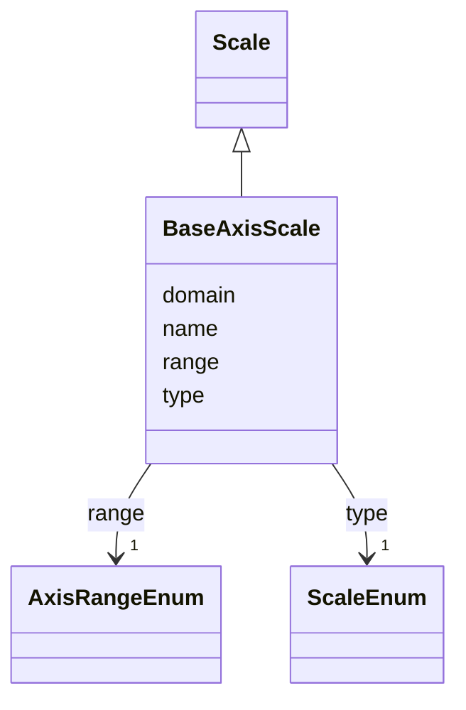

# Class: BaseAxisScale 


_A vega like scale specifically for mapping from a data domain to an axis range._


URI: [vega_scverse:BaseAxisScale](https://w3id.org/scverse/vega-scverse/BaseAxisScale)





## Inheritance
* [Scale](Scale.md)
    * **BaseAxisScale**


## Slots

| Name | Cardinality and Range | Description | Inheritance |
| ---  | --- | --- | --- |
| [domain](domain.md) | 2 <br/> [Float](Float.md) | The set of input data values that the scale maps from | direct |
| [range](range.md) | 1 <br/> [AxisRangeEnum](AxisRangeEnum.md) | Defines the target visual dimension for the axis scale's output range | direct |
| [name](name.md) | 1 <br/> [String](String.md) | `Y_scale` or `X_scale` optionally followed by `_n` where n stands for the ind... | [Scale](Scale.md) |
| [type](type.md) | 1 <br/> [ScaleEnum](ScaleEnum.md) | Only linear is supported for an `AxisScale` for now | [Scale](Scale.md) |


## Usages

| used by | used in | type | used |
| ---  | --- | --- | --- |
| [BaseScales](BaseScales.md) | [scales](scales.md) | any_of[range] | [BaseAxisScale](BaseAxisScale.md) |


## Identifier and Mapping Information


### Schema Source


* from schema: https://w3id.org/scverse/vega-scverse/specification


## Mappings

| Mapping Type | Mapped Value |
| ---  | ---  |
| self | vega_scverse:BaseAxisScale |
| native | vega_scverse:BaseAxisScale |


## LinkML Source

<!-- TODO: investigate https://stackoverflow.com/questions/37606292/how-to-create-tabbed-code-blocks-in-mkdocs-or-sphinx -->

### Direct

<details>
```yaml
name: BaseAxisScale
description: A vega like scale specifically for mapping from a data domain to an axis
  range.
from_schema: https://w3id.org/scverse/vega-scverse/specification
is_a: Scale
slot_usage:
  name:
    name: name
    description: '`Y_scale` or `X_scale` optionally followed by `_n` where n stands
      for the index of the subplot.'
    pattern: ^[XY]_scale(_\d+)?$
  type:
    name: type
    description: Only linear is supported for an `AxisScale` for now.
    ifabsent: string(linear)
    equals_string: linear
attributes:
  domain:
    name: domain
    description: 'The set of input data values that the scale maps from. In the case
      of a linear scale,

      this should be a two-element list representing the minimum and maximum numeric
      values

      to be transformed. For example, [512.0, 0.0] maps the data range from 512 (top)
      to 0 (bottom),

      which is typical for Y-axis scales in image coordinate systems where the origin
      is at the top-left.'
    from_schema: https://w3id.org/scverse/vega-scverse/scales
    rank: 1000
    domain_of:
    - BaseAxisScale
    - LinearColorScale
    - BaseCategoricalColorScale
    - Axis
    range: float
    required: true
    multivalued: true
    exact_cardinality: 2
  range:
    name: range
    description: "Defines the target visual dimension for the axis scale's output\
      \ range. Must be either 'width' for an X-axis \nscale or 'height' for a Y-axis\
      \ scale. These keywords refer to the pixel extent of the plotting area, not\
      \ the \nfull canvas. The plotting area is the region where data marks are rendered,\
      \ and its dimensions are typically \ndefined by the top-level 'width' and 'height'\
      \ properties of a Vega specification. For example, setting \n\"range\": \"height\"\
      \ in a Y-axis scale maps the scale's domain to pixel positions from top to bottom\
      \ within the \nplot area. This is commonly used to align data values with positional\
      \ axes in coordinate-based visualizations."
    from_schema: https://w3id.org/scverse/vega-scverse/scales
    rank: 1000
    domain_of:
    - BaseAxisScale
    - LinearColorScale
    - BaseCategoricalColorScale
    range: AxisRangeEnum
    required: true

```
</details>

### Induced

<details>
```yaml
name: BaseAxisScale
description: A vega like scale specifically for mapping from a data domain to an axis
  range.
from_schema: https://w3id.org/scverse/vega-scverse/specification
is_a: Scale
slot_usage:
  name:
    name: name
    description: '`Y_scale` or `X_scale` optionally followed by `_n` where n stands
      for the index of the subplot.'
    pattern: ^[XY]_scale(_\d+)?$
  type:
    name: type
    description: Only linear is supported for an `AxisScale` for now.
    ifabsent: string(linear)
    equals_string: linear
attributes:
  domain:
    name: domain
    description: 'The set of input data values that the scale maps from. In the case
      of a linear scale,

      this should be a two-element list representing the minimum and maximum numeric
      values

      to be transformed. For example, [512.0, 0.0] maps the data range from 512 (top)
      to 0 (bottom),

      which is typical for Y-axis scales in image coordinate systems where the origin
      is at the top-left.'
    from_schema: https://w3id.org/scverse/vega-scverse/scales
    rank: 1000
    alias: domain
    owner: BaseAxisScale
    domain_of:
    - BaseAxisScale
    - LinearColorScale
    - BaseCategoricalColorScale
    - Axis
    range: float
    required: true
    multivalued: true
    exact_cardinality: 2
  range:
    name: range
    description: "Defines the target visual dimension for the axis scale's output\
      \ range. Must be either 'width' for an X-axis \nscale or 'height' for a Y-axis\
      \ scale. These keywords refer to the pixel extent of the plotting area, not\
      \ the \nfull canvas. The plotting area is the region where data marks are rendered,\
      \ and its dimensions are typically \ndefined by the top-level 'width' and 'height'\
      \ properties of a Vega specification. For example, setting \n\"range\": \"height\"\
      \ in a Y-axis scale maps the scale's domain to pixel positions from top to bottom\
      \ within the \nplot area. This is commonly used to align data values with positional\
      \ axes in coordinate-based visualizations."
    from_schema: https://w3id.org/scverse/vega-scverse/scales
    rank: 1000
    alias: range
    owner: BaseAxisScale
    domain_of:
    - BaseAxisScale
    - LinearColorScale
    - BaseCategoricalColorScale
    range: AxisRangeEnum
    required: true
  name:
    name: name
    description: '`Y_scale` or `X_scale` optionally followed by `_n` where n stands
      for the index of the subplot.'
    from_schema: https://w3id.org/scverse/vega-scverse/scales
    identifier: true
    alias: name
    owner: BaseAxisScale
    domain_of:
    - DataObject
    - Scale
    range: string
    required: true
    pattern: ^[XY]_scale(_\d+)?$
  type:
    name: type
    description: Only linear is supported for an `AxisScale` for now.
    from_schema: https://w3id.org/scverse/vega-scverse/scales
    ifabsent: string(linear)
    alias: type
    owner: BaseAxisScale
    domain_of:
    - Transform
    - Format
    - Scale
    - Legend
    - Mark
    - TextMark
    - GroupMark
    range: ScaleEnum
    required: true
    equals_string: linear

```
</details>