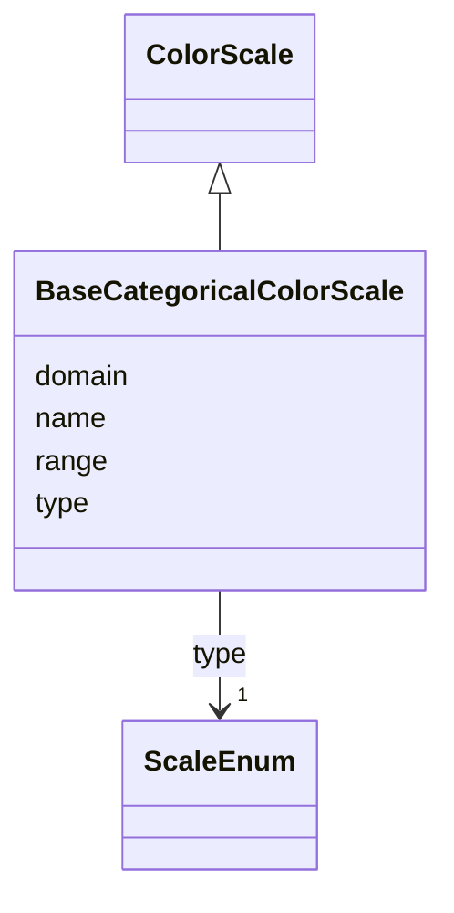

# Class: BaseCategoricalColorScale 


_A scale to map a discrete data domain to discrete colors_


URI: [vega_scverse:BaseCategoricalColorScale](https://w3id.org/scverse/vega-scverse/BaseCategoricalColorScale)





## Inheritance
* [Scale](Scale.md)
    * [ColorScale](ColorScale.md)
        * **BaseCategoricalColorScale**


## Slots

| Name | Cardinality and Range | Description | Inheritance |
| ---  | --- | --- | --- |
| [domain](domain.md) | 1..* <br/> [String](String.md) | The data domain as a list of discrete string values | direct |
| [range](range.md) | 1..* <br/> [String](String.md) | List of RGB colors as hexadecimal strings | direct |
| [name](name.md) | 1 <br/> [String](String.md) | color followed by '_pseudoUUID' used to refer to this scale elsewhere in the ... | [Scale](Scale.md) |
| [type](type.md) | 1 <br/> [ScaleEnum](ScaleEnum.md) | The type of scale which is a description of what kind of mapping is performed... | [Scale](Scale.md) |


## Usages

| used by | used in | type | used |
| ---  | --- | --- | --- |
| [BaseScales](BaseScales.md) | [scales](scales.md) | any_of[range] | [BaseCategoricalColorScale](BaseCategoricalColorScale.md) |


## Identifier and Mapping Information


### Schema Source


* from schema: https://w3id.org/scverse/vega-scverse/specification


## Mappings

| Mapping Type | Mapped Value |
| ---  | ---  |
| self | vega_scverse:BaseCategoricalColorScale |
| native | vega_scverse:BaseCategoricalColorScale |


## LinkML Source

<!-- TODO: investigate https://stackoverflow.com/questions/37606292/how-to-create-tabbed-code-blocks-in-mkdocs-or-sphinx -->

### Direct

<details>
```yaml
name: BaseCategoricalColorScale
description: A scale to map a discrete data domain to discrete colors
from_schema: https://w3id.org/scverse/vega-scverse/specification
is_a: ColorScale
slot_usage:
  type:
    name: type
    ifabsent: string(ordinal)
    equals_string: ordinal
attributes:
  domain:
    name: domain
    description: The data domain as a list of discrete string values. Length must
      be equal to the length of range
    from_schema: https://w3id.org/scverse/vega-scverse/scales
    domain_of:
    - BaseAxisScale
    - LinearColorScale
    - BaseCategoricalColorScale
    - Axis
    range: string
    required: true
    multivalued: true
  range:
    name: range
    description: List of RGB colors as hexadecimal strings. Length must be equal to
      length of domain
    from_schema: https://w3id.org/scverse/vega-scverse/scales
    domain_of:
    - BaseAxisScale
    - LinearColorScale
    - BaseCategoricalColorScale
    required: true
    multivalued: true
    pattern: ^#(?:[0-9a-fA-F]{3}|[0-9a-fA-F]{6})$

```
</details>

### Induced

<details>
```yaml
name: BaseCategoricalColorScale
description: A scale to map a discrete data domain to discrete colors
from_schema: https://w3id.org/scverse/vega-scverse/specification
is_a: ColorScale
slot_usage:
  type:
    name: type
    ifabsent: string(ordinal)
    equals_string: ordinal
attributes:
  domain:
    name: domain
    description: The data domain as a list of discrete string values. Length must
      be equal to the length of range
    from_schema: https://w3id.org/scverse/vega-scverse/scales
    alias: domain
    owner: BaseCategoricalColorScale
    domain_of:
    - BaseAxisScale
    - LinearColorScale
    - BaseCategoricalColorScale
    - Axis
    range: string
    required: true
    multivalued: true
  range:
    name: range
    description: List of RGB colors as hexadecimal strings. Length must be equal to
      length of domain
    from_schema: https://w3id.org/scverse/vega-scverse/scales
    alias: range
    owner: BaseCategoricalColorScale
    domain_of:
    - BaseAxisScale
    - LinearColorScale
    - BaseCategoricalColorScale
    range: string
    required: true
    multivalued: true
    pattern: ^#(?:[0-9a-fA-F]{3}|[0-9a-fA-F]{6})$
  name:
    name: name
    description: color followed by '_pseudoUUID' used to refer to this scale elsewhere
      in the view configuration.
    from_schema: https://w3id.org/scverse/vega-scverse/scales
    identifier: true
    alias: name
    owner: BaseCategoricalColorScale
    domain_of:
    - DataObject
    - Scale
    range: string
    required: true
    pattern: ^color_[0-9a-fA-F]{8}-[0-9a-fA-F]{4}-[0-9a-fA-F]{4}-[0-9a-fA-F]{4}-[0-9a-fA-F]{12}$
  type:
    name: type
    description: "The type of scale which is a description of what kind of mapping\
      \ is performed between data domain and \nvisual range, e.g. `linear`."
    from_schema: https://w3id.org/scverse/vega-scverse/scales
    ifabsent: string(ordinal)
    alias: type
    owner: BaseCategoricalColorScale
    domain_of:
    - Transform
    - Format
    - Scale
    - Legend
    - Mark
    - TextMark
    - GroupMark
    range: ScaleEnum
    required: true
    equals_string: ordinal

```
</details>