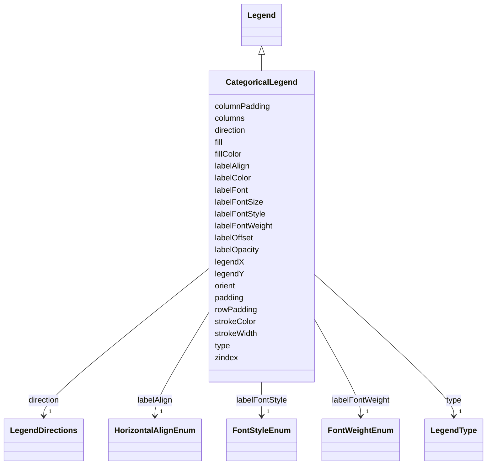

# Class: CategoricalLegend 


_Type of legend for categorical data._


URI: [vega_scverse:CategoricalLegend](https://w3id.org/scverse/vega-scverse/CategoricalLegend)





## Inheritance
* [Legend](Legend.md)
    * **CategoricalLegend**


## Slots

| Name | Cardinality and Range | Description | Inheritance |
| ---  | --- | --- | --- |
| [columns](columns.md) | 0..1 <br/> [Integer](Integer.md) | The number of columns in which to arrange symbol legend entries | direct |
| [columnPadding](columnPadding.md) | 0..1 <br/> [Float](Float.md) | The horizontal padding in pixels between symbol legend entries | direct |
| [rowPadding](rowPadding.md) | 0..1 <br/> [Float](Float.md) | The vertical padding in pixels between symbol legend entries | direct |
| [type](type.md) | 1 <br/> [LegendType](LegendType.md) | The type of legend, either 'gradient' (continuous data) or 'discrete' (catego... | [Legend](Legend.md) |
| [direction](direction.md) | 1 <br/> [LegendDirections](LegendDirections.md) | The direction of the legend, one of 'vertical' or 'horizontal' | [Legend](Legend.md) |
| [orient](orient.md) | 0..1 <br/> [String](String.md) | The orientation of the legend, determining where the legend is placed relativ... | [Legend](Legend.md) |
| [padding](padding.md) | 0..1 <br/> [Float](Float.md) | The padding between the border and content of the legend group in pixels | [Legend](Legend.md) |
| [fill](fill.md) | 1 <br/> [String](String.md) | The name of a scale that maps to a fill color | [Legend](Legend.md) |
| [fillColor](fillColor.md) | 0..1 <br/> [String](String.md) | Hex string representing a RGBA color, which is the background color of the le... | [Legend](Legend.md) |
| [strokeColor](strokeColor.md) | 0..1 <br/> [String](String.md) | Hex string representing a RGBA color, which is the color of the legend border | [Legend](Legend.md) |
| [strokeWidth](strokeWidth.md) | 0..1 <br/> [Float](Float.md) | The width of the legend border in pixels | [Legend](Legend.md) |
| [labelOffset](labelOffset.md) | 1 <br/> [Float](Float.md) | Offset in pixels between legend labels their corresponding symbol or gradient | [Legend](Legend.md) |
| [labelAlign](labelAlign.md) | 1 <br/> [HorizontalAlignEnum](HorizontalAlignEnum.md) | Horizontal text alignment for legend labels | [Legend](Legend.md) |
| [labelColor](labelColor.md) | 1 <br/> [String](String.md) | Text color for legend labels represented by a RGB hex string | [Legend](Legend.md) |
| [labelOpacity](labelOpacity.md) | 1 <br/> [String](String.md) | The opacity of legend labels | [Legend](Legend.md) |
| [labelFont](labelFont.md) | 0..1 <br/> [String](String.md) | Font name for legend labels | [Legend](Legend.md) |
| [labelFontSize](labelFontSize.md) | 1 <br/> [Float](Float.md) | Font size in pixels for legend labels | [Legend](Legend.md) |
| [labelFontStyle](labelFontStyle.md) | 1 <br/> [FontStyleEnum](FontStyleEnum.md) | Font style of legend labels | [Legend](Legend.md) |
| [labelFontWeight](labelFontWeight.md) | 1 <br/> [FontWeightEnum](FontWeightEnum.md) | Font weight of legend labels | [Legend](Legend.md) |
| [legendX](legendX.md) | 1 <br/> [Float](Float.md) | The pixel x-coordinate of the legend group | [Legend](Legend.md) |
| [legendY](legendY.md) | 1 <br/> [Float](Float.md) | The pixel y-coordinate of the legend group | [Legend](Legend.md) |
| [zindex](zindex.md) | 1 <br/> [Float](Float.md) | The integer z-index indicating the layering of the legend group relative to o... | [Legend](Legend.md) |


## Identifier and Mapping Information


### Schema Source


* from schema: https://w3id.org/scverse/vega-scverse/specification


## Mappings

| Mapping Type | Mapped Value |
| ---  | ---  |
| self | vega_scverse:CategoricalLegend |
| native | vega_scverse:CategoricalLegend |


## LinkML Source

<!-- TODO: investigate https://stackoverflow.com/questions/37606292/how-to-create-tabbed-code-blocks-in-mkdocs-or-sphinx -->

### Direct

<details>
```yaml
name: CategoricalLegend
description: Type of legend for categorical data.
from_schema: https://w3id.org/scverse/vega-scverse/specification
is_a: Legend
attributes:
  columns:
    name: columns
    description: "The number of columns in which to arrange symbol legend entries.\
      \ A value of 0 or lower indicates a single row \nwith one column per entry.\
      \ The default is 0 for horizontal symbol legends and 1 for vertical symbol legends."
    from_schema: https://w3id.org/scverse/vega-scverse/legends
    rank: 1000
    domain_of:
    - CategoricalLegend
    range: integer
  columnPadding:
    name: columnPadding
    description: The horizontal padding in pixels between symbol legend entries.
    from_schema: https://w3id.org/scverse/vega-scverse/legends
    rank: 1000
    domain_of:
    - CategoricalLegend
    range: float
  rowPadding:
    name: rowPadding
    description: The vertical padding in pixels between symbol legend entries.
    from_schema: https://w3id.org/scverse/vega-scverse/legends
    rank: 1000
    domain_of:
    - CategoricalLegend
    range: float

```
</details>

### Induced

<details>
```yaml
name: CategoricalLegend
description: Type of legend for categorical data.
from_schema: https://w3id.org/scverse/vega-scverse/specification
is_a: Legend
attributes:
  columns:
    name: columns
    description: "The number of columns in which to arrange symbol legend entries.\
      \ A value of 0 or lower indicates a single row \nwith one column per entry.\
      \ The default is 0 for horizontal symbol legends and 1 for vertical symbol legends."
    from_schema: https://w3id.org/scverse/vega-scverse/legends
    rank: 1000
    alias: columns
    owner: CategoricalLegend
    domain_of:
    - CategoricalLegend
    range: integer
  columnPadding:
    name: columnPadding
    description: The horizontal padding in pixels between symbol legend entries.
    from_schema: https://w3id.org/scverse/vega-scverse/legends
    rank: 1000
    alias: columnPadding
    owner: CategoricalLegend
    domain_of:
    - CategoricalLegend
    range: float
  rowPadding:
    name: rowPadding
    description: The vertical padding in pixels between symbol legend entries.
    from_schema: https://w3id.org/scverse/vega-scverse/legends
    rank: 1000
    alias: rowPadding
    owner: CategoricalLegend
    domain_of:
    - CategoricalLegend
    range: float
  type:
    name: type
    description: The type of legend, either 'gradient' (continuous data) or 'discrete'
      (categorical data).
    from_schema: https://w3id.org/scverse/vega-scverse/legends
    alias: type
    owner: CategoricalLegend
    domain_of:
    - Transform
    - Format
    - Scale
    - Legend
    - Mark
    - TextMark
    - GroupMark
    range: legendType
    required: true
  direction:
    name: direction
    description: The direction of the legend, one of 'vertical' or 'horizontal'.
    from_schema: https://w3id.org/scverse/vega-scverse/legends
    rank: 1000
    alias: direction
    owner: CategoricalLegend
    domain_of:
    - Legend
    range: legendDirections
    required: true
  orient:
    name: orient
    description: "The orientation of the legend, determining where the legend is placed\
      \ relative to a chart's data rectangle. \nCurrently, only 'none' is allowed\
      \ here as in Vega this allows to directly specify the positioning in \npixel\
      \ coordinates. If there is demand, this can be changed."
    from_schema: https://w3id.org/scverse/vega-scverse/legends
    ifabsent: string(none)
    alias: orient
    owner: CategoricalLegend
    domain_of:
    - Axis
    - Legend
    - Title
    range: string
    equals_string: none
  padding:
    name: padding
    description: The padding between the border and content of the legend group in
      pixels.
    from_schema: https://w3id.org/scverse/vega-scverse/legends
    alias: padding
    owner: CategoricalLegend
    domain_of:
    - ViewConfiguration
    - Legend
    range: float
  fill:
    name: fill
    description: 'The name of a scale that maps to a fill color. This represents the
      color used to visualize discrete classes

      or continuous data in the legend.'
    from_schema: https://w3id.org/scverse/vega-scverse/legends
    rank: 1000
    alias: fill
    owner: CategoricalLegend
    domain_of:
    - Legend
    - ImageEncodeEnter
    - LabelEncodeEnter
    - PointsEncodeEnter
    - PathEncodeEnter
    - TextEncodeEnter
    - MarkEncodeUpdate
    range: string
    required: true
    pattern: ^color_[0-9a-fA-F]{8}-[0-9a-fA-F]{4}-[0-9a-fA-F]{4}-[0-9a-fA-F]{4}-[0-9a-fA-F]{12}$
  fillColor:
    name: fillColor
    description: Hex string representing a RGBA color, which is the background color
      of the legend.
    from_schema: https://w3id.org/scverse/vega-scverse/legends
    rank: 1000
    slot_uri: rgbaHexSlot
    alias: fillColor
    owner: CategoricalLegend
    domain_of:
    - Legend
    range: string
  strokeColor:
    name: strokeColor
    description: Hex string representing a RGBA color, which is the color of the legend
      border.
    from_schema: https://w3id.org/scverse/vega-scverse/legends
    rank: 1000
    slot_uri: rgbaHexSlot
    alias: strokeColor
    owner: CategoricalLegend
    domain_of:
    - Legend
    range: string
  strokeWidth:
    name: strokeWidth
    description: "The width of the legend border in pixels. This property deviates\
      \ from its Vega equivalent, in that the \nvega equivalent expects a 'Scale'."
    from_schema: https://w3id.org/scverse/vega-scverse/legends
    alias: strokeWidth
    owner: CategoricalLegend
    domain_of:
    - Legend
    - LabelEncodeEnter
    - PointsEncodeEnter
    range: float
  labelOffset:
    name: labelOffset
    description: Offset in pixels between legend labels their corresponding symbol
      or gradient.
    from_schema: https://w3id.org/scverse/vega-scverse/legends
    rank: 1000
    alias: labelOffset
    owner: CategoricalLegend
    domain_of:
    - Legend
    range: float
    required: true
  labelAlign:
    name: labelAlign
    description: 'Horizontal text alignment for legend labels. In short this means
      where the label text is relative to the

      anchor point of the labels (this could be defined as the coordinates where the
      labels are specified to be).'
    from_schema: https://w3id.org/scverse/vega-scverse/legends
    rank: 1000
    alias: labelAlign
    owner: CategoricalLegend
    domain_of:
    - Legend
    range: HorizontalAlignEnum
    required: true
  labelColor:
    name: labelColor
    description: Text color for legend labels represented by a RGB hex string.
    from_schema: https://w3id.org/scverse/vega-scverse/legends
    slot_uri: rgbHexSlot
    alias: labelColor
    owner: CategoricalLegend
    domain_of:
    - Axis
    - Legend
    range: string
    required: true
  labelOpacity:
    name: labelOpacity
    description: The opacity of legend labels.
    from_schema: https://w3id.org/scverse/vega-scverse/legends
    slot_uri: opacityValueSlot
    alias: labelOpacity
    owner: CategoricalLegend
    domain_of:
    - Axis
    - Legend
    range: string
    required: true
  labelFont:
    name: labelFont
    description: Font name for legend labels.
    from_schema: https://w3id.org/scverse/vega-scverse/legends
    ifabsent: string(Arial)
    alias: labelFont
    owner: CategoricalLegend
    domain_of:
    - Axis
    - Legend
    range: string
  labelFontSize:
    name: labelFontSize
    description: Font size in pixels for legend labels.
    from_schema: https://w3id.org/scverse/vega-scverse/legends
    alias: labelFontSize
    owner: CategoricalLegend
    domain_of:
    - Axis
    - Legend
    range: float
    required: true
  labelFontStyle:
    name: labelFontStyle
    description: Font style of legend labels
    from_schema: https://w3id.org/scverse/vega-scverse/legends
    alias: labelFontStyle
    owner: CategoricalLegend
    domain_of:
    - Axis
    - Legend
    range: FontStyleEnum
    required: true
  labelFontWeight:
    name: labelFontWeight
    description: Font weight of legend labels.
    from_schema: https://w3id.org/scverse/vega-scverse/legends
    alias: labelFontWeight
    owner: CategoricalLegend
    domain_of:
    - Axis
    - Legend
    range: FontWeightEnum
    required: true
  legendX:
    name: legendX
    description: The pixel x-coordinate of the legend group.
    from_schema: https://w3id.org/scverse/vega-scverse/legends
    rank: 1000
    alias: legendX
    owner: CategoricalLegend
    domain_of:
    - Legend
    range: float
    required: true
  legendY:
    name: legendY
    description: The pixel y-coordinate of the legend group.
    from_schema: https://w3id.org/scverse/vega-scverse/legends
    rank: 1000
    alias: legendY
    owner: CategoricalLegend
    domain_of:
    - Legend
    range: float
    required: true
  zindex:
    name: zindex
    description: "The integer z-index indicating the layering of the legend group\
      \ relative to other axis, mark, and \nlegend groups."
    from_schema: https://w3id.org/scverse/vega-scverse/legends
    alias: zindex
    owner: CategoricalLegend
    domain_of:
    - Axis
    - Legend
    - Mark
    - TextMark
    range: float
    required: true

```
</details>