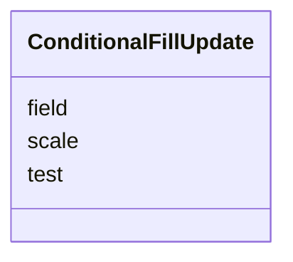

# Class: ConditionalFillUpdate 


_Update color based on test condition. This is following an 'if-then-else' style chain of production rules. If_

_no else is specified, then the property value evaluates to 'null' or similar value._


URI: [vega_scverse:ConditionalFillUpdate](https://w3id.org/scverse/vega-scverse/ConditionalFillUpdate)





<!-- no inheritance hierarchy -->


## Slots

| Name | Cardinality and Range | Description | Inheritance |
| ---  | --- | --- | --- |
| [test](test.md) | 1 <br/> [String](String.md) | The condition to test on, e | direct |
| [scale](scale.md) | 1 <br/> [String](String.md) | The scale to use for applying the fill color | direct |
| [field](field.md) | 1 <br/> [String](String.md) | The column that serves as data input, in the test condition this corresponds ... | direct |


## Usages

| used by | used in | type | used |
| ---  | --- | --- | --- |
| [MarkEncodeUpdate](MarkEncodeUpdate.md) | [fill](fill.md) | any_of[range] | [ConditionalFillUpdate](ConditionalFillUpdate.md) |


## Identifier and Mapping Information


### Schema Source


* from schema: https://w3id.org/scverse/vega-scverse/specification


## Mappings

| Mapping Type | Mapped Value |
| ---  | ---  |
| self | vega_scverse:ConditionalFillUpdate |
| native | vega_scverse:ConditionalFillUpdate |


## LinkML Source

<!-- TODO: investigate https://stackoverflow.com/questions/37606292/how-to-create-tabbed-code-blocks-in-mkdocs-or-sphinx -->

### Direct

<details>
```yaml
name: ConditionalFillUpdate
description: 'Update color based on test condition. This is following an ''if-then-else''
  style chain of production rules. If

  no else is specified, then the property value evaluates to ''null'' or similar value.'
from_schema: https://w3id.org/scverse/vega-scverse/specification
attributes:
  test:
    name: test
    description: 'The condition to test on, e.g. ''isValid(datum.value). MUST be a
      valid expression in Vega. See also:

      https://vega.github.io/vega/docs/expressions/ and it MUST evaluate to either
      ''true'' or ''false''.'
    from_schema: https://w3id.org/scverse/vega-scverse/encode
    rank: 1000
    domain_of:
    - ConditionalFillUpdate
    range: string
    required: true
  scale:
    name: scale
    description: The scale to use for applying the fill color. This scale MUST exist
      in the view configuration Scales array.
    from_schema: https://w3id.org/scverse/vega-scverse/encode
    domain_of:
    - Axis
    - ColorItem
    - AxisItem
    - ConditionalFillUpdate
    required: true
    pattern: ^color_[0-9a-fA-F]{8}-[0-9a-fA-F]{4}-[0-9a-fA-F]{4}-[0-9a-fA-F]{4}-[0-9a-fA-F]{12}$
  field:
    name: field
    description: The column that serves as data input, in the test condition this
      corresponds to 'datum'.
    from_schema: https://w3id.org/scverse/vega-scverse/encode
    domain_of:
    - AggregateTransform
    - SpreadTransform
    - ContinuousColorDomain
    - ColorItem
    - AxisItem
    - ConditionalFillUpdate
    range: string
    required: true

```
</details>

### Induced

<details>
```yaml
name: ConditionalFillUpdate
description: 'Update color based on test condition. This is following an ''if-then-else''
  style chain of production rules. If

  no else is specified, then the property value evaluates to ''null'' or similar value.'
from_schema: https://w3id.org/scverse/vega-scverse/specification
attributes:
  test:
    name: test
    description: 'The condition to test on, e.g. ''isValid(datum.value). MUST be a
      valid expression in Vega. See also:

      https://vega.github.io/vega/docs/expressions/ and it MUST evaluate to either
      ''true'' or ''false''.'
    from_schema: https://w3id.org/scverse/vega-scverse/encode
    rank: 1000
    alias: test
    owner: ConditionalFillUpdate
    domain_of:
    - ConditionalFillUpdate
    range: string
    required: true
  scale:
    name: scale
    description: The scale to use for applying the fill color. This scale MUST exist
      in the view configuration Scales array.
    from_schema: https://w3id.org/scverse/vega-scverse/encode
    alias: scale
    owner: ConditionalFillUpdate
    domain_of:
    - Axis
    - ColorItem
    - AxisItem
    - ConditionalFillUpdate
    range: string
    required: true
    pattern: ^color_[0-9a-fA-F]{8}-[0-9a-fA-F]{4}-[0-9a-fA-F]{4}-[0-9a-fA-F]{4}-[0-9a-fA-F]{12}$
  field:
    name: field
    description: The column that serves as data input, in the test condition this
      corresponds to 'datum'.
    from_schema: https://w3id.org/scverse/vega-scverse/encode
    alias: field
    owner: ConditionalFillUpdate
    domain_of:
    - AggregateTransform
    - SpreadTransform
    - ContinuousColorDomain
    - ColorItem
    - AxisItem
    - ConditionalFillUpdate
    range: string
    required: true

```
</details>