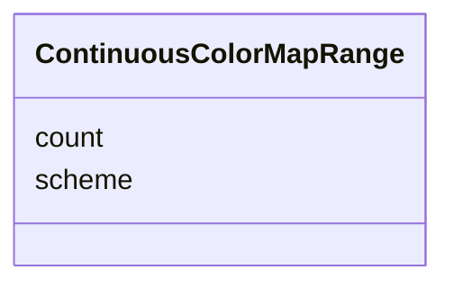

# Class: ContinuousColorMapRange 


_Color scheme reference for a color palette._


URI: [vega_scverse:ContinuousColorMapRange](https://w3id.org/scverse/vega-scverse/ContinuousColorMapRange)





<!-- no inheritance hierarchy -->


## Slots

| Name | Cardinality and Range | Description | Inheritance |
| ---  | --- | --- | --- |
| [scheme](scheme.md) | 1 <br/> [String](String.md) | The name of the color scheme to use or an array of color values | direct |
| [count](count.md) | 1 <br/> [Integer](Integer.md) | The number of colors to use in the scheme | direct |


## Usages

| used by | used in | type | used |
| ---  | --- | --- | --- |
| [LinearColorScale](LinearColorScale.md) | [range](range.md) | range | [ContinuousColorMapRange](ContinuousColorMapRange.md) |


## Identifier and Mapping Information


### Schema Source


* from schema: https://w3id.org/scverse/vega-scverse/specification


## Mappings

| Mapping Type | Mapped Value |
| ---  | ---  |
| self | vega_scverse:ContinuousColorMapRange |
| native | vega_scverse:ContinuousColorMapRange |


## LinkML Source

<!-- TODO: investigate https://stackoverflow.com/questions/37606292/how-to-create-tabbed-code-blocks-in-mkdocs-or-sphinx -->

### Direct

<details>
```yaml
name: ContinuousColorMapRange
description: Color scheme reference for a color palette.
from_schema: https://w3id.org/scverse/vega-scverse/specification
attributes:
  scheme:
    name: scheme
    description: The name of the color scheme to use or an array of color values.
    from_schema: https://w3id.org/scverse/vega-scverse/scales
    rank: 1000
    domain_of:
    - ContinuousColorMapRange
    range: string
    required: true
  count:
    name: count
    description: The number of colors to use in the scheme.
    from_schema: https://w3id.org/scverse/vega-scverse/scales
    rank: 1000
    domain_of:
    - ContinuousColorMapRange
    range: integer
    required: true

```
</details>

### Induced

<details>
```yaml
name: ContinuousColorMapRange
description: Color scheme reference for a color palette.
from_schema: https://w3id.org/scverse/vega-scverse/specification
attributes:
  scheme:
    name: scheme
    description: The name of the color scheme to use or an array of color values.
    from_schema: https://w3id.org/scverse/vega-scverse/scales
    rank: 1000
    alias: scheme
    owner: ContinuousColorMapRange
    domain_of:
    - ContinuousColorMapRange
    range: string
    required: true
  count:
    name: count
    description: The number of colors to use in the scheme.
    from_schema: https://w3id.org/scverse/vega-scverse/scales
    rank: 1000
    alias: count
    owner: ContinuousColorMapRange
    domain_of:
    - ContinuousColorMapRange
    range: integer
    required: true

```
</details>