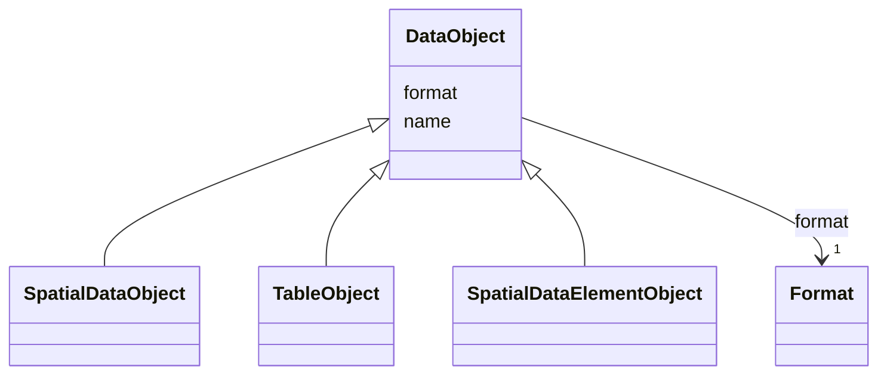

# Class: DataObject 


_Abstract class for Vega like data set definitions and transforms that define the data based on scverse data _

_models like SpatialData and AnnData to load and how to process it._


* __NOTE__: this is an abstract class and should not be instantiated directly


URI: [vega_scverse:DataObject](https://w3id.org/scverse/vega-scverse/DataObject)





## Inheritance
* **DataObject**
    * [SpatialDataObject](SpatialDataObject.md)
    * [TableObject](TableObject.md)
    * [SpatialDataElementObject](SpatialDataElementObject.md)


## Slots

| Name | Cardinality and Range | Description | Inheritance |
| ---  | --- | --- | --- |
| [name](name.md) | 1 <br/> [String](String.md) | The name used throughout the view configuration to refer to the data object | direct |
| [format](format.md) | 1 <br/> [Format](Format.md) | Format object containing the type of data as object and a string value repres... | direct |


## Usages

| used by | used in | type | used |
| ---  | --- | --- | --- |
| [ViewConfiguration](ViewConfiguration.md) | [data](data.md) | range | [DataObject](DataObject.md) |


## Identifier and Mapping Information


### Schema Source


* from schema: https://w3id.org/scverse/vega-scverse/specification


## Mappings

| Mapping Type | Mapped Value |
| ---  | ---  |
| self | vega_scverse:DataObject |
| native | vega_scverse:DataObject |


## LinkML Source

<!-- TODO: investigate https://stackoverflow.com/questions/37606292/how-to-create-tabbed-code-blocks-in-mkdocs-or-sphinx -->

### Direct

<details>
```yaml
name: DataObject
description: "Abstract class for Vega like data set definitions and transforms that\
  \ define the data based on scverse data \nmodels like SpatialData and AnnData to\
  \ load and how to process it."
from_schema: https://w3id.org/scverse/vega-scverse/specification
abstract: true
attributes:
  name:
    name: name
    description: "The name used throughout the view configuration to refer to the\
      \ data object. It is an arbitrary string \nfollowed by an underscore and pseudo\
      \ UUID."
    from_schema: https://w3id.org/scverse/vega-scverse/data
    rank: 1000
    domain_of:
    - DataObject
    - Scale
    required: true
    pattern: ^(.*_)?[0-9a-fA-F]{8}-[0-9a-fA-F]{4}-[0-9a-fA-F]{4}-[0-9a-fA-F]{4}-[0-9a-fA-F]{12}$
  format:
    name: format
    description: Format object containing the type of data as object and a string
      value representing the version.
    from_schema: https://w3id.org/scverse/vega-scverse/data
    rank: 1000
    domain_of:
    - DataObject
    range: Format
    required: true

```
</details>

### Induced

<details>
```yaml
name: DataObject
description: "Abstract class for Vega like data set definitions and transforms that\
  \ define the data based on scverse data \nmodels like SpatialData and AnnData to\
  \ load and how to process it."
from_schema: https://w3id.org/scverse/vega-scverse/specification
abstract: true
attributes:
  name:
    name: name
    description: "The name used throughout the view configuration to refer to the\
      \ data object. It is an arbitrary string \nfollowed by an underscore and pseudo\
      \ UUID."
    from_schema: https://w3id.org/scverse/vega-scverse/data
    rank: 1000
    alias: name
    owner: DataObject
    domain_of:
    - DataObject
    - Scale
    range: string
    required: true
    pattern: ^(.*_)?[0-9a-fA-F]{8}-[0-9a-fA-F]{4}-[0-9a-fA-F]{4}-[0-9a-fA-F]{4}-[0-9a-fA-F]{12}$
  format:
    name: format
    description: Format object containing the type of data as object and a string
      value representing the version.
    from_schema: https://w3id.org/scverse/vega-scverse/data
    rank: 1000
    alias: format
    owner: DataObject
    domain_of:
    - DataObject
    range: Format
    required: true

```
</details>