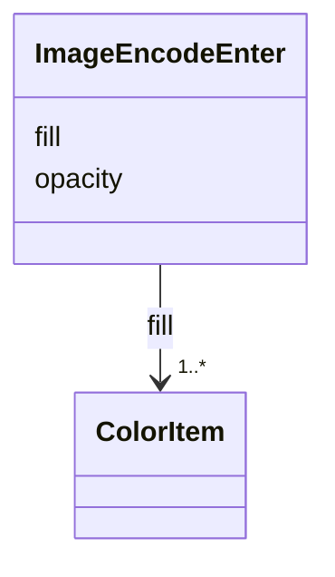

# Class: ImageEncodeEnter 


_Enter properties that are evaluated when image data is processed for the first time and the raster_image mark is _

_newly added to a scene._


URI: [vega_scverse:ImageEncodeEnter](https://w3id.org/scverse/vega-scverse/ImageEncodeEnter)





<!-- no inheritance hierarchy -->


## Slots

| Name | Cardinality and Range | Description | Inheritance |
| ---  | --- | --- | --- |
| [opacity](opacity.md) | 1 <br/> [String](String.md) | The opacity of the image mark | direct |
| [fill](fill.md) | 1..* <br/> [ColorItem](ColorItem.md) | The colormap by which to show the intensity value of the image or channel | direct |


## Usages

| used by | used in | type | used |
| ---  | --- | --- | --- |
| [ImageEncode](ImageEncode.md) | [enter](enter.md) | range | [ImageEncodeEnter](ImageEncodeEnter.md) |


## Identifier and Mapping Information


### Schema Source


* from schema: https://w3id.org/scverse/vega-scverse/specification


## Mappings

| Mapping Type | Mapped Value |
| ---  | ---  |
| self | vega_scverse:ImageEncodeEnter |
| native | vega_scverse:ImageEncodeEnter |


## LinkML Source

<!-- TODO: investigate https://stackoverflow.com/questions/37606292/how-to-create-tabbed-code-blocks-in-mkdocs-or-sphinx -->

### Direct

<details>
```yaml
name: ImageEncodeEnter
description: "Enter properties that are evaluated when image data is processed for\
  \ the first time and the raster_image mark is \nnewly added to a scene."
from_schema: https://w3id.org/scverse/vega-scverse/specification
attributes:
  opacity:
    name: opacity
    description: The opacity of the image mark.
    from_schema: https://w3id.org/scverse/vega-scverse/encode
    rank: 1000
    slot_uri: opacityValueSlot
    domain_of:
    - ImageEncodeEnter
    required: true
  fill:
    name: fill
    description: The colormap by which to show the intensity value of the image or
      channel.
    from_schema: https://w3id.org/scverse/vega-scverse/encode
    domain_of:
    - Legend
    - ImageEncodeEnter
    - LabelEncodeEnter
    - PointsEncodeEnter
    - PathEncodeEnter
    - TextEncodeEnter
    - MarkEncodeUpdate
    range: ColorItem
    required: true
    multivalued: true

```
</details>

### Induced

<details>
```yaml
name: ImageEncodeEnter
description: "Enter properties that are evaluated when image data is processed for\
  \ the first time and the raster_image mark is \nnewly added to a scene."
from_schema: https://w3id.org/scverse/vega-scverse/specification
attributes:
  opacity:
    name: opacity
    description: The opacity of the image mark.
    from_schema: https://w3id.org/scverse/vega-scverse/encode
    rank: 1000
    slot_uri: opacityValueSlot
    alias: opacity
    owner: ImageEncodeEnter
    domain_of:
    - ImageEncodeEnter
    range: string
    required: true
  fill:
    name: fill
    description: The colormap by which to show the intensity value of the image or
      channel.
    from_schema: https://w3id.org/scverse/vega-scverse/encode
    alias: fill
    owner: ImageEncodeEnter
    domain_of:
    - Legend
    - ImageEncodeEnter
    - LabelEncodeEnter
    - PointsEncodeEnter
    - PathEncodeEnter
    - TextEncodeEnter
    - MarkEncodeUpdate
    range: ColorItem
    required: true
    multivalued: true

```
</details>