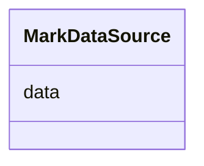

# Class: MarkDataSource 


_Object with a data field pointing to the name of the datastream that serves as data source for the mark._


URI: [vega_scverse:MarkDataSource](https://w3id.org/scverse/vega-scverse/MarkDataSource)





<!-- no inheritance hierarchy -->


## Slots

| Name | Cardinality and Range | Description | Inheritance |
| ---  | --- | --- | --- |
| [data](data.md) | 1 <br/> [String](String.md) | name of the datastream | direct |


## Usages

| used by | used in | type | used |
| ---  | --- | --- | --- |
| [Mark](Mark.md) | [from_](from_.md) | range | [MarkDataSource](MarkDataSource.md) |
| [RasterImageMark](RasterImageMark.md) | [from_](from_.md) | range | [MarkDataSource](MarkDataSource.md) |
| [RasterLabelMark](RasterLabelMark.md) | [from_](from_.md) | range | [MarkDataSource](MarkDataSource.md) |
| [PointsMark](PointsMark.md) | [from_](from_.md) | range | [MarkDataSource](MarkDataSource.md) |
| [ShapesMark](ShapesMark.md) | [from_](from_.md) | range | [MarkDataSource](MarkDataSource.md) |


## Identifier and Mapping Information


### Schema Source


* from schema: https://w3id.org/scverse/vega-scverse/specification


## Mappings

| Mapping Type | Mapped Value |
| ---  | ---  |
| self | vega_scverse:MarkDataSource |
| native | vega_scverse:MarkDataSource |


## LinkML Source

<!-- TODO: investigate https://stackoverflow.com/questions/37606292/how-to-create-tabbed-code-blocks-in-mkdocs-or-sphinx -->

### Direct

<details>
```yaml
name: MarkDataSource
description: Object with a data field pointing to the name of the datastream that
  serves as data source for the mark.
from_schema: https://w3id.org/scverse/vega-scverse/specification
attributes:
  data:
    name: data
    description: name of the datastream
    from_schema: https://w3id.org/scverse/vega-scverse/marks
    domain_of:
    - ViewConfiguration
    - ContinuousColorDomain
    - MarkDataSource
    required: true
    pattern: ^(.*_)?[0-9a-fA-F]{8}-[0-9a-fA-F]{4}-[0-9a-fA-F]{4}-[0-9a-fA-F]{4}-[0-9a-fA-F]{12}$

```
</details>

### Induced

<details>
```yaml
name: MarkDataSource
description: Object with a data field pointing to the name of the datastream that
  serves as data source for the mark.
from_schema: https://w3id.org/scverse/vega-scverse/specification
attributes:
  data:
    name: data
    description: name of the datastream
    from_schema: https://w3id.org/scverse/vega-scverse/marks
    alias: data
    owner: MarkDataSource
    domain_of:
    - ViewConfiguration
    - ContinuousColorDomain
    - MarkDataSource
    range: string
    required: true
    pattern: ^(.*_)?[0-9a-fA-F]{8}-[0-9a-fA-F]{4}-[0-9a-fA-F]{4}-[0-9a-fA-F]{4}-[0-9a-fA-F]{12}$

```
</details>