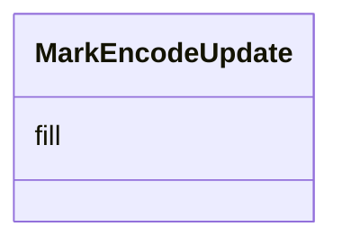

# Class: MarkEncodeUpdate 


_Update properties that are evaluated for all existing (non-exiting) mark instances._


URI: [vega_scverse:MarkEncodeUpdate](https://w3id.org/scverse/vega-scverse/MarkEncodeUpdate)





<!-- no inheritance hierarchy -->


## Slots

| Name | Cardinality and Range | Description | Inheritance |
| ---  | --- | --- | --- |
| [fill](fill.md) | * <br/> [String](String.md)&nbsp;or&nbsp;<br />[ConditionalFillUpdate](ConditionalFillUpdate.md)&nbsp;or&nbsp;<br />[RGBHexItem](RGBHexItem.md) | Update of fill color based on a test condition and optional a backup static f... | direct |


## Usages

| used by | used in | type | used |
| ---  | --- | --- | --- |
| [LabelEncode](LabelEncode.md) | [update](update.md) | range | [MarkEncodeUpdate](MarkEncodeUpdate.md) |
| [SymbolEncode](SymbolEncode.md) | [update](update.md) | range | [MarkEncodeUpdate](MarkEncodeUpdate.md) |
| [PathEncode](PathEncode.md) | [update](update.md) | range | [MarkEncodeUpdate](MarkEncodeUpdate.md) |


## Identifier and Mapping Information


### Schema Source


* from schema: https://w3id.org/scverse/vega-scverse/specification


## Mappings

| Mapping Type | Mapped Value |
| ---  | ---  |
| self | vega_scverse:MarkEncodeUpdate |
| native | vega_scverse:MarkEncodeUpdate |


## LinkML Source

<!-- TODO: investigate https://stackoverflow.com/questions/37606292/how-to-create-tabbed-code-blocks-in-mkdocs-or-sphinx -->

### Direct

<details>
```yaml
name: MarkEncodeUpdate
description: Update properties that are evaluated for all existing (non-exiting) mark
  instances.
from_schema: https://w3id.org/scverse/vega-scverse/specification
attributes:
  fill:
    name: fill
    description: Update of fill color based on a test condition and optional a backup
      static fill value
    from_schema: https://w3id.org/scverse/vega-scverse/encode
    domain_of:
    - Legend
    - ImageEncodeEnter
    - LabelEncodeEnter
    - PointsEncodeEnter
    - PathEncodeEnter
    - TextEncodeEnter
    - MarkEncodeUpdate
    multivalued: true
    any_of:
    - range: ConditionalFillUpdate
    - range: RGBHexItem

```
</details>

### Induced

<details>
```yaml
name: MarkEncodeUpdate
description: Update properties that are evaluated for all existing (non-exiting) mark
  instances.
from_schema: https://w3id.org/scverse/vega-scverse/specification
attributes:
  fill:
    name: fill
    description: Update of fill color based on a test condition and optional a backup
      static fill value
    from_schema: https://w3id.org/scverse/vega-scverse/encode
    alias: fill
    owner: MarkEncodeUpdate
    domain_of:
    - Legend
    - ImageEncodeEnter
    - LabelEncodeEnter
    - PointsEncodeEnter
    - PathEncodeEnter
    - TextEncodeEnter
    - MarkEncodeUpdate
    range: string
    multivalued: true
    any_of:
    - range: ConditionalFillUpdate
    - range: RGBHexItem

```
</details>