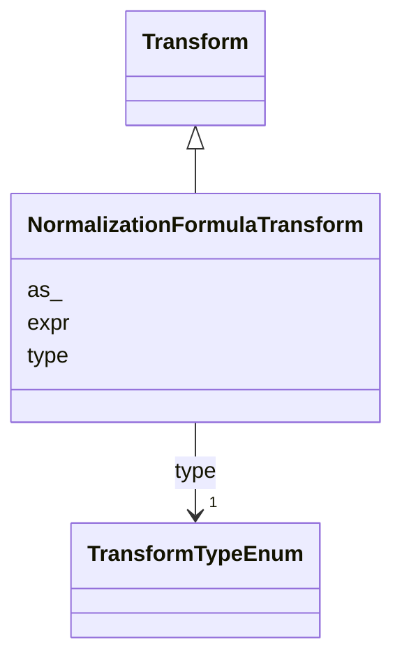

# Class: NormalizationFormulaTransform 


_A formula to transform data._


URI: [vega_scverse:NormalizationFormulaTransform](https://w3id.org/scverse/vega-scverse/NormalizationFormulaTransform)





## Inheritance
* [Transform](Transform.md)
    * **NormalizationFormulaTransform**


## Slots

| Name | Cardinality and Range | Description | Inheritance |
| ---  | --- | --- | --- |
| [expr](expr.md) | 1 <br/> [String](String.md) | Formula represented as string that in this case applies a normalization on th... | direct |
| [as_](as_.md) | 1 <br/> [String](String.md) | The output field names to use for each field to which a normalization is appl... | direct |
| [type](type.md) | 1 <br/> [TransformTypeEnum](TransformTypeEnum.md) | The type of transform | [Transform](Transform.md) |


## Usages

| used by | used in | type | used |
| ---  | --- | --- | --- |
| [SpatialDataElementObject](SpatialDataElementObject.md) | [transform](transform.md) | any_of[range] | [NormalizationFormulaTransform](NormalizationFormulaTransform.md) |


## Identifier and Mapping Information


### Schema Source


* from schema: https://w3id.org/scverse/vega-scverse/specification


## Mappings

| Mapping Type | Mapped Value |
| ---  | ---  |
| self | vega_scverse:NormalizationFormulaTransform |
| native | vega_scverse:NormalizationFormulaTransform |


## LinkML Source

<!-- TODO: investigate https://stackoverflow.com/questions/37606292/how-to-create-tabbed-code-blocks-in-mkdocs-or-sphinx -->

### Direct

<details>
```yaml
name: NormalizationFormulaTransform
description: A formula to transform data.
from_schema: https://w3id.org/scverse/vega-scverse/specification
is_a: Transform
slot_usage:
  type:
    name: type
    ifabsent: string(formula)
    equals_string: formula
attributes:
  expr:
    name: expr
    description: "Formula represented as string that in this case applies a normalization\
      \ on the data. The column or field of \ndata that is normalized is indicated\
      \ as 'datum.<name_of_column>'."
    from_schema: https://w3id.org/scverse/vega-scverse/data
    domain_of:
    - FilterTransform
    - FilterChannelTransform
    - NormalizationFormulaTransform
    required: true
    pattern: (?:clamp\(\s*)?\(\s*datum\.\w+\s*[-+*/]\s*[\d.]+\s*\)\s*[-+*/]\s*\(\s*[\d.]+\s*[-+*/]\s*[\d.]+\s*\)(?:\s*,\s*[\d.]+\s*,\s*[\d.]+\s*\))?
  as_:
    name: as_
    description: The output field names to use for each field to which a normalization
      is applied.
    from_schema: https://w3id.org/scverse/vega-scverse/data
    domain_of:
    - AggregateTransform
    - SpreadTransform
    - NormalizationFormulaTransform
    range: string
    required: true

```
</details>

### Induced

<details>
```yaml
name: NormalizationFormulaTransform
description: A formula to transform data.
from_schema: https://w3id.org/scverse/vega-scverse/specification
is_a: Transform
slot_usage:
  type:
    name: type
    ifabsent: string(formula)
    equals_string: formula
attributes:
  expr:
    name: expr
    description: "Formula represented as string that in this case applies a normalization\
      \ on the data. The column or field of \ndata that is normalized is indicated\
      \ as 'datum.<name_of_column>'."
    from_schema: https://w3id.org/scverse/vega-scverse/data
    alias: expr
    owner: NormalizationFormulaTransform
    domain_of:
    - FilterTransform
    - FilterChannelTransform
    - NormalizationFormulaTransform
    range: string
    required: true
    pattern: (?:clamp\(\s*)?\(\s*datum\.\w+\s*[-+*/]\s*[\d.]+\s*\)\s*[-+*/]\s*\(\s*[\d.]+\s*[-+*/]\s*[\d.]+\s*\)(?:\s*,\s*[\d.]+\s*,\s*[\d.]+\s*\))?
  as_:
    name: as_
    description: The output field names to use for each field to which a normalization
      is applied.
    from_schema: https://w3id.org/scverse/vega-scverse/data
    alias: as_
    owner: NormalizationFormulaTransform
    domain_of:
    - AggregateTransform
    - SpreadTransform
    - NormalizationFormulaTransform
    range: string
    required: true
  type:
    name: type
    description: The type of transform.
    from_schema: https://w3id.org/scverse/vega-scverse/data
    rank: 1000
    ifabsent: string(formula)
    alias: type
    owner: NormalizationFormulaTransform
    domain_of:
    - Transform
    - Format
    - Scale
    - Legend
    - Mark
    - TextMark
    - GroupMark
    range: TransformTypeEnum
    required: true
    equals_string: formula

```
</details>