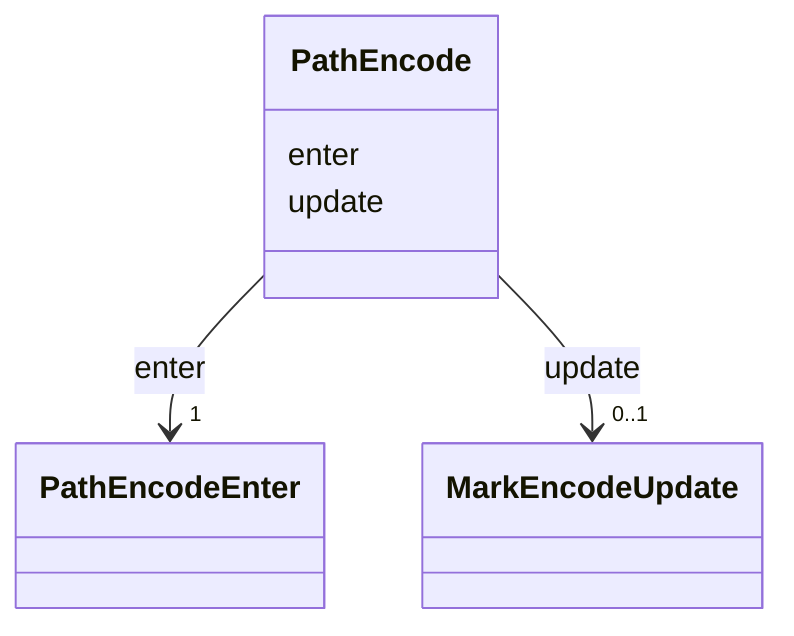

# Class: PathEncode 


_A set of visual encoding properties that determine the position and appearance of a 'path' mark. _

_In Vega, there are three primary property sets: enter, update, exit. The enter properties are evaluated when data _

_is processed for the first time and a mark instance is newly added to a scene. The update properties are evaluated _

_for all existing (non-exiting) mark instances. The exit properties are evaluated when the data backing a mark is _

_removed, and so the mark is leaving the visual scene. However, in this specification we currently only support_

_enter and update property sets for a 'path' mark._


URI: [vega_scverse:PathEncode](https://w3id.org/scverse/vega-scverse/PathEncode)





<!-- no inheritance hierarchy -->


## Slots

| Name | Cardinality and Range | Description | Inheritance |
| ---  | --- | --- | --- |
| [enter](enter.md) | 1 <br/> [PathEncodeEnter](PathEncodeEnter.md) | Enter properties that are evaluated when points data is processed for the fir... | direct |
| [update](update.md) | 0..1 <br/> [MarkEncodeUpdate](MarkEncodeUpdate.md) | Update properties that are evaluated for all existing (non-exiting) mark inst... | direct |


## Usages

| used by | used in | type | used |
| ---  | --- | --- | --- |
| [ShapesMark](ShapesMark.md) | [encode](encode.md) | range | [PathEncode](PathEncode.md) |


## Identifier and Mapping Information


### Schema Source


* from schema: https://w3id.org/scverse/vega-scverse/specification


## Mappings

| Mapping Type | Mapped Value |
| ---  | ---  |
| self | vega_scverse:PathEncode |
| native | vega_scverse:PathEncode |


## LinkML Source

<!-- TODO: investigate https://stackoverflow.com/questions/37606292/how-to-create-tabbed-code-blocks-in-mkdocs-or-sphinx -->

### Direct

<details>
```yaml
name: PathEncode
description: "A set of visual encoding properties that determine the position and\
  \ appearance of a 'path' mark. \nIn Vega, there are three primary property sets:\
  \ enter, update, exit. The enter properties are evaluated when data \nis processed\
  \ for the first time and a mark instance is newly added to a scene. The update properties\
  \ are evaluated \nfor all existing (non-exiting) mark instances. The exit properties\
  \ are evaluated when the data backing a mark is \nremoved, and so the mark is leaving\
  \ the visual scene. However, in this specification we currently only support\nenter\
  \ and update property sets for a 'path' mark."
from_schema: https://w3id.org/scverse/vega-scverse/specification
attributes:
  enter:
    name: enter
    description: "Enter properties that are evaluated when points data is processed\
      \ for the first time and the points mark \nis newly added to a scene."
    from_schema: https://w3id.org/scverse/vega-scverse/encode
    domain_of:
    - ImageEncode
    - LabelEncode
    - SymbolEncode
    - PathEncode
    - TextEncode
    - GroupEncode
    range: PathEncodeEnter
    required: true
  update:
    name: update
    description: "Update properties that are evaluated for all existing (non-exiting)\
      \ mark instances. Usually defined if the \nuser specified a color to be used\
      \ for the PointsMark."
    from_schema: https://w3id.org/scverse/vega-scverse/encode
    domain_of:
    - LabelEncode
    - SymbolEncode
    - PathEncode
    range: MarkEncodeUpdate
    required: false

```
</details>

### Induced

<details>
```yaml
name: PathEncode
description: "A set of visual encoding properties that determine the position and\
  \ appearance of a 'path' mark. \nIn Vega, there are three primary property sets:\
  \ enter, update, exit. The enter properties are evaluated when data \nis processed\
  \ for the first time and a mark instance is newly added to a scene. The update properties\
  \ are evaluated \nfor all existing (non-exiting) mark instances. The exit properties\
  \ are evaluated when the data backing a mark is \nremoved, and so the mark is leaving\
  \ the visual scene. However, in this specification we currently only support\nenter\
  \ and update property sets for a 'path' mark."
from_schema: https://w3id.org/scverse/vega-scverse/specification
attributes:
  enter:
    name: enter
    description: "Enter properties that are evaluated when points data is processed\
      \ for the first time and the points mark \nis newly added to a scene."
    from_schema: https://w3id.org/scverse/vega-scverse/encode
    alias: enter
    owner: PathEncode
    domain_of:
    - ImageEncode
    - LabelEncode
    - SymbolEncode
    - PathEncode
    - TextEncode
    - GroupEncode
    range: PathEncodeEnter
    required: true
  update:
    name: update
    description: "Update properties that are evaluated for all existing (non-exiting)\
      \ mark instances. Usually defined if the \nuser specified a color to be used\
      \ for the PointsMark."
    from_schema: https://w3id.org/scverse/vega-scverse/encode
    alias: update
    owner: PathEncode
    domain_of:
    - LabelEncode
    - SymbolEncode
    - PathEncode
    range: MarkEncodeUpdate
    required: false

```
</details>