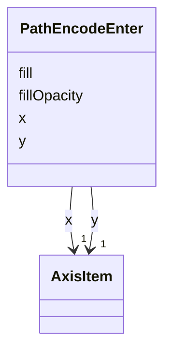

# Class: PathEncodeEnter 


_Enter properties that are evaluated when shapes data is processed for the first time and the raster_image mark is _

_newly added to a scene._


URI: [vega_scverse:PathEncodeEnter](https://w3id.org/scverse/vega-scverse/PathEncodeEnter)





<!-- no inheritance hierarchy -->


## Slots

| Name | Cardinality and Range | Description | Inheritance |
| ---  | --- | --- | --- |
| [x](x.md) | 1 <br/> [AxisItem](AxisItem.md) | The x coordinates | direct |
| [y](y.md) | 1 <br/> [AxisItem](AxisItem.md) | The y coordinates | direct |
| [fill](fill.md) | 1 <br/> [String](String.md)&nbsp;or&nbsp;<br />[ColorItem](ColorItem.md)&nbsp;or&nbsp;<br />[RGBHexItem](RGBHexItem.md) | The color fill of each individual label | direct |
| [fillOpacity](fillOpacity.md) | 1 <br/> [String](String.md) |  | direct |


## Usages

| used by | used in | type | used |
| ---  | --- | --- | --- |
| [PathEncode](PathEncode.md) | [enter](enter.md) | range | [PathEncodeEnter](PathEncodeEnter.md) |


## Identifier and Mapping Information


### Schema Source


* from schema: https://w3id.org/scverse/vega-scverse/specification


## Mappings

| Mapping Type | Mapped Value |
| ---  | ---  |
| self | vega_scverse:PathEncodeEnter |
| native | vega_scverse:PathEncodeEnter |


## LinkML Source

<!-- TODO: investigate https://stackoverflow.com/questions/37606292/how-to-create-tabbed-code-blocks-in-mkdocs-or-sphinx -->

### Direct

<details>
```yaml
name: PathEncodeEnter
description: "Enter properties that are evaluated when shapes data is processed for\
  \ the first time and the raster_image mark is \nnewly added to a scene."
from_schema: https://w3id.org/scverse/vega-scverse/specification
attributes:
  x:
    name: x
    description: The x coordinates
    from_schema: https://w3id.org/scverse/vega-scverse/encode
    domain_of:
    - PointsEncodeEnter
    - PathEncodeEnter
    - TextEncodeEnter
    - GroupEncodeEnter
    range: AxisItem
    required: true
  y:
    name: y
    description: The y coordinates
    from_schema: https://w3id.org/scverse/vega-scverse/encode
    domain_of:
    - PointsEncodeEnter
    - PathEncodeEnter
    - TextEncodeEnter
    - GroupEncodeEnter
    range: AxisItem
    required: true
  fill:
    name: fill
    description: The color fill of each individual label.
    from_schema: https://w3id.org/scverse/vega-scverse/encode
    domain_of:
    - Legend
    - ImageEncodeEnter
    - LabelEncodeEnter
    - PointsEncodeEnter
    - PathEncodeEnter
    - TextEncodeEnter
    - MarkEncodeUpdate
    required: true
    any_of:
    - range: ColorItem
    - range: RGBHexItem
  fillOpacity:
    name: fillOpacity
    description: ''
    from_schema: https://w3id.org/scverse/vega-scverse/encode
    slot_uri: opacityValueSlot
    domain_of:
    - LabelEncodeEnter
    - PointsEncodeEnter
    - PathEncodeEnter
    - TextEncodeEnter
    required: true

```
</details>

### Induced

<details>
```yaml
name: PathEncodeEnter
description: "Enter properties that are evaluated when shapes data is processed for\
  \ the first time and the raster_image mark is \nnewly added to a scene."
from_schema: https://w3id.org/scverse/vega-scverse/specification
attributes:
  x:
    name: x
    description: The x coordinates
    from_schema: https://w3id.org/scverse/vega-scverse/encode
    alias: x
    owner: PathEncodeEnter
    domain_of:
    - PointsEncodeEnter
    - PathEncodeEnter
    - TextEncodeEnter
    - GroupEncodeEnter
    range: AxisItem
    required: true
  y:
    name: y
    description: The y coordinates
    from_schema: https://w3id.org/scverse/vega-scverse/encode
    alias: y
    owner: PathEncodeEnter
    domain_of:
    - PointsEncodeEnter
    - PathEncodeEnter
    - TextEncodeEnter
    - GroupEncodeEnter
    range: AxisItem
    required: true
  fill:
    name: fill
    description: The color fill of each individual label.
    from_schema: https://w3id.org/scverse/vega-scverse/encode
    alias: fill
    owner: PathEncodeEnter
    domain_of:
    - Legend
    - ImageEncodeEnter
    - LabelEncodeEnter
    - PointsEncodeEnter
    - PathEncodeEnter
    - TextEncodeEnter
    - MarkEncodeUpdate
    range: string
    required: true
    any_of:
    - range: ColorItem
    - range: RGBHexItem
  fillOpacity:
    name: fillOpacity
    description: ''
    from_schema: https://w3id.org/scverse/vega-scverse/encode
    slot_uri: opacityValueSlot
    alias: fillOpacity
    owner: PathEncodeEnter
    domain_of:
    - LabelEncodeEnter
    - PointsEncodeEnter
    - PathEncodeEnter
    - TextEncodeEnter
    range: string
    required: true

```
</details>