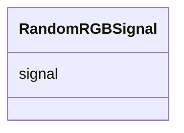

# Class: RandomRGBSignal 


_RGB value represented by a hexadecimal string value._


URI: [vega_scverse:RandomRGBSignal](https://w3id.org/scverse/vega-scverse/RandomRGBSignal)





<!-- no inheritance hierarchy -->


## Slots

| Name | Cardinality and Range | Description | Inheritance |
| ---  | --- | --- | --- |
| [signal](signal.md) | 0..1 <br/> [String](String.md) | Signal creating random RGB color for labels in a label raster | direct |


## Usages

| used by | used in | type | used |
| ---  | --- | --- | --- |
| [LabelEncodeEnter](LabelEncodeEnter.md) | [fill](fill.md) | any_of[range] | [RandomRGBSignal](RandomRGBSignal.md) |


## Identifier and Mapping Information


### Schema Source


* from schema: https://w3id.org/scverse/vega-scverse/specification


## Mappings

| Mapping Type | Mapped Value |
| ---  | ---  |
| self | vega_scverse:RandomRGBSignal |
| native | vega_scverse:RandomRGBSignal |


## LinkML Source

<!-- TODO: investigate https://stackoverflow.com/questions/37606292/how-to-create-tabbed-code-blocks-in-mkdocs-or-sphinx -->

### Direct

<details>
```yaml
name: RandomRGBSignal
description: RGB value represented by a hexadecimal string value.
from_schema: https://w3id.org/scverse/vega-scverse/specification
attributes:
  signal:
    name: signal
    description: Signal creating random RGB color for labels in a label raster.
    from_schema: https://w3id.org/scverse/vega-scverse/marks
    rank: 1000
    ifabsent: string(rgb(random()*255, random()*255, random()*255))
    domain_of:
    - RandomRGBSignal
    equals_string: rgb(random()*255, random()*255, random()*255)

```
</details>

### Induced

<details>
```yaml
name: RandomRGBSignal
description: RGB value represented by a hexadecimal string value.
from_schema: https://w3id.org/scverse/vega-scverse/specification
attributes:
  signal:
    name: signal
    description: Signal creating random RGB color for labels in a label raster.
    from_schema: https://w3id.org/scverse/vega-scverse/marks
    rank: 1000
    ifabsent: string(rgb(random()*255, random()*255, random()*255))
    alias: signal
    owner: RandomRGBSignal
    domain_of:
    - RandomRGBSignal
    range: string
    equals_string: rgb(random()*255, random()*255, random()*255)

```
</details>