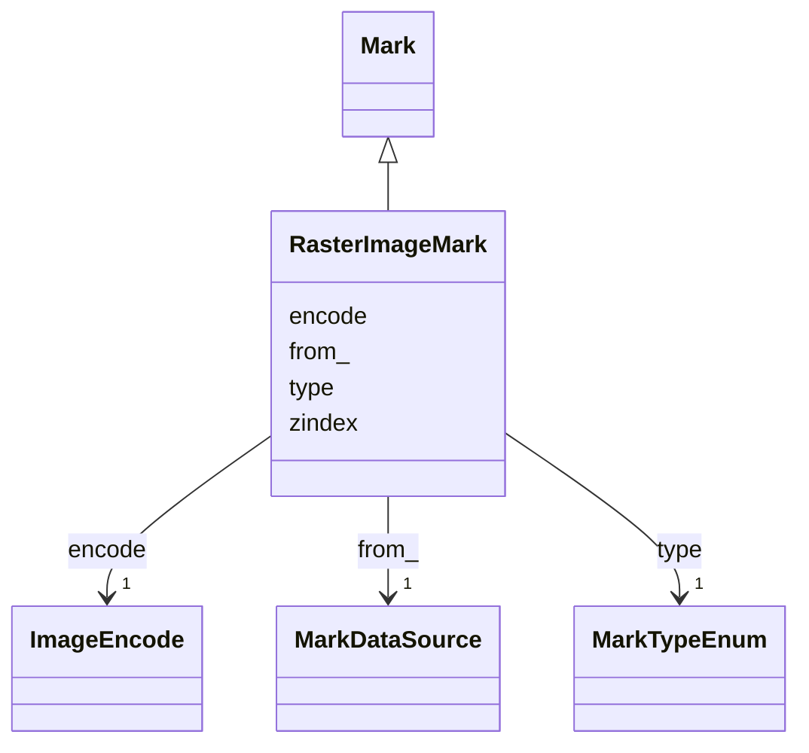

# Class: RasterImageMark 


_Graphical mark encoding an image._


URI: [vega_scverse:RasterImageMark](https://w3id.org/scverse/vega-scverse/RasterImageMark)





## Inheritance
* [Mark](Mark.md)
    * **RasterImageMark**


## Slots

| Name | Cardinality and Range | Description | Inheritance |
| ---  | --- | --- | --- |
| [type](type.md) | 1 <br/> [MarkTypeEnum](MarkTypeEnum.md) | The type of the mark | [Mark](Mark.md) |
| [from_](from_.md) | 1 <br/> [MarkDataSource](MarkDataSource.md) | The data stream used as the source for the graphical mark | [Mark](Mark.md) |
| [encode](encode.md) | 1 <br/> [ImageEncode](ImageEncode.md) | A set of visual encoding properties that determine the position and appearanc... | [Mark](Mark.md) |
| [zindex](zindex.md) | 1 <br/> [Integer](Integer.md) | An integer z-index indicating the layering order of sibling mark items | [Mark](Mark.md) |


## Identifier and Mapping Information


### Schema Source


* from schema: https://w3id.org/scverse/vega-scverse/specification


## Mappings

| Mapping Type | Mapped Value |
| ---  | ---  |
| self | vega_scverse:RasterImageMark |
| native | vega_scverse:RasterImageMark |


## LinkML Source

<!-- TODO: investigate https://stackoverflow.com/questions/37606292/how-to-create-tabbed-code-blocks-in-mkdocs-or-sphinx -->

### Direct

<details>
```yaml
name: RasterImageMark
description: Graphical mark encoding an image.
from_schema: https://w3id.org/scverse/vega-scverse/specification
is_a: Mark
slot_usage:
  type:
    name: type
    description: The type of the mark. In this case, it is always 'raster_image'
    ifabsent: string(raster_image)
    equals_string: raster_image
  encode:
    name: encode
    description: A set of visual encoding properties that determine the position and
      appearance of the raster_image mark.
    range: ImageEncode

```
</details>

### Induced

<details>
```yaml
name: RasterImageMark
description: Graphical mark encoding an image.
from_schema: https://w3id.org/scverse/vega-scverse/specification
is_a: Mark
slot_usage:
  type:
    name: type
    description: The type of the mark. In this case, it is always 'raster_image'
    ifabsent: string(raster_image)
    equals_string: raster_image
  encode:
    name: encode
    description: A set of visual encoding properties that determine the position and
      appearance of the raster_image mark.
    range: ImageEncode
attributes:
  type:
    name: type
    description: The type of the mark. In this case, it is always 'raster_image'
    from_schema: https://w3id.org/scverse/vega-scverse/marks
    ifabsent: string(raster_image)
    alias: type
    owner: RasterImageMark
    domain_of:
    - Transform
    - Format
    - Scale
    - Legend
    - Mark
    - TextMark
    - GroupMark
    range: MarkTypeEnum
    required: true
    equals_string: raster_image
  from_:
    name: from_
    description: The data stream used as the source for the graphical mark.
    from_schema: https://w3id.org/scverse/vega-scverse/marks
    rank: 1000
    alias: from_
    owner: RasterImageMark
    domain_of:
    - Mark
    range: MarkDataSource
    required: true
  encode:
    name: encode
    description: A set of visual encoding properties that determine the position and
      appearance of the raster_image mark.
    from_schema: https://w3id.org/scverse/vega-scverse/marks
    rank: 1000
    alias: encode
    owner: RasterImageMark
    domain_of:
    - Mark
    - TextMark
    - GroupMark
    range: ImageEncode
    required: true
  zindex:
    name: zindex
    description: "An integer z-index indicating the layering order of sibling mark\
      \ items. The default value is 0. Higher values \n(1) will cause marks to be\
      \ drawn on top of those with lower z-index values."
    from_schema: https://w3id.org/scverse/vega-scverse/marks
    alias: zindex
    owner: RasterImageMark
    domain_of:
    - Axis
    - Legend
    - Mark
    - TextMark
    range: integer
    required: true

```
</details>