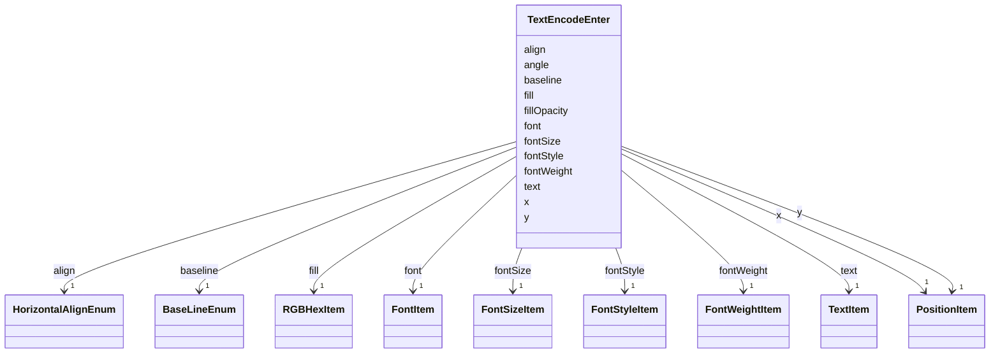

# Class: TextEncodeEnter 


_Enter properties that are evaluated when data for a text mark is processed for the first time and the _

_group mark is newly added to a scene._


URI: [vega_scverse:TextEncodeEnter](https://w3id.org/scverse/vega-scverse/TextEncodeEnter)





<!-- no inheritance hierarchy -->


## Slots

| Name | Cardinality and Range | Description | Inheritance |
| ---  | --- | --- | --- |
| [x](x.md) | 1 <br/> [PositionItem](PositionItem.md) |  | direct |
| [y](y.md) | 1 <br/> [PositionItem](PositionItem.md) |  | direct |
| [text](text.md) | 1 <br/> [TextItem](TextItem.md) |  | direct |
| [align](align.md) | 1 <br/> [HorizontalAlignEnum](HorizontalAlignEnum.md) | The horizontal text alignment relative to the text anchor point | direct |
| [angle](angle.md) | 0..1 <br/> [Float](Float.md) | The rotation angle of the text in degrees | direct |
| [baseline](baseline.md) | 1 <br/> [BaseLineEnum](BaseLineEnum.md) | The baseline attribute specifies the vertical alignment (baseline) of the tex... | direct |
| [font](font.md) | 1 <br/> [FontItem](FontItem.md) |  | direct |
| [fontSize](fontSize.md) | 1 <br/> [FontSizeItem](FontSizeItem.md) |  | direct |
| [fontWeight](fontWeight.md) | 1 <br/> [FontWeightItem](FontWeightItem.md) |  | direct |
| [fontStyle](fontStyle.md) | 1 <br/> [FontStyleItem](FontStyleItem.md) |  | direct |
| [fill](fill.md) | 1 <br/> [RGBHexItem](RGBHexItem.md) | The color of the text | direct |
| [fillOpacity](fillOpacity.md) | 0..1 <br/> [String](String.md) | Opacity of the text | direct |


## Usages

| used by | used in | type | used |
| ---  | --- | --- | --- |
| [TextEncode](TextEncode.md) | [enter](enter.md) | range | [TextEncodeEnter](TextEncodeEnter.md) |


## Identifier and Mapping Information


### Schema Source


* from schema: https://w3id.org/scverse/vega-scverse/specification


## Mappings

| Mapping Type | Mapped Value |
| ---  | ---  |
| self | vega_scverse:TextEncodeEnter |
| native | vega_scverse:TextEncodeEnter |


## LinkML Source

<!-- TODO: investigate https://stackoverflow.com/questions/37606292/how-to-create-tabbed-code-blocks-in-mkdocs-or-sphinx -->

### Direct

<details>
```yaml
name: TextEncodeEnter
description: "Enter properties that are evaluated when data for a text mark is processed\
  \ for the first time and the \ngroup mark is newly added to a scene."
from_schema: https://w3id.org/scverse/vega-scverse/specification
attributes:
  x:
    name: x
    from_schema: https://w3id.org/scverse/vega-scverse/encode
    domain_of:
    - PointsEncodeEnter
    - PathEncodeEnter
    - TextEncodeEnter
    - GroupEncodeEnter
    range: PositionItem
    required: true
  y:
    name: y
    from_schema: https://w3id.org/scverse/vega-scverse/encode
    domain_of:
    - PointsEncodeEnter
    - PathEncodeEnter
    - TextEncodeEnter
    - GroupEncodeEnter
    range: PositionItem
    required: true
  text:
    name: text
    from_schema: https://w3id.org/scverse/vega-scverse/encode
    domain_of:
    - Title
    - TextEncodeEnter
    range: TextItem
    required: true
  align:
    name: align
    description: The horizontal text alignment relative to the text anchor point.
    from_schema: https://w3id.org/scverse/vega-scverse/encode
    rank: 1000
    domain_of:
    - TextEncodeEnter
    range: HorizontalAlignEnum
    required: true
  angle:
    name: angle
    description: The rotation angle of the text in degrees.
    from_schema: https://w3id.org/scverse/vega-scverse/encode
    rank: 1000
    domain_of:
    - TextEncodeEnter
    range: float
    minimum_value: 0
    maximum_value: 359
  baseline:
    name: baseline
    description: The baseline attribute specifies the vertical alignment (baseline)
      of the text relative to its y-coordinate.
    from_schema: https://w3id.org/scverse/vega-scverse/encode
    domain_of:
    - Title
    - TextEncodeEnter
    range: BaseLineEnum
    required: true
  font:
    name: font
    from_schema: https://w3id.org/scverse/vega-scverse/encode
    domain_of:
    - Title
    - TextEncodeEnter
    range: FontItem
    required: true
  fontSize:
    name: fontSize
    from_schema: https://w3id.org/scverse/vega-scverse/encode
    domain_of:
    - Title
    - TextEncodeEnter
    range: FontSizeItem
    required: true
  fontWeight:
    name: fontWeight
    from_schema: https://w3id.org/scverse/vega-scverse/encode
    domain_of:
    - Title
    - TextEncodeEnter
    range: FontWeightItem
    required: true
  fontStyle:
    name: fontStyle
    from_schema: https://w3id.org/scverse/vega-scverse/encode
    domain_of:
    - Title
    - TextEncodeEnter
    range: FontStyleItem
    required: true
  fill:
    name: fill
    description: The color of the text
    from_schema: https://w3id.org/scverse/vega-scverse/encode
    domain_of:
    - Legend
    - ImageEncodeEnter
    - LabelEncodeEnter
    - PointsEncodeEnter
    - PathEncodeEnter
    - TextEncodeEnter
    - MarkEncodeUpdate
    range: RGBHexItem
    required: true
  fillOpacity:
    name: fillOpacity
    description: Opacity of the text.
    from_schema: https://w3id.org/scverse/vega-scverse/encode
    slot_uri: opacityValueSlot
    domain_of:
    - LabelEncodeEnter
    - PointsEncodeEnter
    - PathEncodeEnter
    - TextEncodeEnter

```
</details>

### Induced

<details>
```yaml
name: TextEncodeEnter
description: "Enter properties that are evaluated when data for a text mark is processed\
  \ for the first time and the \ngroup mark is newly added to a scene."
from_schema: https://w3id.org/scverse/vega-scverse/specification
attributes:
  x:
    name: x
    from_schema: https://w3id.org/scverse/vega-scverse/encode
    alias: x
    owner: TextEncodeEnter
    domain_of:
    - PointsEncodeEnter
    - PathEncodeEnter
    - TextEncodeEnter
    - GroupEncodeEnter
    range: PositionItem
    required: true
  y:
    name: y
    from_schema: https://w3id.org/scverse/vega-scverse/encode
    alias: y
    owner: TextEncodeEnter
    domain_of:
    - PointsEncodeEnter
    - PathEncodeEnter
    - TextEncodeEnter
    - GroupEncodeEnter
    range: PositionItem
    required: true
  text:
    name: text
    from_schema: https://w3id.org/scverse/vega-scverse/encode
    alias: text
    owner: TextEncodeEnter
    domain_of:
    - Title
    - TextEncodeEnter
    range: TextItem
    required: true
  align:
    name: align
    description: The horizontal text alignment relative to the text anchor point.
    from_schema: https://w3id.org/scverse/vega-scverse/encode
    rank: 1000
    alias: align
    owner: TextEncodeEnter
    domain_of:
    - TextEncodeEnter
    range: HorizontalAlignEnum
    required: true
  angle:
    name: angle
    description: The rotation angle of the text in degrees.
    from_schema: https://w3id.org/scverse/vega-scverse/encode
    rank: 1000
    alias: angle
    owner: TextEncodeEnter
    domain_of:
    - TextEncodeEnter
    range: float
    minimum_value: 0
    maximum_value: 359
  baseline:
    name: baseline
    description: The baseline attribute specifies the vertical alignment (baseline)
      of the text relative to its y-coordinate.
    from_schema: https://w3id.org/scverse/vega-scverse/encode
    alias: baseline
    owner: TextEncodeEnter
    domain_of:
    - Title
    - TextEncodeEnter
    range: BaseLineEnum
    required: true
  font:
    name: font
    from_schema: https://w3id.org/scverse/vega-scverse/encode
    alias: font
    owner: TextEncodeEnter
    domain_of:
    - Title
    - TextEncodeEnter
    range: FontItem
    required: true
  fontSize:
    name: fontSize
    from_schema: https://w3id.org/scverse/vega-scverse/encode
    alias: fontSize
    owner: TextEncodeEnter
    domain_of:
    - Title
    - TextEncodeEnter
    range: FontSizeItem
    required: true
  fontWeight:
    name: fontWeight
    from_schema: https://w3id.org/scverse/vega-scverse/encode
    alias: fontWeight
    owner: TextEncodeEnter
    domain_of:
    - Title
    - TextEncodeEnter
    range: FontWeightItem
    required: true
  fontStyle:
    name: fontStyle
    from_schema: https://w3id.org/scverse/vega-scverse/encode
    alias: fontStyle
    owner: TextEncodeEnter
    domain_of:
    - Title
    - TextEncodeEnter
    range: FontStyleItem
    required: true
  fill:
    name: fill
    description: The color of the text
    from_schema: https://w3id.org/scverse/vega-scverse/encode
    alias: fill
    owner: TextEncodeEnter
    domain_of:
    - Legend
    - ImageEncodeEnter
    - LabelEncodeEnter
    - PointsEncodeEnter
    - PathEncodeEnter
    - TextEncodeEnter
    - MarkEncodeUpdate
    range: RGBHexItem
    required: true
  fillOpacity:
    name: fillOpacity
    description: Opacity of the text.
    from_schema: https://w3id.org/scverse/vega-scverse/encode
    slot_uri: opacityValueSlot
    alias: fillOpacity
    owner: TextEncodeEnter
    domain_of:
    - LabelEncodeEnter
    - PointsEncodeEnter
    - PathEncodeEnter
    - TextEncodeEnter
    range: string

```
</details>