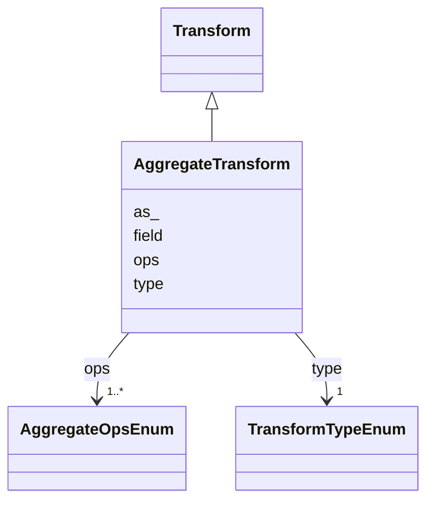

# Class: AggregateTransform 


_Group and summarize an input data stream to produce a derived output stream using particular summary statistics_

_operations, e.g. sum, average etc.._


URI: [vega_scverse:AggregateTransform](https://w3id.org/scverse/vega-scverse/AggregateTransform)





## Inheritance
* [Transform](Transform.md)
    * **AggregateTransform**


## Slots

| Name | Cardinality and Range | Description | Inheritance |
| ---  | --- | --- | --- |
| [field](field.md) | 1..* <br/> [String](String.md) | The data fields for which to compute aggregate functions | direct |
| [ops](ops.md) | 1..* <br/> [AggregateOpsEnum](AggregateOpsEnum.md) | The summary statistic to apply per field | direct |
| [as_](as_.md) | 1..* <br/> [String](String.md) | The output field names to use for each aggregated field in fields | direct |
| [type](type.md) | 1 <br/> [TransformTypeEnum](TransformTypeEnum.md) | The type of transform | [Transform](Transform.md) |


## Usages

| used by | used in | type | used |
| ---  | --- | --- | --- |
| [SpatialDataElementObject](SpatialDataElementObject.md) | [transform](transform.md) | any_of[range] | [AggregateTransform](AggregateTransform.md) |


## Identifier and Mapping Information


### Schema Source


* from schema: https://w3id.org/scverse/vega-scverse/specification


## Mappings

| Mapping Type | Mapped Value |
| ---  | ---  |
| self | vega_scverse:AggregateTransform |
| native | vega_scverse:AggregateTransform |


## LinkML Source

<!-- TODO: investigate https://stackoverflow.com/questions/37606292/how-to-create-tabbed-code-blocks-in-mkdocs-or-sphinx -->

### Direct

<details>
```yaml
name: AggregateTransform
description: 'Group and summarize an input data stream to produce a derived output
  stream using particular summary statistics

  operations, e.g. sum, average etc..'
from_schema: https://w3id.org/scverse/vega-scverse/specification
rank: 1000
is_a: Transform
slot_usage:
  type:
    name: type
    ifabsent: string(aggregate)
    equals_string: aggregate
attributes:
  field:
    name: field
    description: "The data fields for which to compute aggregate functions. This array\
      \ should align with the as \narrays."
    from_schema: https://w3id.org/scverse/vega-scverse/data
    rank: 1000
    domain_of:
    - AggregateTransform
    - SpreadTransform
    - ContinuousColorDomain
    - ColorItem
    - AxisItem
    - ConditionalFillUpdate
    range: string
    required: true
    multivalued: true
  ops:
    name: ops
    description: 'The summary statistic to apply per field. This deviates from vega
      where ops has a single string value

      while here it is an array with a length equal to ''field'' and ''as''.'
    from_schema: https://w3id.org/scverse/vega-scverse/data
    rank: 1000
    domain_of:
    - AggregateTransform
    range: AggregateOpsEnum
    required: true
    multivalued: true
  as_:
    name: as_
    description: 'The output field names to use for each aggregated field in fields.
      In the initial implementation this is

      the same as the values in ''field''.'
    from_schema: https://w3id.org/scverse/vega-scverse/data
    rank: 1000
    domain_of:
    - AggregateTransform
    - SpreadTransform
    - NormalizationFormulaTransform
    range: string
    required: true
    multivalued: true

```
</details>

### Induced

<details>
```yaml
name: AggregateTransform
description: 'Group and summarize an input data stream to produce a derived output
  stream using particular summary statistics

  operations, e.g. sum, average etc..'
from_schema: https://w3id.org/scverse/vega-scverse/specification
rank: 1000
is_a: Transform
slot_usage:
  type:
    name: type
    ifabsent: string(aggregate)
    equals_string: aggregate
attributes:
  field:
    name: field
    description: "The data fields for which to compute aggregate functions. This array\
      \ should align with the as \narrays."
    from_schema: https://w3id.org/scverse/vega-scverse/data
    rank: 1000
    alias: field
    owner: AggregateTransform
    domain_of:
    - AggregateTransform
    - SpreadTransform
    - ContinuousColorDomain
    - ColorItem
    - AxisItem
    - ConditionalFillUpdate
    range: string
    required: true
    multivalued: true
  ops:
    name: ops
    description: 'The summary statistic to apply per field. This deviates from vega
      where ops has a single string value

      while here it is an array with a length equal to ''field'' and ''as''.'
    from_schema: https://w3id.org/scverse/vega-scverse/data
    rank: 1000
    alias: ops
    owner: AggregateTransform
    domain_of:
    - AggregateTransform
    range: AggregateOpsEnum
    required: true
    multivalued: true
  as_:
    name: as_
    description: 'The output field names to use for each aggregated field in fields.
      In the initial implementation this is

      the same as the values in ''field''.'
    from_schema: https://w3id.org/scverse/vega-scverse/data
    rank: 1000
    alias: as_
    owner: AggregateTransform
    domain_of:
    - AggregateTransform
    - SpreadTransform
    - NormalizationFormulaTransform
    range: string
    required: true
    multivalued: true
  type:
    name: type
    description: The type of transform.
    from_schema: https://w3id.org/scverse/vega-scverse/data
    rank: 1000
    ifabsent: string(aggregate)
    alias: type
    owner: AggregateTransform
    domain_of:
    - Transform
    - Format
    - Scale
    - Legend
    - Mark
    - TextMark
    - GroupMark
    range: TransformTypeEnum
    required: true
    equals_string: aggregate

```
</details>