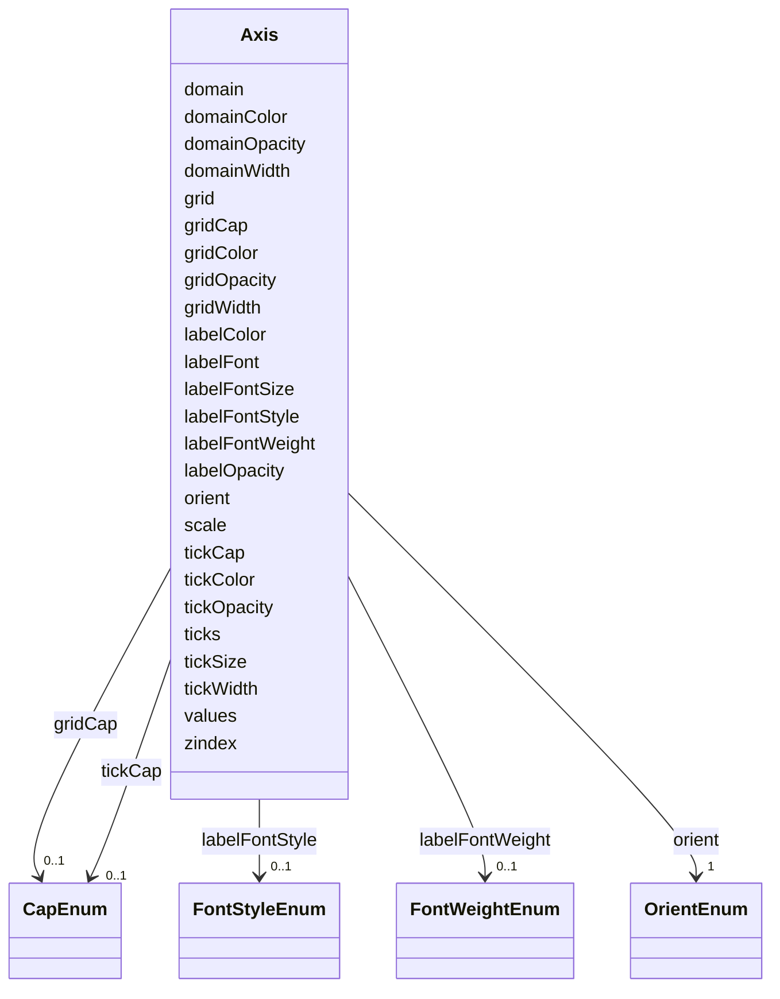

# Class: Axis 


_An axis visualizes a spatial scale mapping for cartesian coordinates using ticks, grid lines and labels._


URI: [vega_scverse:Axis](https://w3id.org/scverse/vega-scverse/Axis)





<!-- no inheritance hierarchy -->


## Slots

| Name | Cardinality and Range | Description | Inheritance |
| ---  | --- | --- | --- |
| [scale](scale.md) | 1 <br/> [String](String.md) | Name of the 'AxisScale' to visualize as axis object | direct |
| [orient](orient.md) | 1 <br/> [OrientEnum](OrientEnum.md) | The orientation of the axis, either 'left', 'right', 'top' or 'bottom' | direct |
| [domain](domain.md) | 1 <br/> [Boolean](Boolean.md) | A boolean flag indicating if the domain (the axis baseline, the line that the... | direct |
| [domainOpacity](domainOpacity.md) | 0..1 <br/> [String](String.md) | Opacity of axis domain line | direct |
| [domainColor](domainColor.md) | 0..1 <br/> [String](String.md) | Color of axis domain line | direct |
| [domainWidth](domainWidth.md) | 0..1 <br/> [Float](Float.md) | Stroke width of axis domain line | direct |
| [grid](grid.md) | 0..1 <br/> [Boolean](Boolean.md) | A boolean flag indicating if grid lines should be included as part of the axi... | direct |
| [gridOpacity](gridOpacity.md) | 0..1 <br/> [String](String.md) | Opacity of axis grid lines | direct |
| [gridCap](gridCap.md) | 0..1 <br/> [CapEnum](CapEnum.md) | The stroke cap for axis grid lines | direct |
| [gridColor](gridColor.md) | 0..1 <br/> [String](String.md) | Color of axis grid lines | direct |
| [gridWidth](gridWidth.md) | 0..1 <br/> [Float](Float.md) | Stroke width of axis grid lines | direct |
| [labelColor](labelColor.md) | 0..1 <br/> [String](String.md) | Text color of axis tick labels | direct |
| [labelOpacity](labelOpacity.md) | 0..1 <br/> [String](String.md) | Opacity of axis tick labels | direct |
| [labelFont](labelFont.md) | 0..1 <br/> [String](String.md) | Font name for axis tick labels | direct |
| [labelFontSize](labelFontSize.md) | 0..1 <br/> [Float](Float.md) | Font size of axis tick labels | direct |
| [labelFontStyle](labelFontStyle.md) | 0..1 <br/> [FontStyleEnum](FontStyleEnum.md) | Font style of axis tick labels | direct |
| [labelFontWeight](labelFontWeight.md) | 0..1 <br/> [FontWeightEnum](FontWeightEnum.md) | Font weight of axis tick labels | direct |
| [ticks](ticks.md) | 0..1 <br/> [Boolean](Boolean.md) | A boolean flag indicating if ticks should be included as part of the axis | direct |
| [tickOpacity](tickOpacity.md) | 0..1 <br/> [String](String.md) | Opacity of axis ticks | direct |
| [tickColor](tickColor.md) | 0..1 <br/> [String](String.md) | Color of axis ticks | direct |
| [tickCap](tickCap.md) | 0..1 <br/> [CapEnum](CapEnum.md) | The stroke cap for axis tick marks | direct |
| [tickWidth](tickWidth.md) | 0..1 <br/> [String](String.md) | Width in pixels of axis ticks | direct |
| [tickSize](tickSize.md) | 0..1 <br/> [String](String.md) | The length in pixels of axis ticks | direct |
| [values](values.md) | 1..* <br/> [String](String.md)&nbsp;or&nbsp;<br />[Float](Float.md)&nbsp;or&nbsp;<br />[Integer](Integer.md) | Explicitly set the visible axis tick and label values | direct |
| [zindex](zindex.md) | 1 <br/> [Float](Float.md) | The integer z-index indicating the layering of the axis group relative to oth... | direct |


## Usages

| used by | used in | type | used |
| ---  | --- | --- | --- |
| [ViewConfiguration](ViewConfiguration.md) | [axes](axes.md) | range | [Axis](Axis.md) |
| [GroupMark](GroupMark.md) | [axes](axes.md) | range | [Axis](Axis.md) |


## Identifier and Mapping Information


### Schema Source


* from schema: https://w3id.org/scverse/vega-scverse/specification


## Mappings

| Mapping Type | Mapped Value |
| ---  | ---  |
| self | vega_scverse:Axis |
| native | vega_scverse:Axis |


## LinkML Source

<!-- TODO: investigate https://stackoverflow.com/questions/37606292/how-to-create-tabbed-code-blocks-in-mkdocs-or-sphinx -->

### Direct

<details>
```yaml
name: Axis
description: An axis visualizes a spatial scale mapping for cartesian coordinates
  using ticks, grid lines and labels.
from_schema: https://w3id.org/scverse/vega-scverse/specification
rank: 1000
attributes:
  scale:
    name: scale
    description: Name of the 'AxisScale' to visualize as axis object.
    from_schema: https://w3id.org/scverse/vega-scverse/axes
    rank: 1000
    domain_of:
    - Axis
    - ColorItem
    - AxisItem
    - ConditionalFillUpdate
    required: true
    pattern: ^[XY]_scale(_\d+)?$
  orient:
    name: orient
    description: The orientation of the axis, either 'left', 'right', 'top' or 'bottom'.
    from_schema: https://w3id.org/scverse/vega-scverse/axes
    rank: 1000
    domain_of:
    - Axis
    - Legend
    - Title
    range: OrientEnum
    required: true
  domain:
    name: domain
    description: "A boolean flag indicating if the domain (the axis baseline, the\
      \ line that the ticks connect to) should be \nincluded as part of the axis."
    from_schema: https://w3id.org/scverse/vega-scverse/axes
    domain_of:
    - BaseAxisScale
    - LinearColorScale
    - BaseCategoricalColorScale
    - Axis
    range: boolean
    required: true
  domainOpacity:
    name: domainOpacity
    description: Opacity of axis domain line.
    from_schema: https://w3id.org/scverse/vega-scverse/axes
    rank: 1000
    slot_uri: opacityValueSlot
    domain_of:
    - Axis
  domainColor:
    name: domainColor
    description: Color of axis domain line.
    from_schema: https://w3id.org/scverse/vega-scverse/axes
    rank: 1000
    slot_uri: rgbHexSlot
    domain_of:
    - Axis
  domainWidth:
    name: domainWidth
    description: Stroke width of axis domain line.
    from_schema: https://w3id.org/scverse/vega-scverse/axes
    rank: 1000
    domain_of:
    - Axis
    range: float
  grid:
    name: grid
    description: A boolean flag indicating if grid lines should be included as part
      of the axis.
    from_schema: https://w3id.org/scverse/vega-scverse/axes
    rank: 1000
    ifabsent: 'False'
    domain_of:
    - Axis
    range: boolean
  gridOpacity:
    name: gridOpacity
    description: Opacity of axis grid lines.
    from_schema: https://w3id.org/scverse/vega-scverse/axes
    rank: 1000
    slot_uri: opacityValueSlot
    domain_of:
    - Axis
  gridCap:
    name: gridCap
    description: The stroke cap for axis grid lines. One of 'butt' (default), 'round'
      or 'square'.
    from_schema: https://w3id.org/scverse/vega-scverse/axes
    rank: 1000
    domain_of:
    - Axis
    range: CapEnum
  gridColor:
    name: gridColor
    description: Color of axis grid lines.
    from_schema: https://w3id.org/scverse/vega-scverse/axes
    rank: 1000
    slot_uri: rgbHexSlot
    domain_of:
    - Axis
  gridWidth:
    name: gridWidth
    description: Stroke width of axis grid lines.
    from_schema: https://w3id.org/scverse/vega-scverse/axes
    rank: 1000
    domain_of:
    - Axis
    range: float
  labelColor:
    name: labelColor
    description: Text color of axis tick labels.
    from_schema: https://w3id.org/scverse/vega-scverse/axes
    rank: 1000
    slot_uri: rgbHexSlot
    domain_of:
    - Axis
    - Legend
  labelOpacity:
    name: labelOpacity
    description: Opacity of axis tick labels.
    from_schema: https://w3id.org/scverse/vega-scverse/axes
    rank: 1000
    slot_uri: opacityValueSlot
    domain_of:
    - Axis
    - Legend
  labelFont:
    name: labelFont
    description: Font name for axis tick labels.
    from_schema: https://w3id.org/scverse/vega-scverse/axes
    rank: 1000
    domain_of:
    - Axis
    - Legend
    range: string
  labelFontSize:
    name: labelFontSize
    description: Font size of axis tick labels.
    from_schema: https://w3id.org/scverse/vega-scverse/axes
    rank: 1000
    domain_of:
    - Axis
    - Legend
    range: float
  labelFontStyle:
    name: labelFontStyle
    description: Font style of axis tick labels
    from_schema: https://w3id.org/scverse/vega-scverse/axes
    rank: 1000
    domain_of:
    - Axis
    - Legend
    range: FontStyleEnum
  labelFontWeight:
    name: labelFontWeight
    description: Font weight of axis tick labels.
    from_schema: https://w3id.org/scverse/vega-scverse/axes
    rank: 1000
    domain_of:
    - Axis
    - Legend
    range: FontWeightEnum
  ticks:
    name: ticks
    description: A boolean flag indicating if ticks should be included as part of
      the axis.
    from_schema: https://w3id.org/scverse/vega-scverse/axes
    rank: 1000
    ifabsent: 'True'
    domain_of:
    - Axis
    range: boolean
  tickOpacity:
    name: tickOpacity
    description: Opacity of axis ticks.
    from_schema: https://w3id.org/scverse/vega-scverse/axes
    rank: 1000
    slot_uri: opacityValueSlot
    domain_of:
    - Axis
  tickColor:
    name: tickColor
    description: Color of axis ticks.
    from_schema: https://w3id.org/scverse/vega-scverse/axes
    rank: 1000
    slot_uri: rgbHexSlot
    domain_of:
    - Axis
  tickCap:
    name: tickCap
    description: The stroke cap for axis tick marks. One of "butt" (default), "round"
      or "square".
    from_schema: https://w3id.org/scverse/vega-scverse/axes
    rank: 1000
    domain_of:
    - Axis
    range: CapEnum
  tickWidth:
    name: tickWidth
    description: Width in pixels of axis ticks.
    from_schema: https://w3id.org/scverse/vega-scverse/axes
    rank: 1000
    slot_uri: nonNegativeFloatSlot
    domain_of:
    - Axis
  tickSize:
    name: tickSize
    description: The length in pixels of axis ticks.
    from_schema: https://w3id.org/scverse/vega-scverse/axes
    rank: 1000
    slot_uri: nonNegativeFloatSlot
    domain_of:
    - Axis
  values:
    name: values
    description: "Explicitly set the visible axis tick and label values. The array\
      \ entries should be legal values in the \nbacking scale domain."
    from_schema: https://w3id.org/scverse/vega-scverse/axes
    rank: 1000
    domain_of:
    - Axis
    required: true
    multivalued: true
    any_of:
    - range: float
    - range: integer
  zindex:
    name: zindex
    description: "The integer z-index indicating the layering of the axis group relative\
      \ to other axis, mark, and legend groups. \nThe default value is 0 and axes\
      \ and grid lines are drawn behind any marks defined in the same specification\
      \ \nlevel. Higher values (1) will cause axes and grid lines to be drawn on top\
      \ of marks."
    from_schema: https://w3id.org/scverse/vega-scverse/axes
    rank: 1000
    domain_of:
    - Axis
    - Legend
    - Mark
    - TextMark
    range: float
    required: true

```
</details>

### Induced

<details>
```yaml
name: Axis
description: An axis visualizes a spatial scale mapping for cartesian coordinates
  using ticks, grid lines and labels.
from_schema: https://w3id.org/scverse/vega-scverse/specification
rank: 1000
attributes:
  scale:
    name: scale
    description: Name of the 'AxisScale' to visualize as axis object.
    from_schema: https://w3id.org/scverse/vega-scverse/axes
    rank: 1000
    alias: scale
    owner: Axis
    domain_of:
    - Axis
    - ColorItem
    - AxisItem
    - ConditionalFillUpdate
    range: string
    required: true
    pattern: ^[XY]_scale(_\d+)?$
  orient:
    name: orient
    description: The orientation of the axis, either 'left', 'right', 'top' or 'bottom'.
    from_schema: https://w3id.org/scverse/vega-scverse/axes
    rank: 1000
    alias: orient
    owner: Axis
    domain_of:
    - Axis
    - Legend
    - Title
    range: OrientEnum
    required: true
  domain:
    name: domain
    description: "A boolean flag indicating if the domain (the axis baseline, the\
      \ line that the ticks connect to) should be \nincluded as part of the axis."
    from_schema: https://w3id.org/scverse/vega-scverse/axes
    alias: domain
    owner: Axis
    domain_of:
    - BaseAxisScale
    - LinearColorScale
    - BaseCategoricalColorScale
    - Axis
    range: boolean
    required: true
  domainOpacity:
    name: domainOpacity
    description: Opacity of axis domain line.
    from_schema: https://w3id.org/scverse/vega-scverse/axes
    rank: 1000
    slot_uri: opacityValueSlot
    alias: domainOpacity
    owner: Axis
    domain_of:
    - Axis
    range: string
  domainColor:
    name: domainColor
    description: Color of axis domain line.
    from_schema: https://w3id.org/scverse/vega-scverse/axes
    rank: 1000
    slot_uri: rgbHexSlot
    alias: domainColor
    owner: Axis
    domain_of:
    - Axis
    range: string
  domainWidth:
    name: domainWidth
    description: Stroke width of axis domain line.
    from_schema: https://w3id.org/scverse/vega-scverse/axes
    rank: 1000
    alias: domainWidth
    owner: Axis
    domain_of:
    - Axis
    range: float
  grid:
    name: grid
    description: A boolean flag indicating if grid lines should be included as part
      of the axis.
    from_schema: https://w3id.org/scverse/vega-scverse/axes
    rank: 1000
    ifabsent: 'False'
    alias: grid
    owner: Axis
    domain_of:
    - Axis
    range: boolean
  gridOpacity:
    name: gridOpacity
    description: Opacity of axis grid lines.
    from_schema: https://w3id.org/scverse/vega-scverse/axes
    rank: 1000
    slot_uri: opacityValueSlot
    alias: gridOpacity
    owner: Axis
    domain_of:
    - Axis
    range: string
  gridCap:
    name: gridCap
    description: The stroke cap for axis grid lines. One of 'butt' (default), 'round'
      or 'square'.
    from_schema: https://w3id.org/scverse/vega-scverse/axes
    rank: 1000
    alias: gridCap
    owner: Axis
    domain_of:
    - Axis
    range: CapEnum
  gridColor:
    name: gridColor
    description: Color of axis grid lines.
    from_schema: https://w3id.org/scverse/vega-scverse/axes
    rank: 1000
    slot_uri: rgbHexSlot
    alias: gridColor
    owner: Axis
    domain_of:
    - Axis
    range: string
  gridWidth:
    name: gridWidth
    description: Stroke width of axis grid lines.
    from_schema: https://w3id.org/scverse/vega-scverse/axes
    rank: 1000
    alias: gridWidth
    owner: Axis
    domain_of:
    - Axis
    range: float
  labelColor:
    name: labelColor
    description: Text color of axis tick labels.
    from_schema: https://w3id.org/scverse/vega-scverse/axes
    rank: 1000
    slot_uri: rgbHexSlot
    alias: labelColor
    owner: Axis
    domain_of:
    - Axis
    - Legend
    range: string
  labelOpacity:
    name: labelOpacity
    description: Opacity of axis tick labels.
    from_schema: https://w3id.org/scverse/vega-scverse/axes
    rank: 1000
    slot_uri: opacityValueSlot
    alias: labelOpacity
    owner: Axis
    domain_of:
    - Axis
    - Legend
    range: string
  labelFont:
    name: labelFont
    description: Font name for axis tick labels.
    from_schema: https://w3id.org/scverse/vega-scverse/axes
    rank: 1000
    alias: labelFont
    owner: Axis
    domain_of:
    - Axis
    - Legend
    range: string
  labelFontSize:
    name: labelFontSize
    description: Font size of axis tick labels.
    from_schema: https://w3id.org/scverse/vega-scverse/axes
    rank: 1000
    alias: labelFontSize
    owner: Axis
    domain_of:
    - Axis
    - Legend
    range: float
  labelFontStyle:
    name: labelFontStyle
    description: Font style of axis tick labels
    from_schema: https://w3id.org/scverse/vega-scverse/axes
    rank: 1000
    alias: labelFontStyle
    owner: Axis
    domain_of:
    - Axis
    - Legend
    range: FontStyleEnum
  labelFontWeight:
    name: labelFontWeight
    description: Font weight of axis tick labels.
    from_schema: https://w3id.org/scverse/vega-scverse/axes
    rank: 1000
    alias: labelFontWeight
    owner: Axis
    domain_of:
    - Axis
    - Legend
    range: FontWeightEnum
  ticks:
    name: ticks
    description: A boolean flag indicating if ticks should be included as part of
      the axis.
    from_schema: https://w3id.org/scverse/vega-scverse/axes
    rank: 1000
    ifabsent: 'True'
    alias: ticks
    owner: Axis
    domain_of:
    - Axis
    range: boolean
  tickOpacity:
    name: tickOpacity
    description: Opacity of axis ticks.
    from_schema: https://w3id.org/scverse/vega-scverse/axes
    rank: 1000
    slot_uri: opacityValueSlot
    alias: tickOpacity
    owner: Axis
    domain_of:
    - Axis
    range: string
  tickColor:
    name: tickColor
    description: Color of axis ticks.
    from_schema: https://w3id.org/scverse/vega-scverse/axes
    rank: 1000
    slot_uri: rgbHexSlot
    alias: tickColor
    owner: Axis
    domain_of:
    - Axis
    range: string
  tickCap:
    name: tickCap
    description: The stroke cap for axis tick marks. One of "butt" (default), "round"
      or "square".
    from_schema: https://w3id.org/scverse/vega-scverse/axes
    rank: 1000
    alias: tickCap
    owner: Axis
    domain_of:
    - Axis
    range: CapEnum
  tickWidth:
    name: tickWidth
    description: Width in pixels of axis ticks.
    from_schema: https://w3id.org/scverse/vega-scverse/axes
    rank: 1000
    slot_uri: nonNegativeFloatSlot
    alias: tickWidth
    owner: Axis
    domain_of:
    - Axis
    range: string
  tickSize:
    name: tickSize
    description: The length in pixels of axis ticks.
    from_schema: https://w3id.org/scverse/vega-scverse/axes
    rank: 1000
    slot_uri: nonNegativeFloatSlot
    alias: tickSize
    owner: Axis
    domain_of:
    - Axis
    range: string
  values:
    name: values
    description: "Explicitly set the visible axis tick and label values. The array\
      \ entries should be legal values in the \nbacking scale domain."
    from_schema: https://w3id.org/scverse/vega-scverse/axes
    rank: 1000
    alias: values
    owner: Axis
    domain_of:
    - Axis
    range: string
    required: true
    multivalued: true
    any_of:
    - range: float
    - range: integer
  zindex:
    name: zindex
    description: "The integer z-index indicating the layering of the axis group relative\
      \ to other axis, mark, and legend groups. \nThe default value is 0 and axes\
      \ and grid lines are drawn behind any marks defined in the same specification\
      \ \nlevel. Higher values (1) will cause axes and grid lines to be drawn on top\
      \ of marks."
    from_schema: https://w3id.org/scverse/vega-scverse/axes
    rank: 1000
    alias: zindex
    owner: Axis
    domain_of:
    - Axis
    - Legend
    - Mark
    - TextMark
    range: float
    required: true

```
</details>