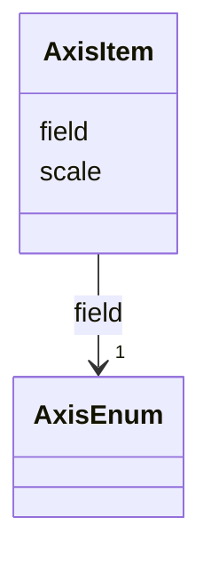

# Class: AxisItem 


_A axis item which for a mark can define the scale and field used for the axis definition in the mark._


URI: [vega_scverse:AxisItem](https://w3id.org/scverse/vega-scverse/AxisItem)





<!-- no inheritance hierarchy -->


## Slots

| Name | Cardinality and Range | Description | Inheritance |
| ---  | --- | --- | --- |
| [scale](scale.md) | 1 <br/> [String](String.md) | The scale on which the axis is based | direct |
| [field](field.md) | 1 <br/> [AxisEnum](AxisEnum.md) | The mark's field value transformed by the scale | direct |


## Usages

| used by | used in | type | used |
| ---  | --- | --- | --- |
| [PointsEncodeEnter](PointsEncodeEnter.md) | [x](x.md) | range | [AxisItem](AxisItem.md) |
| [PointsEncodeEnter](PointsEncodeEnter.md) | [y](y.md) | range | [AxisItem](AxisItem.md) |
| [PathEncodeEnter](PathEncodeEnter.md) | [x](x.md) | range | [AxisItem](AxisItem.md) |
| [PathEncodeEnter](PathEncodeEnter.md) | [y](y.md) | range | [AxisItem](AxisItem.md) |


## Identifier and Mapping Information


### Schema Source


* from schema: https://w3id.org/scverse/vega-scverse/specification


## Mappings

| Mapping Type | Mapped Value |
| ---  | ---  |
| self | vega_scverse:AxisItem |
| native | vega_scverse:AxisItem |


## LinkML Source

<!-- TODO: investigate https://stackoverflow.com/questions/37606292/how-to-create-tabbed-code-blocks-in-mkdocs-or-sphinx -->

### Direct

<details>
```yaml
name: AxisItem
description: A axis item which for a mark can define the scale and field used for
  the axis definition in the mark.
from_schema: https://w3id.org/scverse/vega-scverse/specification
rank: 1000
attributes:
  scale:
    name: scale
    description: The scale on which the axis is based.
    from_schema: https://w3id.org/scverse/vega-scverse/marks
    domain_of:
    - Axis
    - ColorItem
    - AxisItem
    - ConditionalFillUpdate
    required: true
    pattern: ^[XY]_scale(_\d+)?$
  field:
    name: field
    description: The mark's field value transformed by the scale. Either x or y.
    from_schema: https://w3id.org/scverse/vega-scverse/marks
    domain_of:
    - AggregateTransform
    - SpreadTransform
    - ContinuousColorDomain
    - ColorItem
    - AxisItem
    - ConditionalFillUpdate
    range: AxisEnum
    required: true

```
</details>

### Induced

<details>
```yaml
name: AxisItem
description: A axis item which for a mark can define the scale and field used for
  the axis definition in the mark.
from_schema: https://w3id.org/scverse/vega-scverse/specification
rank: 1000
attributes:
  scale:
    name: scale
    description: The scale on which the axis is based.
    from_schema: https://w3id.org/scverse/vega-scverse/marks
    alias: scale
    owner: AxisItem
    domain_of:
    - Axis
    - ColorItem
    - AxisItem
    - ConditionalFillUpdate
    range: string
    required: true
    pattern: ^[XY]_scale(_\d+)?$
  field:
    name: field
    description: The mark's field value transformed by the scale. Either x or y.
    from_schema: https://w3id.org/scverse/vega-scverse/marks
    alias: field
    owner: AxisItem
    domain_of:
    - AggregateTransform
    - SpreadTransform
    - ContinuousColorDomain
    - ColorItem
    - AxisItem
    - ConditionalFillUpdate
    range: AxisEnum
    required: true

```
</details>