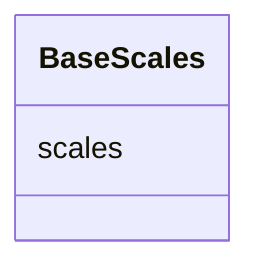

# Class: BaseScales 


_Vega like definition for scales which specifies a collection of mappings from a data domain_

_(e.g., numbers, categories, dates) to a visual range (e.g., position on the screen, color spectrum, size)._

_Due to LinkML currently not supporting assigning classes as values for ranged in any_of, this class_

_should be used as an abstract base class._


* __NOTE__: this is an abstract class and should not be instantiated directly


URI: [vega_scverse:BaseScales](https://w3id.org/scverse/vega-scverse/BaseScales)





<!-- no inheritance hierarchy -->


## Slots

| Name | Cardinality and Range | Description | Inheritance |
| ---  | --- | --- | --- |
| [scales](scales.md) | * <br/> [String](String.md)&nbsp;or&nbsp;<br />[BaseAxisScale](BaseAxisScale.md)&nbsp;or&nbsp;<br />[BaseCategoricalColorScale](BaseCategoricalColorScale.md)&nbsp;or&nbsp;<br />[LinearColorScale](LinearColorScale.md) |  | direct |


## Usages

| used by | used in | type | used |
| ---  | --- | --- | --- |
| [ViewConfiguration](ViewConfiguration.md) | [scales](scales.md) | range | [BaseScales](BaseScales.md) |


## Identifier and Mapping Information


### Schema Source


* from schema: https://w3id.org/scverse/vega-scverse/specification


## Mappings

| Mapping Type | Mapped Value |
| ---  | ---  |
| self | vega_scverse:BaseScales |
| native | vega_scverse:BaseScales |


## LinkML Source

<!-- TODO: investigate https://stackoverflow.com/questions/37606292/how-to-create-tabbed-code-blocks-in-mkdocs-or-sphinx -->

### Direct

<details>
```yaml
name: BaseScales
description: 'Vega like definition for scales which specifies a collection of mappings
  from a data domain

  (e.g., numbers, categories, dates) to a visual range (e.g., position on the screen,
  color spectrum, size).

  Due to LinkML currently not supporting assigning classes as values for ranged in
  any_of, this class

  should be used as an abstract base class.'
from_schema: https://w3id.org/scverse/vega-scverse/specification
rank: 1000
abstract: true
attributes:
  scales:
    name: scales
    from_schema: https://w3id.org/scverse/vega-scverse/scales
    domain_of:
    - ViewConfiguration
    - BaseScales
    - GroupMark
    multivalued: true
    any_of:
    - range: BaseAxisScale
    - range: BaseCategoricalColorScale
    - range: LinearColorScale

```
</details>

### Induced

<details>
```yaml
name: BaseScales
description: 'Vega like definition for scales which specifies a collection of mappings
  from a data domain

  (e.g., numbers, categories, dates) to a visual range (e.g., position on the screen,
  color spectrum, size).

  Due to LinkML currently not supporting assigning classes as values for ranged in
  any_of, this class

  should be used as an abstract base class.'
from_schema: https://w3id.org/scverse/vega-scverse/specification
rank: 1000
abstract: true
attributes:
  scales:
    name: scales
    from_schema: https://w3id.org/scverse/vega-scverse/scales
    alias: scales
    owner: BaseScales
    domain_of:
    - ViewConfiguration
    - BaseScales
    - GroupMark
    range: string
    multivalued: true
    any_of:
    - range: BaseAxisScale
    - range: BaseCategoricalColorScale
    - range: LinearColorScale

```
</details>