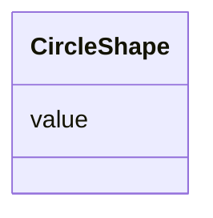

# Class: CircleShape 


_Circle shape definition used in symbol mark._


URI: [vega_scverse:CircleShape](https://w3id.org/scverse/vega-scverse/CircleShape)





<!-- no inheritance hierarchy -->


## Slots

| Name | Cardinality and Range | Description | Inheritance |
| ---  | --- | --- | --- |
| [value](value.md) | 0..1 <br/> [String](String.md) | Type of shape, in this case circle | direct |


## Usages

| used by | used in | type | used |
| ---  | --- | --- | --- |
| [PointsEncodeEnter](PointsEncodeEnter.md) | [shape](shape.md) | range | [CircleShape](CircleShape.md) |


## Identifier and Mapping Information


### Schema Source


* from schema: https://w3id.org/scverse/vega-scverse/specification


## Mappings

| Mapping Type | Mapped Value |
| ---  | ---  |
| self | vega_scverse:CircleShape |
| native | vega_scverse:CircleShape |


## LinkML Source

<!-- TODO: investigate https://stackoverflow.com/questions/37606292/how-to-create-tabbed-code-blocks-in-mkdocs-or-sphinx -->

### Direct

<details>
```yaml
name: CircleShape
description: Circle shape definition used in symbol mark.
from_schema: https://w3id.org/scverse/vega-scverse/specification
rank: 1000
attributes:
  value:
    name: value
    description: Type of shape, in this case circle.
    from_schema: https://w3id.org/scverse/vega-scverse/marks
    ifabsent: string(circle)
    domain_of:
    - PositionItem
    - TextItem
    - baselineItem
    - FontItem
    - FontSizeItem
    - FontWeightItem
    - FontStyleItem
    - RGBHexItem
    - CircleShape
    equals_string: circle

```
</details>

### Induced

<details>
```yaml
name: CircleShape
description: Circle shape definition used in symbol mark.
from_schema: https://w3id.org/scverse/vega-scverse/specification
rank: 1000
attributes:
  value:
    name: value
    description: Type of shape, in this case circle.
    from_schema: https://w3id.org/scverse/vega-scverse/marks
    ifabsent: string(circle)
    alias: value
    owner: CircleShape
    domain_of:
    - PositionItem
    - TextItem
    - baselineItem
    - FontItem
    - FontSizeItem
    - FontWeightItem
    - FontStyleItem
    - RGBHexItem
    - CircleShape
    range: string
    equals_string: circle

```
</details>