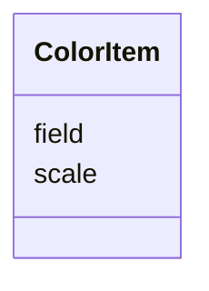

# Class: ColorItem 


_A single color item definition specifying the scale on which the color is based and the value / field_

_to which to apply the color._


URI: [vega_scverse:ColorItem](https://w3id.org/scverse/vega-scverse/ColorItem)





<!-- no inheritance hierarchy -->


## Slots

| Name | Cardinality and Range | Description | Inheritance |
| ---  | --- | --- | --- |
| [scale](scale.md) | 1 <br/> [String](String.md) | The color scale | direct |
| [field](field.md) | 1 <br/> [String](String.md) | The value or field to which to apply the color | direct |


## Usages

| used by | used in | type | used |
| ---  | --- | --- | --- |
| [ImageEncodeEnter](ImageEncodeEnter.md) | [fill](fill.md) | range | [ColorItem](ColorItem.md) |
| [LabelEncodeEnter](LabelEncodeEnter.md) | [stroke](stroke.md) | range | [ColorItem](ColorItem.md) |
| [LabelEncodeEnter](LabelEncodeEnter.md) | [fill](fill.md) | any_of[range] | [ColorItem](ColorItem.md) |
| [PointsEncodeEnter](PointsEncodeEnter.md) | [stroke](stroke.md) | any_of[range] | [ColorItem](ColorItem.md) |
| [PointsEncodeEnter](PointsEncodeEnter.md) | [fill](fill.md) | any_of[range] | [ColorItem](ColorItem.md) |
| [PathEncodeEnter](PathEncodeEnter.md) | [fill](fill.md) | any_of[range] | [ColorItem](ColorItem.md) |


## Identifier and Mapping Information


### Schema Source


* from schema: https://w3id.org/scverse/vega-scverse/specification


## Mappings

| Mapping Type | Mapped Value |
| ---  | ---  |
| self | vega_scverse:ColorItem |
| native | vega_scverse:ColorItem |


## LinkML Source

<!-- TODO: investigate https://stackoverflow.com/questions/37606292/how-to-create-tabbed-code-blocks-in-mkdocs-or-sphinx -->

### Direct

<details>
```yaml
name: ColorItem
description: 'A single color item definition specifying the scale on which the color
  is based and the value / field

  to which to apply the color.'
from_schema: https://w3id.org/scverse/vega-scverse/specification
rank: 1000
attributes:
  scale:
    name: scale
    description: The color scale.
    from_schema: https://w3id.org/scverse/vega-scverse/marks
    domain_of:
    - Axis
    - ColorItem
    - AxisItem
    - ConditionalFillUpdate
    required: true
    pattern: ^color_[0-9a-fA-F]{8}-[0-9a-fA-F]{4}-[0-9a-fA-F]{4}-[0-9a-fA-F]{4}-[0-9a-fA-F]{12}$
  field:
    name: field
    description: The value or field to which to apply the color.
    from_schema: https://w3id.org/scverse/vega-scverse/marks
    domain_of:
    - AggregateTransform
    - SpreadTransform
    - ContinuousColorDomain
    - ColorItem
    - AxisItem
    - ConditionalFillUpdate
    range: string
    required: true

```
</details>

### Induced

<details>
```yaml
name: ColorItem
description: 'A single color item definition specifying the scale on which the color
  is based and the value / field

  to which to apply the color.'
from_schema: https://w3id.org/scverse/vega-scverse/specification
rank: 1000
attributes:
  scale:
    name: scale
    description: The color scale.
    from_schema: https://w3id.org/scverse/vega-scverse/marks
    alias: scale
    owner: ColorItem
    domain_of:
    - Axis
    - ColorItem
    - AxisItem
    - ConditionalFillUpdate
    range: string
    required: true
    pattern: ^color_[0-9a-fA-F]{8}-[0-9a-fA-F]{4}-[0-9a-fA-F]{4}-[0-9a-fA-F]{4}-[0-9a-fA-F]{12}$
  field:
    name: field
    description: The value or field to which to apply the color.
    from_schema: https://w3id.org/scverse/vega-scverse/marks
    alias: field
    owner: ColorItem
    domain_of:
    - AggregateTransform
    - SpreadTransform
    - ContinuousColorDomain
    - ColorItem
    - AxisItem
    - ConditionalFillUpdate
    range: string
    required: true

```
</details>