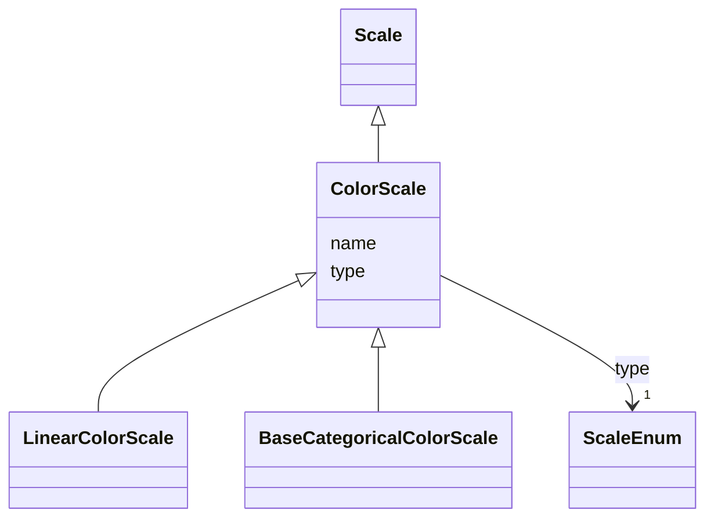

# Class: ColorScale 


_Abstract class to map a data domain to a color range. Not to be used on its own._


* __NOTE__: this is an abstract class and should not be instantiated directly


URI: [vega_scverse:ColorScale](https://w3id.org/scverse/vega-scverse/ColorScale)





## Inheritance
* [Scale](Scale.md)
    * **ColorScale**
        * [LinearColorScale](LinearColorScale.md)
        * [BaseCategoricalColorScale](BaseCategoricalColorScale.md)


## Slots

| Name | Cardinality and Range | Description | Inheritance |
| ---  | --- | --- | --- |
| [name](name.md) | 1 <br/> [String](String.md) | color followed by '_pseudoUUID' used to refer to this scale elsewhere in the ... | [Scale](Scale.md) |
| [type](type.md) | 1 <br/> [ScaleEnum](ScaleEnum.md) | The type of scale which is a description of what kind of mapping is performed... | [Scale](Scale.md) |


## Identifier and Mapping Information


### Schema Source


* from schema: https://w3id.org/scverse/vega-scverse/specification


## Mappings

| Mapping Type | Mapped Value |
| ---  | ---  |
| self | vega_scverse:ColorScale |
| native | vega_scverse:ColorScale |


## LinkML Source

<!-- TODO: investigate https://stackoverflow.com/questions/37606292/how-to-create-tabbed-code-blocks-in-mkdocs-or-sphinx -->

### Direct

<details>
```yaml
name: ColorScale
description: Abstract class to map a data domain to a color range. Not to be used
  on its own.
from_schema: https://w3id.org/scverse/vega-scverse/specification
rank: 1000
is_a: Scale
abstract: true
slot_usage:
  name:
    name: name
    description: color followed by '_pseudoUUID' used to refer to this scale elsewhere
      in the view configuration.
    pattern: ^color_[0-9a-fA-F]{8}-[0-9a-fA-F]{4}-[0-9a-fA-F]{4}-[0-9a-fA-F]{4}-[0-9a-fA-F]{12}$

```
</details>

### Induced

<details>
```yaml
name: ColorScale
description: Abstract class to map a data domain to a color range. Not to be used
  on its own.
from_schema: https://w3id.org/scverse/vega-scverse/specification
rank: 1000
is_a: Scale
abstract: true
slot_usage:
  name:
    name: name
    description: color followed by '_pseudoUUID' used to refer to this scale elsewhere
      in the view configuration.
    pattern: ^color_[0-9a-fA-F]{8}-[0-9a-fA-F]{4}-[0-9a-fA-F]{4}-[0-9a-fA-F]{4}-[0-9a-fA-F]{12}$
attributes:
  name:
    name: name
    description: color followed by '_pseudoUUID' used to refer to this scale elsewhere
      in the view configuration.
    from_schema: https://w3id.org/scverse/vega-scverse/scales
    identifier: true
    alias: name
    owner: ColorScale
    domain_of:
    - DataObject
    - Scale
    range: string
    required: true
    pattern: ^color_[0-9a-fA-F]{8}-[0-9a-fA-F]{4}-[0-9a-fA-F]{4}-[0-9a-fA-F]{4}-[0-9a-fA-F]{12}$
  type:
    name: type
    description: "The type of scale which is a description of what kind of mapping\
      \ is performed between data domain and \nvisual range, e.g. `linear`."
    from_schema: https://w3id.org/scverse/vega-scverse/scales
    alias: type
    owner: ColorScale
    domain_of:
    - Transform
    - Format
    - Scale
    - Legend
    - Mark
    - TextMark
    - GroupMark
    range: ScaleEnum
    required: true

```
</details>