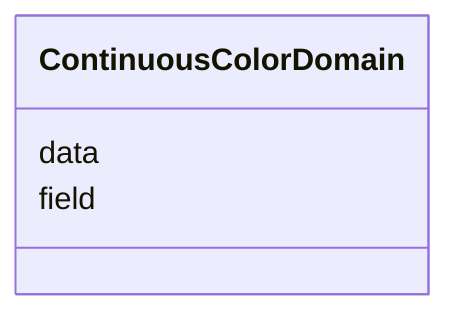

# Class: ContinuousColorDomain 


_A data domain or source for a LinearColorScale._


URI: [vega_scverse:ContinuousColorDomain](https://w3id.org/scverse/vega-scverse/ContinuousColorDomain)





<!-- no inheritance hierarchy -->


## Slots

| Name | Cardinality and Range | Description | Inheritance |
| ---  | --- | --- | --- |
| [data](data.md) | 1 <br/> [String](String.md) | The identifier of the particular data object in the data array to which the c... | direct |
| [field](field.md) | 1 <br/> [String](String.md) | If the data source is a table, then the field is the column within the table ... | direct |


## Usages

| used by | used in | type | used |
| ---  | --- | --- | --- |
| [LinearColorScale](LinearColorScale.md) | [domain](domain.md) | range | [ContinuousColorDomain](ContinuousColorDomain.md) |


## Identifier and Mapping Information


### Schema Source


* from schema: https://w3id.org/scverse/vega-scverse/specification


## Mappings

| Mapping Type | Mapped Value |
| ---  | ---  |
| self | vega_scverse:ContinuousColorDomain |
| native | vega_scverse:ContinuousColorDomain |


## LinkML Source

<!-- TODO: investigate https://stackoverflow.com/questions/37606292/how-to-create-tabbed-code-blocks-in-mkdocs-or-sphinx -->

### Direct

<details>
```yaml
name: ContinuousColorDomain
description: A data domain or source for a LinearColorScale.
from_schema: https://w3id.org/scverse/vega-scverse/specification
rank: 1000
attributes:
  data:
    name: data
    description: "The identifier of the particular data object in the data array to\
      \ which the color mapping in \nLinearColorScale must be applied. In Vega this\
      \ is only defined when the type of Scale is\nordinal, but we deviate from that."
    from_schema: https://w3id.org/scverse/vega-scverse/scales
    domain_of:
    - ViewConfiguration
    - ContinuousColorDomain
    - MarkDataSource
    required: true
    pattern: ^.*_[0-9a-fA-F]{8}-[0-9a-fA-F]{4}-[0-9a-fA-F]{4}-[0-9a-fA-F]{4}-[0-9a-fA-F]{12}$
  field:
    name: field
    description: "If the data source is a table, then the field is the column within\
      \ the table that is used as \na source for the color mapping. In case of raster\
      \ data with a single channel, the field equals\n'value' and if multichannel\
      \ raster data it is the name or index of the image channel."
    from_schema: https://w3id.org/scverse/vega-scverse/scales
    domain_of:
    - AggregateTransform
    - SpreadTransform
    - ContinuousColorDomain
    - ColorItem
    - AxisItem
    - ConditionalFillUpdate
    range: string
    required: true

```
</details>

### Induced

<details>
```yaml
name: ContinuousColorDomain
description: A data domain or source for a LinearColorScale.
from_schema: https://w3id.org/scverse/vega-scverse/specification
rank: 1000
attributes:
  data:
    name: data
    description: "The identifier of the particular data object in the data array to\
      \ which the color mapping in \nLinearColorScale must be applied. In Vega this\
      \ is only defined when the type of Scale is\nordinal, but we deviate from that."
    from_schema: https://w3id.org/scverse/vega-scverse/scales
    alias: data
    owner: ContinuousColorDomain
    domain_of:
    - ViewConfiguration
    - ContinuousColorDomain
    - MarkDataSource
    range: string
    required: true
    pattern: ^.*_[0-9a-fA-F]{8}-[0-9a-fA-F]{4}-[0-9a-fA-F]{4}-[0-9a-fA-F]{4}-[0-9a-fA-F]{12}$
  field:
    name: field
    description: "If the data source is a table, then the field is the column within\
      \ the table that is used as \na source for the color mapping. In case of raster\
      \ data with a single channel, the field equals\n'value' and if multichannel\
      \ raster data it is the name or index of the image channel."
    from_schema: https://w3id.org/scverse/vega-scverse/scales
    alias: field
    owner: ContinuousColorDomain
    domain_of:
    - AggregateTransform
    - SpreadTransform
    - ContinuousColorDomain
    - ColorItem
    - AxisItem
    - ConditionalFillUpdate
    range: string
    required: true

```
</details>