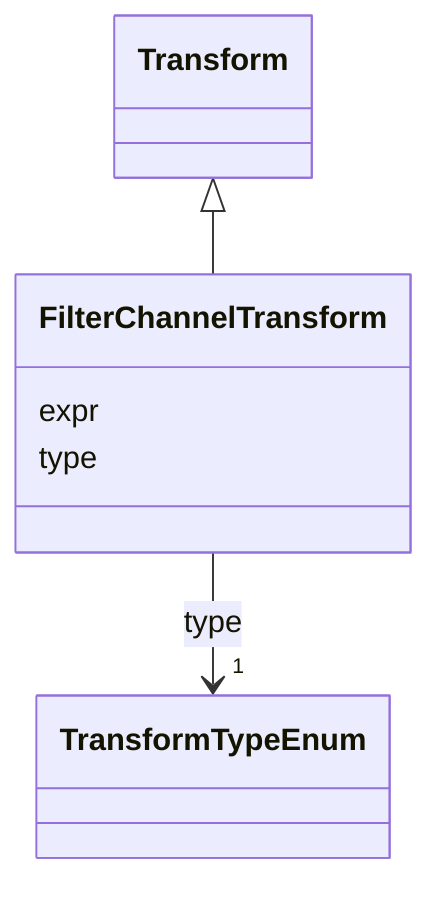

# Class: FilterChannelTransform 


_Filter on particular channels in a raster data object._


URI: [vega_scverse:FilterChannelTransform](https://w3id.org/scverse/vega-scverse/FilterChannelTransform)





## Inheritance
* [Transform](Transform.md)
    * **FilterChannelTransform**


## Slots

| Name | Cardinality and Range | Description | Inheritance |
| ---  | --- | --- | --- |
| [expr](expr.md) | 1..* <br/> [String](String.md)&nbsp;or&nbsp;<br />[String](String.md)&nbsp;or&nbsp;<br />[Integer](Integer.md) | The channel(s) to filter the input data stream on | direct |
| [type](type.md) | 1 <br/> [TransformTypeEnum](TransformTypeEnum.md) | The type of filter transform | [Transform](Transform.md) |


## Usages

| used by | used in | type | used |
| ---  | --- | --- | --- |
| [SpatialDataElementObject](SpatialDataElementObject.md) | [transform](transform.md) | any_of[range] | [FilterChannelTransform](FilterChannelTransform.md) |


## Identifier and Mapping Information


### Schema Source


* from schema: https://w3id.org/scverse/vega-scverse/specification


## Mappings

| Mapping Type | Mapped Value |
| ---  | ---  |
| self | vega_scverse:FilterChannelTransform |
| native | vega_scverse:FilterChannelTransform |


## LinkML Source

<!-- TODO: investigate https://stackoverflow.com/questions/37606292/how-to-create-tabbed-code-blocks-in-mkdocs-or-sphinx -->

### Direct

<details>
```yaml
name: FilterChannelTransform
description: Filter on particular channels in a raster data object.
from_schema: https://w3id.org/scverse/vega-scverse/specification
rank: 1000
is_a: Transform
slot_usage:
  type:
    name: type
    description: 'The type of filter transform. ''filter_element'' will filter / select
      a particular element from a data source,

      ''filter_cs'' will select the coordinate system in which the element should
      be visualized and ''filter_scale''

      will select the scale of a multiscale raster data element.'
    equals_string: filter_channel
attributes:
  expr:
    name: expr
    description: 'The channel(s) to filter the input data stream on. Either a list
      of integers that correspond to the channel

      indices or list of strings that refer to the name of the channels. Preferably,
      it SHOULD be the latter to

      prevent a different context when ordering of the channels changes.'
    from_schema: https://w3id.org/scverse/vega-scverse/data
    domain_of:
    - FilterTransform
    - FilterChannelTransform
    - NormalizationFormulaTransform
    required: true
    multivalued: true
    any_of:
    - range: string
    - range: integer

```
</details>

### Induced

<details>
```yaml
name: FilterChannelTransform
description: Filter on particular channels in a raster data object.
from_schema: https://w3id.org/scverse/vega-scverse/specification
rank: 1000
is_a: Transform
slot_usage:
  type:
    name: type
    description: 'The type of filter transform. ''filter_element'' will filter / select
      a particular element from a data source,

      ''filter_cs'' will select the coordinate system in which the element should
      be visualized and ''filter_scale''

      will select the scale of a multiscale raster data element.'
    equals_string: filter_channel
attributes:
  expr:
    name: expr
    description: 'The channel(s) to filter the input data stream on. Either a list
      of integers that correspond to the channel

      indices or list of strings that refer to the name of the channels. Preferably,
      it SHOULD be the latter to

      prevent a different context when ordering of the channels changes.'
    from_schema: https://w3id.org/scverse/vega-scverse/data
    alias: expr
    owner: FilterChannelTransform
    domain_of:
    - FilterTransform
    - FilterChannelTransform
    - NormalizationFormulaTransform
    range: string
    required: true
    multivalued: true
    any_of:
    - range: string
    - range: integer
  type:
    name: type
    description: 'The type of filter transform. ''filter_element'' will filter / select
      a particular element from a data source,

      ''filter_cs'' will select the coordinate system in which the element should
      be visualized and ''filter_scale''

      will select the scale of a multiscale raster data element.'
    from_schema: https://w3id.org/scverse/vega-scverse/data
    rank: 1000
    alias: type
    owner: FilterChannelTransform
    domain_of:
    - Transform
    - Format
    - Scale
    - Legend
    - Mark
    - TextMark
    - GroupMark
    range: TransformTypeEnum
    required: true
    equals_string: filter_channel

```
</details>