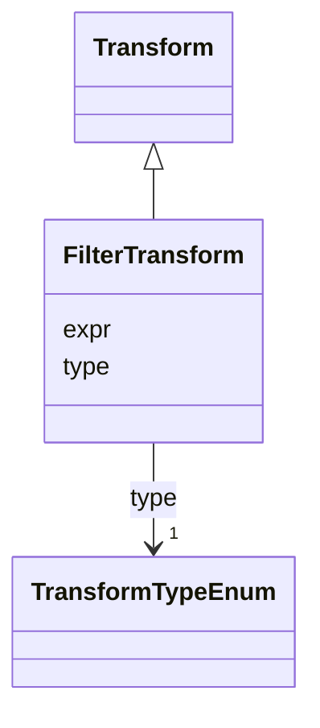

# Class: FilterTransform 


_Select objects from a data stream to keep based on a filter expression. If the value of the filter expression_

_is a single element, e.g. 'blobs_image', then the expression is equivalent to 'datum.value == blobs_image'._

_These are the first transforms in the array of transforms usually when visualizing SpatialData elements._


URI: [vega_scverse:FilterTransform](https://w3id.org/scverse/vega-scverse/FilterTransform)





## Inheritance
* [Transform](Transform.md)
    * **FilterTransform**


## Slots

| Name | Cardinality and Range | Description | Inheritance |
| ---  | --- | --- | --- |
| [expr](expr.md) | 1 <br/> [String](String.md) | Either the name of the element or coordinate system to filter / select | direct |
| [type](type.md) | 1 <br/> [TransformTypeEnum](TransformTypeEnum.md) | The type of filter transform | [Transform](Transform.md) |


## Usages

| used by | used in | type | used |
| ---  | --- | --- | --- |
| [TableObject](TableObject.md) | [transform](transform.md) | exactly_one_of[range] | [FilterTransform](FilterTransform.md) |
| [SpatialDataElementObject](SpatialDataElementObject.md) | [transform](transform.md) | any_of[range] | [FilterTransform](FilterTransform.md) |


## Identifier and Mapping Information


### Schema Source


* from schema: https://w3id.org/scverse/vega-scverse/specification


## Mappings

| Mapping Type | Mapped Value |
| ---  | ---  |
| self | vega_scverse:FilterTransform |
| native | vega_scverse:FilterTransform |


## LinkML Source

<!-- TODO: investigate https://stackoverflow.com/questions/37606292/how-to-create-tabbed-code-blocks-in-mkdocs-or-sphinx -->

### Direct

<details>
```yaml
name: FilterTransform
description: 'Select objects from a data stream to keep based on a filter expression.
  If the value of the filter expression

  is a single element, e.g. ''blobs_image'', then the expression is equivalent to
  ''datum.value == blobs_image''.

  These are the first transforms in the array of transforms usually when visualizing
  SpatialData elements.'
from_schema: https://w3id.org/scverse/vega-scverse/specification
rank: 1000
is_a: Transform
slot_usage:
  type:
    name: type
    description: 'The type of filter transform. ''filter_element'' will filter / select
      a particular element from a data source,

      ''filter_cs'' will select the coordinate system in which the element should
      be visualized and ''filter_scale''

      will select the scale of a multiscale raster data element.'
    equals_string_in:
    - filter_element
    - filter_cs
    - filter_scale
attributes:
  expr:
    name: expr
    description: Either the name of the element or coordinate system to filter / select.
    from_schema: https://w3id.org/scverse/vega-scverse/data
    rank: 1000
    domain_of:
    - FilterTransform
    - FilterChannelTransform
    - NormalizationFormulaTransform
    range: string
    required: true

```
</details>

### Induced

<details>
```yaml
name: FilterTransform
description: 'Select objects from a data stream to keep based on a filter expression.
  If the value of the filter expression

  is a single element, e.g. ''blobs_image'', then the expression is equivalent to
  ''datum.value == blobs_image''.

  These are the first transforms in the array of transforms usually when visualizing
  SpatialData elements.'
from_schema: https://w3id.org/scverse/vega-scverse/specification
rank: 1000
is_a: Transform
slot_usage:
  type:
    name: type
    description: 'The type of filter transform. ''filter_element'' will filter / select
      a particular element from a data source,

      ''filter_cs'' will select the coordinate system in which the element should
      be visualized and ''filter_scale''

      will select the scale of a multiscale raster data element.'
    equals_string_in:
    - filter_element
    - filter_cs
    - filter_scale
attributes:
  expr:
    name: expr
    description: Either the name of the element or coordinate system to filter / select.
    from_schema: https://w3id.org/scverse/vega-scverse/data
    rank: 1000
    alias: expr
    owner: FilterTransform
    domain_of:
    - FilterTransform
    - FilterChannelTransform
    - NormalizationFormulaTransform
    range: string
    required: true
  type:
    name: type
    description: 'The type of filter transform. ''filter_element'' will filter / select
      a particular element from a data source,

      ''filter_cs'' will select the coordinate system in which the element should
      be visualized and ''filter_scale''

      will select the scale of a multiscale raster data element.'
    from_schema: https://w3id.org/scverse/vega-scverse/data
    rank: 1000
    alias: type
    owner: FilterTransform
    domain_of:
    - Transform
    - Format
    - Scale
    - Legend
    - Mark
    - TextMark
    - GroupMark
    range: TransformTypeEnum
    required: true
    equals_string_in:
    - filter_element
    - filter_cs
    - filter_scale

```
</details>