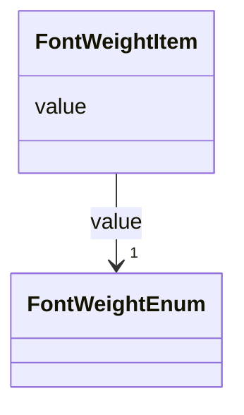

# Class: FontWeightItem 


_Font weight of the text_


URI: [vega_scverse:FontWeightItem](https://w3id.org/scverse/vega-scverse/FontWeightItem)





<!-- no inheritance hierarchy -->


## Slots

| Name | Cardinality and Range | Description | Inheritance |
| ---  | --- | --- | --- |
| [value](value.md) | 1 <br/> [FontWeightEnum](FontWeightEnum.md) | The font weight value | direct |


## Usages

| used by | used in | type | used |
| ---  | --- | --- | --- |
| [TextEncodeEnter](TextEncodeEnter.md) | [fontWeight](fontWeight.md) | range | [FontWeightItem](FontWeightItem.md) |


## Identifier and Mapping Information


### Schema Source


* from schema: https://w3id.org/scverse/vega-scverse/specification


## Mappings

| Mapping Type | Mapped Value |
| ---  | ---  |
| self | vega_scverse:FontWeightItem |
| native | vega_scverse:FontWeightItem |


## LinkML Source

<!-- TODO: investigate https://stackoverflow.com/questions/37606292/how-to-create-tabbed-code-blocks-in-mkdocs-or-sphinx -->

### Direct

<details>
```yaml
name: FontWeightItem
description: Font weight of the text
from_schema: https://w3id.org/scverse/vega-scverse/specification
rank: 1000
attributes:
  value:
    name: value
    description: The font weight value.
    from_schema: https://w3id.org/scverse/vega-scverse/marks
    domain_of:
    - PositionItem
    - TextItem
    - baselineItem
    - FontItem
    - FontSizeItem
    - FontWeightItem
    - FontStyleItem
    - RGBHexItem
    - CircleShape
    range: FontWeightEnum
    required: true

```
</details>

### Induced

<details>
```yaml
name: FontWeightItem
description: Font weight of the text
from_schema: https://w3id.org/scverse/vega-scverse/specification
rank: 1000
attributes:
  value:
    name: value
    description: The font weight value.
    from_schema: https://w3id.org/scverse/vega-scverse/marks
    alias: value
    owner: FontWeightItem
    domain_of:
    - PositionItem
    - TextItem
    - baselineItem
    - FontItem
    - FontSizeItem
    - FontWeightItem
    - FontStyleItem
    - RGBHexItem
    - CircleShape
    range: FontWeightEnum
    required: true

```
</details>