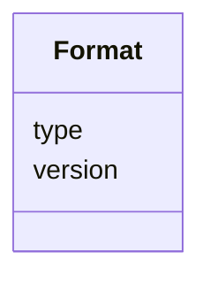

# Class: Format 


_Format object containing the type of data as object and a string value representing the version._


URI: [vega_scverse:Format](https://w3id.org/scverse/vega-scverse/Format)





<!-- no inheritance hierarchy -->


## Slots

| Name | Cardinality and Range | Description | Inheritance |
| ---  | --- | --- | --- |
| [type](type.md) | 1 <br/> [String](String.md) | The type of the data as string, e | direct |
| [version](version.md) | 1 <br/> [String](String.md) | The version of the data type that is defined | direct |


## Usages

| used by | used in | type | used |
| ---  | --- | --- | --- |
| [DataObject](DataObject.md) | [format](format.md) | range | [Format](Format.md) |
| [SpatialDataObject](SpatialDataObject.md) | [format](format.md) | range | [Format](Format.md) |
| [TableObject](TableObject.md) | [format](format.md) | range | [Format](Format.md) |
| [SpatialDataElementObject](SpatialDataElementObject.md) | [format](format.md) | range | [Format](Format.md) |


## Identifier and Mapping Information


### Schema Source


* from schema: https://w3id.org/scverse/vega-scverse/specification


## Mappings

| Mapping Type | Mapped Value |
| ---  | ---  |
| self | vega_scverse:Format |
| native | vega_scverse:Format |


## LinkML Source

<!-- TODO: investigate https://stackoverflow.com/questions/37606292/how-to-create-tabbed-code-blocks-in-mkdocs-or-sphinx -->

### Direct

<details>
```yaml
name: Format
description: Format object containing the type of data as object and a string value
  representing the version.
from_schema: https://w3id.org/scverse/vega-scverse/specification
rank: 1000
attributes:
  type:
    name: type
    description: The type of the data as string, e.g. RasterFormat
    from_schema: https://w3id.org/scverse/vega-scverse/data
    domain_of:
    - Transform
    - Format
    - Scale
    - Legend
    - Mark
    - TextMark
    - GroupMark
    range: string
    required: true
  version:
    name: version
    description: The version of the data type that is defined. Defined as semantic
      version + optional development release.
    from_schema: https://w3id.org/scverse/vega-scverse/data
    rank: 1000
    domain_of:
    - Format
    required: true
    pattern: ^(\d+\.\d+)(\.\d+)?([a-zA-Z0-9.+-]*)?$

```
</details>

### Induced

<details>
```yaml
name: Format
description: Format object containing the type of data as object and a string value
  representing the version.
from_schema: https://w3id.org/scverse/vega-scverse/specification
rank: 1000
attributes:
  type:
    name: type
    description: The type of the data as string, e.g. RasterFormat
    from_schema: https://w3id.org/scverse/vega-scverse/data
    alias: type
    owner: Format
    domain_of:
    - Transform
    - Format
    - Scale
    - Legend
    - Mark
    - TextMark
    - GroupMark
    range: string
    required: true
  version:
    name: version
    description: The version of the data type that is defined. Defined as semantic
      version + optional development release.
    from_schema: https://w3id.org/scverse/vega-scverse/data
    rank: 1000
    alias: version
    owner: Format
    domain_of:
    - Format
    range: string
    required: true
    pattern: ^(\d+\.\d+)(\.\d+)?([a-zA-Z0-9.+-]*)?$

```
</details>