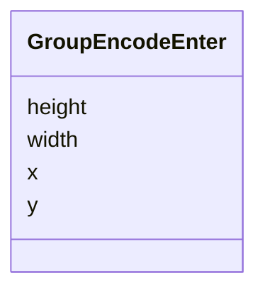

# Class: GroupEncodeEnter 


_Encoding for the position, width and height of a group mark._


URI: [vega_scverse:GroupEncodeEnter](https://w3id.org/scverse/vega-scverse/GroupEncodeEnter)





<!-- no inheritance hierarchy -->


## Slots

| Name | Cardinality and Range | Description | Inheritance |
| ---  | --- | --- | --- |
| [x](x.md) | 1 <br/> [Float](Float.md) | Placing of the group mark along the x axis (width of the complete charter) | direct |
| [y](y.md) | 1 <br/> [Float](Float.md) | Placing of the group mark along the y axis (height of the complete charter) | direct |
| [width](width.md) | 1 <br/> [Float](Float.md) | The width of the mark in pixels | direct |
| [height](height.md) | 1 <br/> [Float](Float.md) | The height of the mark in pixels | direct |


## Usages

| used by | used in | type | used |
| ---  | --- | --- | --- |
| [GroupEncode](GroupEncode.md) | [enter](enter.md) | range | [GroupEncodeEnter](GroupEncodeEnter.md) |


## Identifier and Mapping Information


### Schema Source


* from schema: https://w3id.org/scverse/vega-scverse/specification


## Mappings

| Mapping Type | Mapped Value |
| ---  | ---  |
| self | vega_scverse:GroupEncodeEnter |
| native | vega_scverse:GroupEncodeEnter |


## LinkML Source

<!-- TODO: investigate https://stackoverflow.com/questions/37606292/how-to-create-tabbed-code-blocks-in-mkdocs-or-sphinx -->

### Direct

<details>
```yaml
name: GroupEncodeEnter
description: Encoding for the position, width and height of a group mark.
from_schema: https://w3id.org/scverse/vega-scverse/specification
rank: 1000
attributes:
  x:
    name: x
    description: 'Placing of the group mark along the x axis (width of the complete
      charter). The origin

      is on the left side.'
    from_schema: https://w3id.org/scverse/vega-scverse/encode
    domain_of:
    - PointsEncodeEnter
    - PathEncodeEnter
    - TextEncodeEnter
    - GroupEncodeEnter
    range: float
    required: true
  y:
    name: y
    description: 'Placing of the group mark along the y axis (height of the complete
      charter). The origin

      is on the top side.'
    from_schema: https://w3id.org/scverse/vega-scverse/encode
    domain_of:
    - PointsEncodeEnter
    - PathEncodeEnter
    - TextEncodeEnter
    - GroupEncodeEnter
    range: float
    required: true
  width:
    name: width
    description: The width of the mark in pixels.
    from_schema: https://w3id.org/scverse/vega-scverse/encode
    domain_of:
    - ViewConfiguration
    - GroupEncodeEnter
    range: float
    required: true
  height:
    name: height
    description: The height of the mark in pixels.
    from_schema: https://w3id.org/scverse/vega-scverse/encode
    domain_of:
    - ViewConfiguration
    - GroupEncodeEnter
    range: float
    required: true

```
</details>

### Induced

<details>
```yaml
name: GroupEncodeEnter
description: Encoding for the position, width and height of a group mark.
from_schema: https://w3id.org/scverse/vega-scverse/specification
rank: 1000
attributes:
  x:
    name: x
    description: 'Placing of the group mark along the x axis (width of the complete
      charter). The origin

      is on the left side.'
    from_schema: https://w3id.org/scverse/vega-scverse/encode
    alias: x
    owner: GroupEncodeEnter
    domain_of:
    - PointsEncodeEnter
    - PathEncodeEnter
    - TextEncodeEnter
    - GroupEncodeEnter
    range: float
    required: true
  y:
    name: y
    description: 'Placing of the group mark along the y axis (height of the complete
      charter). The origin

      is on the top side.'
    from_schema: https://w3id.org/scverse/vega-scverse/encode
    alias: y
    owner: GroupEncodeEnter
    domain_of:
    - PointsEncodeEnter
    - PathEncodeEnter
    - TextEncodeEnter
    - GroupEncodeEnter
    range: float
    required: true
  width:
    name: width
    description: The width of the mark in pixels.
    from_schema: https://w3id.org/scverse/vega-scverse/encode
    alias: width
    owner: GroupEncodeEnter
    domain_of:
    - ViewConfiguration
    - GroupEncodeEnter
    range: float
    required: true
  height:
    name: height
    description: The height of the mark in pixels.
    from_schema: https://w3id.org/scverse/vega-scverse/encode
    alias: height
    owner: GroupEncodeEnter
    domain_of:
    - ViewConfiguration
    - GroupEncodeEnter
    range: float
    required: true

```
</details>