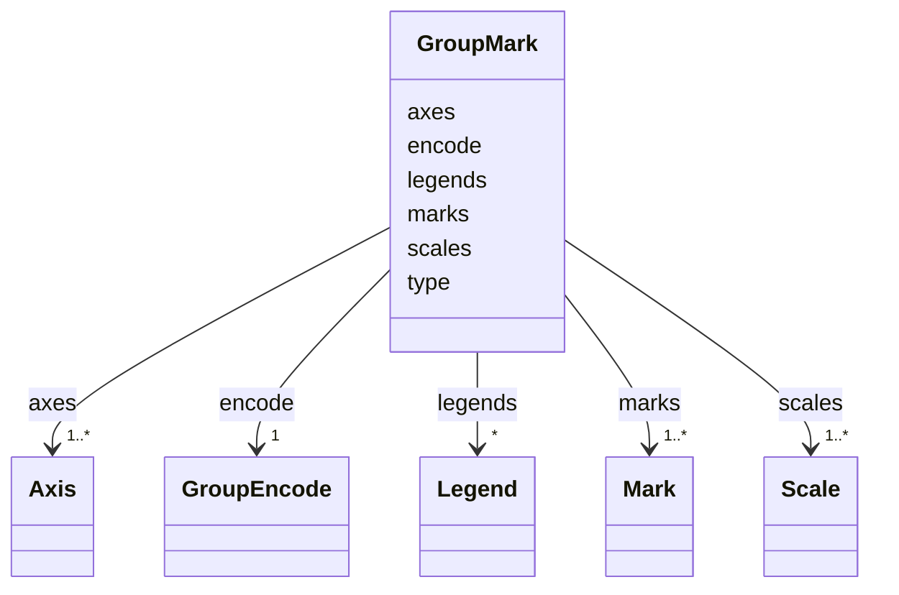

# Class: GroupMark 


_Group marks are containers for other marks, and used to create visualizations with multiple views or layers. Each _

_group instance recursively defines its own nested visualization specification. Group marks provide their own _

_coordinate space and can include nested data, signal, scale, axis, legend, title and mark definitions._


URI: [vega_scverse:GroupMark](https://w3id.org/scverse/vega-scverse/GroupMark)





<!-- no inheritance hierarchy -->


## Slots

| Name | Cardinality and Range | Description | Inheritance |
| ---  | --- | --- | --- |
| [type](type.md) | 0..1 <br/> [String](String.md) | The type of the mark | direct |
| [encode](encode.md) | 1 <br/> [GroupEncode](GroupEncode.md) | A set of visual encoding properties that determine the position of the group ... | direct |
| [scales](scales.md) | 1..* <br/> [Scale](Scale.md) | Scales map data values (numbers, dates, categories, etc | direct |
| [axes](axes.md) | 1..* <br/> [Axis](Axis.md) | Axes visualize spatial scale mappings using ticks, grid lines and labels | direct |
| [legends](legends.md) | * <br/> [Legend](Legend.md) | Legends visualize scale mappings for visual values such as color, shape and s... | direct |
| [marks](marks.md) | 1..* <br/> [Mark](Mark.md) | Graphical marks visually encode data using geometric primitives such as recta... | direct |


## Usages

| used by | used in | type | used |
| ---  | --- | --- | --- |
| [ViewConfiguration](ViewConfiguration.md) | [marks](marks.md) | any_of[range] | [GroupMark](GroupMark.md) |


## Identifier and Mapping Information


### Schema Source


* from schema: https://w3id.org/scverse/vega-scverse/specification


## Mappings

| Mapping Type | Mapped Value |
| ---  | ---  |
| self | vega_scverse:GroupMark |
| native | vega_scverse:GroupMark |


## LinkML Source

<!-- TODO: investigate https://stackoverflow.com/questions/37606292/how-to-create-tabbed-code-blocks-in-mkdocs-or-sphinx -->

### Direct

<details>
```yaml
name: GroupMark
description: "Group marks are containers for other marks, and used to create visualizations\
  \ with multiple views or layers. Each \ngroup instance recursively defines its own\
  \ nested visualization specification. Group marks provide their own \ncoordinate\
  \ space and can include nested data, signal, scale, axis, legend, title and mark\
  \ definitions."
from_schema: https://w3id.org/scverse/vega-scverse/specification
rank: 1000
attributes:
  type:
    name: type
    description: The type of the mark. In this case, it is always 'group'.
    from_schema: https://w3id.org/scverse/vega-scverse/marks
    ifabsent: string(group)
    domain_of:
    - Transform
    - Format
    - Scale
    - Legend
    - Mark
    - TextMark
    - GroupMark
    equals_string: group
  encode:
    name: encode
    description: A set of visual encoding properties that determine the position of
      the group mark.
    from_schema: https://w3id.org/scverse/vega-scverse/marks
    domain_of:
    - Mark
    - TextMark
    - GroupMark
    range: GroupEncode
    required: true
  scales:
    name: scales
    description: "Scales map data values (numbers, dates, categories, etc.) to visual\
      \ values (pixels, colors, sizes). \nScales are a fundamental building block\
      \ of data visualization, as they determine the nature of visual \nencodings."
    from_schema: https://w3id.org/scverse/vega-scverse/marks
    domain_of:
    - ViewConfiguration
    - BaseScales
    - GroupMark
    range: Scale
    required: true
    multivalued: true
  axes:
    name: axes
    description: Axes visualize spatial scale mappings using ticks, grid lines and
      labels.
    from_schema: https://w3id.org/scverse/vega-scverse/marks
    domain_of:
    - ViewConfiguration
    - GroupMark
    range: Axis
    required: true
    multivalued: true
  legends:
    name: legends
    description: Legends visualize scale mappings for visual values such as color,
      shape and size.
    from_schema: https://w3id.org/scverse/vega-scverse/marks
    domain_of:
    - ViewConfiguration
    - GroupMark
    range: Legend
    multivalued: true
  marks:
    name: marks
    description: "Graphical marks visually encode data using geometric primitives\
      \ such as rectangles, lines, and plotting \nsymbols. Marks are the basic visual\
      \ building block of a visualization, providing basic shapes whose \nproperties\
      \ can be set according to backing data. Mark property definitions may be simple\
      \ constants or data \nfields, or scales can be used to map data values to visual\
      \ values."
    from_schema: https://w3id.org/scverse/vega-scverse/marks
    domain_of:
    - ViewConfiguration
    - GroupMark
    range: Mark
    required: true
    multivalued: true

```
</details>

### Induced

<details>
```yaml
name: GroupMark
description: "Group marks are containers for other marks, and used to create visualizations\
  \ with multiple views or layers. Each \ngroup instance recursively defines its own\
  \ nested visualization specification. Group marks provide their own \ncoordinate\
  \ space and can include nested data, signal, scale, axis, legend, title and mark\
  \ definitions."
from_schema: https://w3id.org/scverse/vega-scverse/specification
rank: 1000
attributes:
  type:
    name: type
    description: The type of the mark. In this case, it is always 'group'.
    from_schema: https://w3id.org/scverse/vega-scverse/marks
    ifabsent: string(group)
    alias: type
    owner: GroupMark
    domain_of:
    - Transform
    - Format
    - Scale
    - Legend
    - Mark
    - TextMark
    - GroupMark
    range: string
    equals_string: group
  encode:
    name: encode
    description: A set of visual encoding properties that determine the position of
      the group mark.
    from_schema: https://w3id.org/scverse/vega-scverse/marks
    alias: encode
    owner: GroupMark
    domain_of:
    - Mark
    - TextMark
    - GroupMark
    range: GroupEncode
    required: true
  scales:
    name: scales
    description: "Scales map data values (numbers, dates, categories, etc.) to visual\
      \ values (pixels, colors, sizes). \nScales are a fundamental building block\
      \ of data visualization, as they determine the nature of visual \nencodings."
    from_schema: https://w3id.org/scverse/vega-scverse/marks
    alias: scales
    owner: GroupMark
    domain_of:
    - ViewConfiguration
    - BaseScales
    - GroupMark
    range: Scale
    required: true
    multivalued: true
  axes:
    name: axes
    description: Axes visualize spatial scale mappings using ticks, grid lines and
      labels.
    from_schema: https://w3id.org/scverse/vega-scverse/marks
    alias: axes
    owner: GroupMark
    domain_of:
    - ViewConfiguration
    - GroupMark
    range: Axis
    required: true
    multivalued: true
  legends:
    name: legends
    description: Legends visualize scale mappings for visual values such as color,
      shape and size.
    from_schema: https://w3id.org/scverse/vega-scverse/marks
    alias: legends
    owner: GroupMark
    domain_of:
    - ViewConfiguration
    - GroupMark
    range: Legend
    multivalued: true
  marks:
    name: marks
    description: "Graphical marks visually encode data using geometric primitives\
      \ such as rectangles, lines, and plotting \nsymbols. Marks are the basic visual\
      \ building block of a visualization, providing basic shapes whose \nproperties\
      \ can be set according to backing data. Mark property definitions may be simple\
      \ constants or data \nfields, or scales can be used to map data values to visual\
      \ values."
    from_schema: https://w3id.org/scverse/vega-scverse/marks
    alias: marks
    owner: GroupMark
    domain_of:
    - ViewConfiguration
    - GroupMark
    range: Mark
    required: true
    multivalued: true

```
</details>