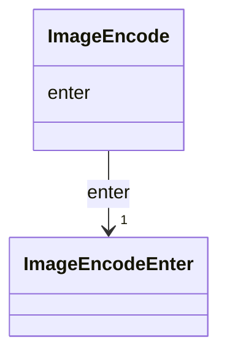

# Class: ImageEncode 


_A set of visual encoding properties that determine the position and appearance of a 'raster_image' mark. _

_In Vega, there are three primary property sets: enter, update, exit. The enter properties are evaluated when data _

_is processed for the first time and a mark instance is newly added to a scene and are the only properties _

_supported for a 'raster_image' mark._


URI: [vega_scverse:ImageEncode](https://w3id.org/scverse/vega-scverse/ImageEncode)





<!-- no inheritance hierarchy -->


## Slots

| Name | Cardinality and Range | Description | Inheritance |
| ---  | --- | --- | --- |
| [enter](enter.md) | 1 <br/> [ImageEncodeEnter](ImageEncodeEnter.md) | Enter properties that are evaluated when image data is processed for the firs... | direct |


## Usages

| used by | used in | type | used |
| ---  | --- | --- | --- |
| [RasterImageMark](RasterImageMark.md) | [encode](encode.md) | range | [ImageEncode](ImageEncode.md) |


## Identifier and Mapping Information


### Schema Source


* from schema: https://w3id.org/scverse/vega-scverse/specification


## Mappings

| Mapping Type | Mapped Value |
| ---  | ---  |
| self | vega_scverse:ImageEncode |
| native | vega_scverse:ImageEncode |


## LinkML Source

<!-- TODO: investigate https://stackoverflow.com/questions/37606292/how-to-create-tabbed-code-blocks-in-mkdocs-or-sphinx -->

### Direct

<details>
```yaml
name: ImageEncode
description: "A set of visual encoding properties that determine the position and\
  \ appearance of a 'raster_image' mark. \nIn Vega, there are three primary property\
  \ sets: enter, update, exit. The enter properties are evaluated when data \nis processed\
  \ for the first time and a mark instance is newly added to a scene and are the only\
  \ properties \nsupported for a 'raster_image' mark."
from_schema: https://w3id.org/scverse/vega-scverse/specification
rank: 1000
attributes:
  enter:
    name: enter
    description: "Enter properties that are evaluated when image data is processed\
      \ for the first time and the raster_image mark \nis newly added to a scene."
    from_schema: https://w3id.org/scverse/vega-scverse/encode
    rank: 1000
    domain_of:
    - ImageEncode
    - LabelEncode
    - SymbolEncode
    - PathEncode
    - TextEncode
    - GroupEncode
    range: ImageEncodeEnter
    required: true

```
</details>

### Induced

<details>
```yaml
name: ImageEncode
description: "A set of visual encoding properties that determine the position and\
  \ appearance of a 'raster_image' mark. \nIn Vega, there are three primary property\
  \ sets: enter, update, exit. The enter properties are evaluated when data \nis processed\
  \ for the first time and a mark instance is newly added to a scene and are the only\
  \ properties \nsupported for a 'raster_image' mark."
from_schema: https://w3id.org/scverse/vega-scverse/specification
rank: 1000
attributes:
  enter:
    name: enter
    description: "Enter properties that are evaluated when image data is processed\
      \ for the first time and the raster_image mark \nis newly added to a scene."
    from_schema: https://w3id.org/scverse/vega-scverse/encode
    rank: 1000
    alias: enter
    owner: ImageEncode
    domain_of:
    - ImageEncode
    - LabelEncode
    - SymbolEncode
    - PathEncode
    - TextEncode
    - GroupEncode
    range: ImageEncodeEnter
    required: true

```
</details>