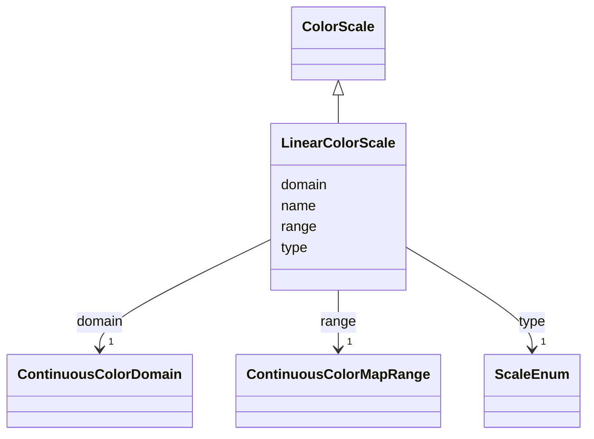

# Class: LinearColorScale 


_A vega like scale specifically for mapping from a linear continuous data domain to a visual color range._


URI: [vega_scverse:LinearColorScale](https://w3id.org/scverse/vega-scverse/LinearColorScale)





## Inheritance
* [Scale](Scale.md)
    * [ColorScale](ColorScale.md)
        * **LinearColorScale**


## Slots

| Name | Cardinality and Range | Description | Inheritance |
| ---  | --- | --- | --- |
| [domain](domain.md) | 1 <br/> [ContinuousColorDomain](ContinuousColorDomain.md) | The data used as a source for the visual color range | direct |
| [range](range.md) | 1 <br/> [ContinuousColorMapRange](ContinuousColorMapRange.md) | The range to which to map the data domain | direct |
| [name](name.md) | 1 <br/> [String](String.md) | color followed by '_pseudoUUID' used to refer to this scale elsewhere in the ... | [Scale](Scale.md) |
| [type](type.md) | 1 <br/> [ScaleEnum](ScaleEnum.md) | Only linear is supported for an `LinearColorScale` for now | [Scale](Scale.md) |


## Usages

| used by | used in | type | used |
| ---  | --- | --- | --- |
| [BaseScales](BaseScales.md) | [scales](scales.md) | any_of[range] | [LinearColorScale](LinearColorScale.md) |


## Identifier and Mapping Information


### Schema Source


* from schema: https://w3id.org/scverse/vega-scverse/specification


## Mappings

| Mapping Type | Mapped Value |
| ---  | ---  |
| self | vega_scverse:LinearColorScale |
| native | vega_scverse:LinearColorScale |


## LinkML Source

<!-- TODO: investigate https://stackoverflow.com/questions/37606292/how-to-create-tabbed-code-blocks-in-mkdocs-or-sphinx -->

### Direct

<details>
```yaml
name: LinearColorScale
description: A vega like scale specifically for mapping from a linear continuous data
  domain to a visual color range.
from_schema: https://w3id.org/scverse/vega-scverse/specification
rank: 1000
is_a: ColorScale
slot_usage:
  type:
    name: type
    description: Only linear is supported for an `LinearColorScale` for now.
    ifabsent: string(linear)
    equals_string: linear
attributes:
  domain:
    name: domain
    description: The data used as a source for the visual color range
    from_schema: https://w3id.org/scverse/vega-scverse/scales
    domain_of:
    - BaseAxisScale
    - LinearColorScale
    - BaseCategoricalColorScale
    - Axis
    range: ContinuousColorDomain
    required: true
  range:
    name: range
    description: The range to which to map the data domain. In this case one that
      refers to a colormap range.
    from_schema: https://w3id.org/scverse/vega-scverse/scales
    domain_of:
    - BaseAxisScale
    - LinearColorScale
    - BaseCategoricalColorScale
    range: ContinuousColorMapRange
    required: true

```
</details>

### Induced

<details>
```yaml
name: LinearColorScale
description: A vega like scale specifically for mapping from a linear continuous data
  domain to a visual color range.
from_schema: https://w3id.org/scverse/vega-scverse/specification
rank: 1000
is_a: ColorScale
slot_usage:
  type:
    name: type
    description: Only linear is supported for an `LinearColorScale` for now.
    ifabsent: string(linear)
    equals_string: linear
attributes:
  domain:
    name: domain
    description: The data used as a source for the visual color range
    from_schema: https://w3id.org/scverse/vega-scverse/scales
    alias: domain
    owner: LinearColorScale
    domain_of:
    - BaseAxisScale
    - LinearColorScale
    - BaseCategoricalColorScale
    - Axis
    range: ContinuousColorDomain
    required: true
  range:
    name: range
    description: The range to which to map the data domain. In this case one that
      refers to a colormap range.
    from_schema: https://w3id.org/scverse/vega-scverse/scales
    alias: range
    owner: LinearColorScale
    domain_of:
    - BaseAxisScale
    - LinearColorScale
    - BaseCategoricalColorScale
    range: ContinuousColorMapRange
    required: true
  name:
    name: name
    description: color followed by '_pseudoUUID' used to refer to this scale elsewhere
      in the view configuration.
    from_schema: https://w3id.org/scverse/vega-scverse/scales
    identifier: true
    alias: name
    owner: LinearColorScale
    domain_of:
    - DataObject
    - Scale
    range: string
    required: true
    pattern: ^color_[0-9a-fA-F]{8}-[0-9a-fA-F]{4}-[0-9a-fA-F]{4}-[0-9a-fA-F]{4}-[0-9a-fA-F]{12}$
  type:
    name: type
    description: Only linear is supported for an `LinearColorScale` for now.
    from_schema: https://w3id.org/scverse/vega-scverse/scales
    ifabsent: string(linear)
    alias: type
    owner: LinearColorScale
    domain_of:
    - Transform
    - Format
    - Scale
    - Legend
    - Mark
    - TextMark
    - GroupMark
    range: ScaleEnum
    required: true
    equals_string: linear

```
</details>