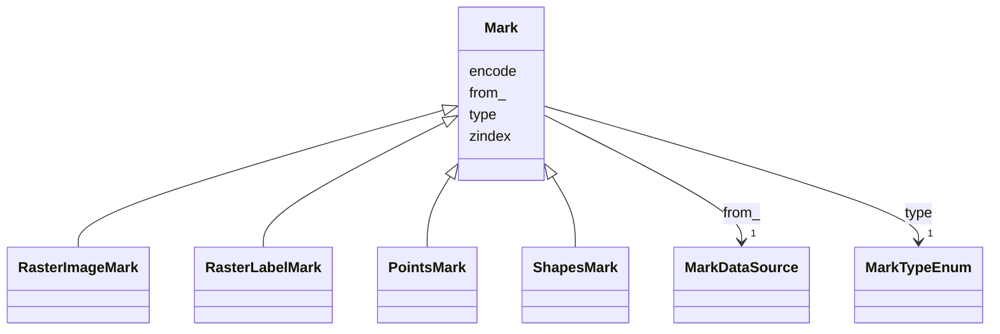

# Class: Mark 


_Graphical marks visually encode data using geometric primitives such as rectangles, lines, and plotting symbols. _

_Marks are the basic visual building block of a visualization, providing basic shapes whose properties can be set _

_according to backing data. Mark property definitions may be simple constants or data fields, or scales can be _

_used to map data values to visual values._


* __NOTE__: this is an abstract class and should not be instantiated directly


URI: [vega_scverse:Mark](https://w3id.org/scverse/vega-scverse/Mark)





## Inheritance
* **Mark**
    * [RasterImageMark](RasterImageMark.md)
    * [RasterLabelMark](RasterLabelMark.md)
    * [PointsMark](PointsMark.md)
    * [ShapesMark](ShapesMark.md)


## Slots

| Name | Cardinality and Range | Description | Inheritance |
| ---  | --- | --- | --- |
| [type](type.md) | 1 <br/> [MarkTypeEnum](MarkTypeEnum.md) | The type of mark | direct |
| [from_](from_.md) | 1 <br/> [MarkDataSource](MarkDataSource.md) | The data stream used as the source for the graphical mark | direct |
| [encode](encode.md) | 1 <br/> [String](String.md) | A set of visual encoding properties that determine the position and appearanc... | direct |
| [zindex](zindex.md) | 1 <br/> [Integer](Integer.md) | An integer z-index indicating the layering order of sibling mark items | direct |


## Usages

| used by | used in | type | used |
| ---  | --- | --- | --- |
| [ViewConfiguration](ViewConfiguration.md) | [marks](marks.md) | any_of[range] | [Mark](Mark.md) |
| [GroupMark](GroupMark.md) | [marks](marks.md) | range | [Mark](Mark.md) |


## Identifier and Mapping Information


### Schema Source


* from schema: https://w3id.org/scverse/vega-scverse/specification


## Mappings

| Mapping Type | Mapped Value |
| ---  | ---  |
| self | vega_scverse:Mark |
| native | vega_scverse:Mark |


## LinkML Source

<!-- TODO: investigate https://stackoverflow.com/questions/37606292/how-to-create-tabbed-code-blocks-in-mkdocs-or-sphinx -->

### Direct

<details>
```yaml
name: Mark
description: "Graphical marks visually encode data using geometric primitives such\
  \ as rectangles, lines, and plotting symbols. \nMarks are the basic visual building\
  \ block of a visualization, providing basic shapes whose properties can be set \n\
  according to backing data. Mark property definitions may be simple constants or\
  \ data fields, or scales can be \nused to map data values to visual values."
from_schema: https://w3id.org/scverse/vega-scverse/specification
rank: 1000
abstract: true
attributes:
  type:
    name: type
    description: The type of mark.
    from_schema: https://w3id.org/scverse/vega-scverse/marks
    domain_of:
    - Transform
    - Format
    - Scale
    - Legend
    - Mark
    - TextMark
    - GroupMark
    range: MarkTypeEnum
    required: true
  from_:
    name: from_
    description: The data stream used as the source for the graphical mark.
    from_schema: https://w3id.org/scverse/vega-scverse/marks
    rank: 1000
    domain_of:
    - Mark
    range: MarkDataSource
    required: true
  encode:
    name: encode
    description: "A set of visual encoding properties that determine the position\
      \ and appearance of mark instances. In Vega, \nthere are three primary property\
      \ sets: enter, update, exit. The enter properties are evaluated when data is\
      \ \nprocessed for the first time and a mark instance is newly added to a scene.\
      \ The update properties are \nevaluated for all existing (non-exiting) mark\
      \ instances. The exit properties are evaluated when the data \nbacking a mark\
      \ is removed, and so the mark is leaving the visual scene. However, in this\
      \ specification we \ncurrently only support enter and update property sets."
    from_schema: https://w3id.org/scverse/vega-scverse/marks
    rank: 1000
    domain_of:
    - Mark
    - TextMark
    - GroupMark
    required: true
  zindex:
    name: zindex
    description: "An integer z-index indicating the layering order of sibling mark\
      \ items. The default value is 0. Higher values \n(1) will cause marks to be\
      \ drawn on top of those with lower z-index values."
    from_schema: https://w3id.org/scverse/vega-scverse/marks
    domain_of:
    - Axis
    - Legend
    - Mark
    - TextMark
    range: integer
    required: true

```
</details>

### Induced

<details>
```yaml
name: Mark
description: "Graphical marks visually encode data using geometric primitives such\
  \ as rectangles, lines, and plotting symbols. \nMarks are the basic visual building\
  \ block of a visualization, providing basic shapes whose properties can be set \n\
  according to backing data. Mark property definitions may be simple constants or\
  \ data fields, or scales can be \nused to map data values to visual values."
from_schema: https://w3id.org/scverse/vega-scverse/specification
rank: 1000
abstract: true
attributes:
  type:
    name: type
    description: The type of mark.
    from_schema: https://w3id.org/scverse/vega-scverse/marks
    alias: type
    owner: Mark
    domain_of:
    - Transform
    - Format
    - Scale
    - Legend
    - Mark
    - TextMark
    - GroupMark
    range: MarkTypeEnum
    required: true
  from_:
    name: from_
    description: The data stream used as the source for the graphical mark.
    from_schema: https://w3id.org/scverse/vega-scverse/marks
    rank: 1000
    alias: from_
    owner: Mark
    domain_of:
    - Mark
    range: MarkDataSource
    required: true
  encode:
    name: encode
    description: "A set of visual encoding properties that determine the position\
      \ and appearance of mark instances. In Vega, \nthere are three primary property\
      \ sets: enter, update, exit. The enter properties are evaluated when data is\
      \ \nprocessed for the first time and a mark instance is newly added to a scene.\
      \ The update properties are \nevaluated for all existing (non-exiting) mark\
      \ instances. The exit properties are evaluated when the data \nbacking a mark\
      \ is removed, and so the mark is leaving the visual scene. However, in this\
      \ specification we \ncurrently only support enter and update property sets."
    from_schema: https://w3id.org/scverse/vega-scverse/marks
    rank: 1000
    alias: encode
    owner: Mark
    domain_of:
    - Mark
    - TextMark
    - GroupMark
    range: string
    required: true
  zindex:
    name: zindex
    description: "An integer z-index indicating the layering order of sibling mark\
      \ items. The default value is 0. Higher values \n(1) will cause marks to be\
      \ drawn on top of those with lower z-index values."
    from_schema: https://w3id.org/scverse/vega-scverse/marks
    alias: zindex
    owner: Mark
    domain_of:
    - Axis
    - Legend
    - Mark
    - TextMark
    range: integer
    required: true

```
</details>