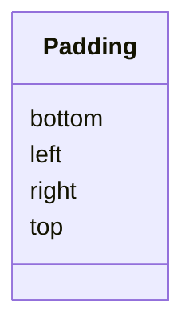

# Class: Padding 


_padding defines the amount of space (in pixels) to reserve between the edge of the chart container and the inner _

_view area where data marks are rendered. It acts as an internal margin that ensures visual elements like axes, _

_titles, and legends don't touch or overflow the chart's outer boundaries._

_When combined with "autosize": {"type": "fit", "contains": "padding"}, this padding is included within the chart's _

_specified width and height, and the inner view is resized accordingly to preserve layout integrity. If padding_

_is defined with this class. This class should at least have one attribute defined._


URI: [vega_scverse:Padding](https://w3id.org/scverse/vega-scverse/Padding)





<!-- no inheritance hierarchy -->


## Slots

| Name | Cardinality and Range | Description | Inheritance |
| ---  | --- | --- | --- |
| [left](left.md) | 0..1 <br/> [Float](Float.md) | The value for padding at the left side of the chart in pixels | direct |
| [top](top.md) | 0..1 <br/> [Float](Float.md) | The value for padding at the top side of the chart in pixels | direct |
| [right](right.md) | 0..1 <br/> [Float](Float.md) | The value for padding at the right side of the chart in pixels | direct |
| [bottom](bottom.md) | 0..1 <br/> [Float](Float.md) | The value for padding at the bottom side of the chart in pixels | direct |


## Usages

| used by | used in | type | used |
| ---  | --- | --- | --- |
| [ViewConfiguration](ViewConfiguration.md) | [padding](padding.md) | any_of[range] | [Padding](Padding.md) |


## Identifier and Mapping Information


### Schema Source


* from schema: https://w3id.org/scverse/vega-scverse/specification


## Mappings

| Mapping Type | Mapped Value |
| ---  | ---  |
| self | vega_scverse:Padding |
| native | vega_scverse:Padding |


## LinkML Source

<!-- TODO: investigate https://stackoverflow.com/questions/37606292/how-to-create-tabbed-code-blocks-in-mkdocs-or-sphinx -->

### Direct

<details>
```yaml
name: Padding
description: "padding defines the amount of space (in pixels) to reserve between the\
  \ edge of the chart container and the inner \nview area where data marks are rendered.\
  \ It acts as an internal margin that ensures visual elements like axes, \ntitles,\
  \ and legends don't touch or overflow the chart's outer boundaries.\nWhen combined\
  \ with \"autosize\": {\"type\": \"fit\", \"contains\": \"padding\"}, this padding\
  \ is included within the chart's \nspecified width and height, and the inner view\
  \ is resized accordingly to preserve layout integrity. If padding\nis defined with\
  \ this class. This class should at least have one attribute defined."
from_schema: https://w3id.org/scverse/vega-scverse/specification
rank: 1000
attributes:
  left:
    name: left
    description: The value for padding at the left side of the chart in pixels.
    from_schema: https://w3id.org/scverse/vega-scverse/marks
    rank: 1000
    domain_of:
    - Padding
    range: float
    required: false
  top:
    name: top
    description: The value for padding at the top side of the chart in pixels.
    from_schema: https://w3id.org/scverse/vega-scverse/marks
    rank: 1000
    domain_of:
    - Padding
    range: float
    required: false
  right:
    name: right
    description: The value for padding at the right side of the chart in pixels.
    from_schema: https://w3id.org/scverse/vega-scverse/marks
    rank: 1000
    domain_of:
    - Padding
    range: float
    required: false
  bottom:
    name: bottom
    description: The value for padding at the bottom side of the chart in pixels.
    from_schema: https://w3id.org/scverse/vega-scverse/marks
    rank: 1000
    domain_of:
    - Padding
    range: float
    required: false

```
</details>

### Induced

<details>
```yaml
name: Padding
description: "padding defines the amount of space (in pixels) to reserve between the\
  \ edge of the chart container and the inner \nview area where data marks are rendered.\
  \ It acts as an internal margin that ensures visual elements like axes, \ntitles,\
  \ and legends don't touch or overflow the chart's outer boundaries.\nWhen combined\
  \ with \"autosize\": {\"type\": \"fit\", \"contains\": \"padding\"}, this padding\
  \ is included within the chart's \nspecified width and height, and the inner view\
  \ is resized accordingly to preserve layout integrity. If padding\nis defined with\
  \ this class. This class should at least have one attribute defined."
from_schema: https://w3id.org/scverse/vega-scverse/specification
rank: 1000
attributes:
  left:
    name: left
    description: The value for padding at the left side of the chart in pixels.
    from_schema: https://w3id.org/scverse/vega-scverse/marks
    rank: 1000
    alias: left
    owner: Padding
    domain_of:
    - Padding
    range: float
    required: false
  top:
    name: top
    description: The value for padding at the top side of the chart in pixels.
    from_schema: https://w3id.org/scverse/vega-scverse/marks
    rank: 1000
    alias: top
    owner: Padding
    domain_of:
    - Padding
    range: float
    required: false
  right:
    name: right
    description: The value for padding at the right side of the chart in pixels.
    from_schema: https://w3id.org/scverse/vega-scverse/marks
    rank: 1000
    alias: right
    owner: Padding
    domain_of:
    - Padding
    range: float
    required: false
  bottom:
    name: bottom
    description: The value for padding at the bottom side of the chart in pixels.
    from_schema: https://w3id.org/scverse/vega-scverse/marks
    rank: 1000
    alias: bottom
    owner: Padding
    domain_of:
    - Padding
    range: float
    required: false

```
</details>