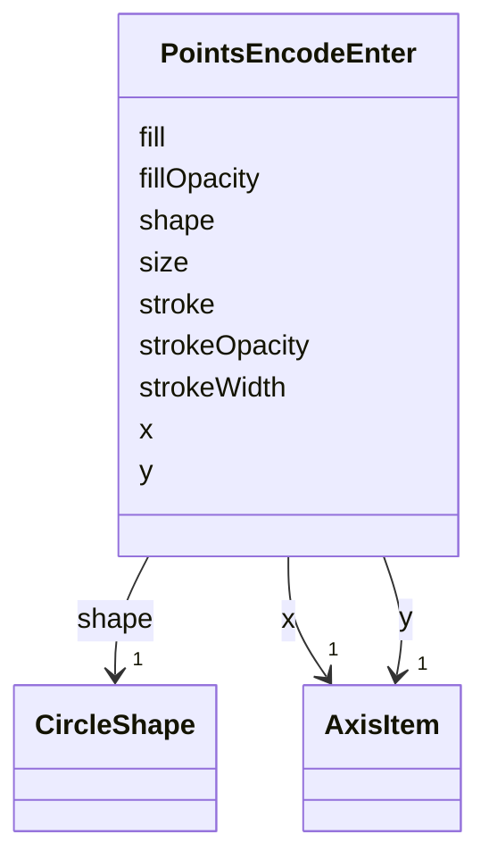

# Class: PointsEncodeEnter 


_Enter properties that are evaluated when points data is processed for the first time and the raster_image mark is _

_newly added to a scene._


URI: [vega_scverse:PointsEncodeEnter](https://w3id.org/scverse/vega-scverse/PointsEncodeEnter)





<!-- no inheritance hierarchy -->


## Slots

| Name | Cardinality and Range | Description | Inheritance |
| ---  | --- | --- | --- |
| [x](x.md) | 1 <br/> [AxisItem](AxisItem.md) | The x coordinates | direct |
| [y](y.md) | 1 <br/> [AxisItem](AxisItem.md) | The y coordinates | direct |
| [stroke](stroke.md) | 1 <br/> [String](String.md)&nbsp;or&nbsp;<br />[ColorItem](ColorItem.md)&nbsp;or&nbsp;<br />[RGBHexItem](RGBHexItem.md) | The color of the outline of each individual point | direct |
| [fill](fill.md) | 1 <br/> [String](String.md)&nbsp;or&nbsp;<br />[ColorItem](ColorItem.md)&nbsp;or&nbsp;<br />[RGBHexItem](RGBHexItem.md) | The color fill of each individual point | direct |
| [fillOpacity](fillOpacity.md) | 1 <br/> [String](String.md) | Opacity value for the point fill between 0 and 1 | direct |
| [strokeOpacity](strokeOpacity.md) | 1 <br/> [String](String.md) | Opacity value for the point outlines between 0 and 1 | direct |
| [strokeWidth](strokeWidth.md) | 1 <br/> [String](String.md) | The width of the point outlines in pixels | direct |
| [size](size.md) | 1 <br/> [String](String.md) | The points bounding box area size (typographic points are 1/72 in | direct |
| [shape](shape.md) | 1 <br/> [CircleShape](CircleShape.md) | The type of shape | direct |


## Usages

| used by | used in | type | used |
| ---  | --- | --- | --- |
| [SymbolEncode](SymbolEncode.md) | [enter](enter.md) | range | [PointsEncodeEnter](PointsEncodeEnter.md) |


## Identifier and Mapping Information


### Schema Source


* from schema: https://w3id.org/scverse/vega-scverse/specification


## Mappings

| Mapping Type | Mapped Value |
| ---  | ---  |
| self | vega_scverse:PointsEncodeEnter |
| native | vega_scverse:PointsEncodeEnter |


## LinkML Source

<!-- TODO: investigate https://stackoverflow.com/questions/37606292/how-to-create-tabbed-code-blocks-in-mkdocs-or-sphinx -->

### Direct

<details>
```yaml
name: PointsEncodeEnter
description: "Enter properties that are evaluated when points data is processed for\
  \ the first time and the raster_image mark is \nnewly added to a scene."
from_schema: https://w3id.org/scverse/vega-scverse/specification
rank: 1000
attributes:
  x:
    name: x
    description: The x coordinates
    from_schema: https://w3id.org/scverse/vega-scverse/encode
    rank: 1000
    domain_of:
    - PointsEncodeEnter
    - PathEncodeEnter
    - TextEncodeEnter
    - GroupEncodeEnter
    range: AxisItem
    required: true
  y:
    name: y
    description: The y coordinates
    from_schema: https://w3id.org/scverse/vega-scverse/encode
    rank: 1000
    domain_of:
    - PointsEncodeEnter
    - PathEncodeEnter
    - TextEncodeEnter
    - GroupEncodeEnter
    range: AxisItem
    required: true
  stroke:
    name: stroke
    description: The color of the outline of each individual point.
    from_schema: https://w3id.org/scverse/vega-scverse/encode
    domain_of:
    - LabelEncodeEnter
    - PointsEncodeEnter
    required: true
    any_of:
    - range: ColorItem
    - range: RGBHexItem
  fill:
    name: fill
    description: The color fill of each individual point.
    from_schema: https://w3id.org/scverse/vega-scverse/encode
    domain_of:
    - Legend
    - ImageEncodeEnter
    - LabelEncodeEnter
    - PointsEncodeEnter
    - PathEncodeEnter
    - TextEncodeEnter
    - MarkEncodeUpdate
    required: true
    any_of:
    - range: ColorItem
    - range: RGBHexItem
  fillOpacity:
    name: fillOpacity
    description: Opacity value for the point fill between 0 and 1.
    from_schema: https://w3id.org/scverse/vega-scverse/encode
    slot_uri: opacityValueSlot
    domain_of:
    - LabelEncodeEnter
    - PointsEncodeEnter
    - PathEncodeEnter
    - TextEncodeEnter
    required: true
  strokeOpacity:
    name: strokeOpacity
    description: Opacity value for the point outlines between 0 and 1.
    from_schema: https://w3id.org/scverse/vega-scverse/encode
    slot_uri: opacityValueSlot
    domain_of:
    - LabelEncodeEnter
    - PointsEncodeEnter
    required: true
  strokeWidth:
    name: strokeWidth
    description: The width of the point outlines in pixels.
    from_schema: https://w3id.org/scverse/vega-scverse/encode
    slot_uri: strokeWidth
    domain_of:
    - Legend
    - LabelEncodeEnter
    - PointsEncodeEnter
    required: true
  size:
    name: size
    description: The points bounding box area size (typographic points are 1/72 in.).
    from_schema: https://w3id.org/scverse/vega-scverse/encode
    slot_uri: size
    domain_of:
    - PointsEncodeEnter
    required: true
  shape:
    name: shape
    description: The type of shape. In this case `circle`.
    from_schema: https://w3id.org/scverse/vega-scverse/encode
    rank: 1000
    domain_of:
    - PointsEncodeEnter
    range: CircleShape
    required: true

```
</details>

### Induced

<details>
```yaml
name: PointsEncodeEnter
description: "Enter properties that are evaluated when points data is processed for\
  \ the first time and the raster_image mark is \nnewly added to a scene."
from_schema: https://w3id.org/scverse/vega-scverse/specification
rank: 1000
attributes:
  x:
    name: x
    description: The x coordinates
    from_schema: https://w3id.org/scverse/vega-scverse/encode
    rank: 1000
    alias: x
    owner: PointsEncodeEnter
    domain_of:
    - PointsEncodeEnter
    - PathEncodeEnter
    - TextEncodeEnter
    - GroupEncodeEnter
    range: AxisItem
    required: true
  y:
    name: y
    description: The y coordinates
    from_schema: https://w3id.org/scverse/vega-scverse/encode
    rank: 1000
    alias: y
    owner: PointsEncodeEnter
    domain_of:
    - PointsEncodeEnter
    - PathEncodeEnter
    - TextEncodeEnter
    - GroupEncodeEnter
    range: AxisItem
    required: true
  stroke:
    name: stroke
    description: The color of the outline of each individual point.
    from_schema: https://w3id.org/scverse/vega-scverse/encode
    alias: stroke
    owner: PointsEncodeEnter
    domain_of:
    - LabelEncodeEnter
    - PointsEncodeEnter
    range: string
    required: true
    any_of:
    - range: ColorItem
    - range: RGBHexItem
  fill:
    name: fill
    description: The color fill of each individual point.
    from_schema: https://w3id.org/scverse/vega-scverse/encode
    alias: fill
    owner: PointsEncodeEnter
    domain_of:
    - Legend
    - ImageEncodeEnter
    - LabelEncodeEnter
    - PointsEncodeEnter
    - PathEncodeEnter
    - TextEncodeEnter
    - MarkEncodeUpdate
    range: string
    required: true
    any_of:
    - range: ColorItem
    - range: RGBHexItem
  fillOpacity:
    name: fillOpacity
    description: Opacity value for the point fill between 0 and 1.
    from_schema: https://w3id.org/scverse/vega-scverse/encode
    slot_uri: opacityValueSlot
    alias: fillOpacity
    owner: PointsEncodeEnter
    domain_of:
    - LabelEncodeEnter
    - PointsEncodeEnter
    - PathEncodeEnter
    - TextEncodeEnter
    range: string
    required: true
  strokeOpacity:
    name: strokeOpacity
    description: Opacity value for the point outlines between 0 and 1.
    from_schema: https://w3id.org/scverse/vega-scverse/encode
    slot_uri: opacityValueSlot
    alias: strokeOpacity
    owner: PointsEncodeEnter
    domain_of:
    - LabelEncodeEnter
    - PointsEncodeEnter
    range: string
    required: true
  strokeWidth:
    name: strokeWidth
    description: The width of the point outlines in pixels.
    from_schema: https://w3id.org/scverse/vega-scverse/encode
    slot_uri: strokeWidth
    alias: strokeWidth
    owner: PointsEncodeEnter
    domain_of:
    - Legend
    - LabelEncodeEnter
    - PointsEncodeEnter
    range: string
    required: true
  size:
    name: size
    description: The points bounding box area size (typographic points are 1/72 in.).
    from_schema: https://w3id.org/scverse/vega-scverse/encode
    slot_uri: size
    alias: size
    owner: PointsEncodeEnter
    domain_of:
    - PointsEncodeEnter
    range: string
    required: true
  shape:
    name: shape
    description: The type of shape. In this case `circle`.
    from_schema: https://w3id.org/scverse/vega-scverse/encode
    rank: 1000
    alias: shape
    owner: PointsEncodeEnter
    domain_of:
    - PointsEncodeEnter
    range: CircleShape
    required: true

```
</details>