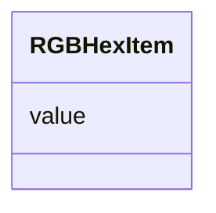

# Class: RGBHexItem 


_RGB value represented by a hexadecimal string value._


URI: [vega_scverse:RGBHexItem](https://w3id.org/scverse/vega-scverse/RGBHexItem)





<!-- no inheritance hierarchy -->


## Slots

| Name | Cardinality and Range | Description | Inheritance |
| ---  | --- | --- | --- |
| [value](value.md) | 0..1 <br/> [String](String.md) | The RGB hex string value | direct |


## Usages

| used by | used in | type | used |
| ---  | --- | --- | --- |
| [PointsEncodeEnter](PointsEncodeEnter.md) | [stroke](stroke.md) | any_of[range] | [RGBHexItem](RGBHexItem.md) |
| [PointsEncodeEnter](PointsEncodeEnter.md) | [fill](fill.md) | any_of[range] | [RGBHexItem](RGBHexItem.md) |
| [PathEncodeEnter](PathEncodeEnter.md) | [fill](fill.md) | any_of[range] | [RGBHexItem](RGBHexItem.md) |
| [TextEncodeEnter](TextEncodeEnter.md) | [fill](fill.md) | range | [RGBHexItem](RGBHexItem.md) |
| [MarkEncodeUpdate](MarkEncodeUpdate.md) | [fill](fill.md) | any_of[range] | [RGBHexItem](RGBHexItem.md) |


## Identifier and Mapping Information


### Schema Source


* from schema: https://w3id.org/scverse/vega-scverse/specification


## Mappings

| Mapping Type | Mapped Value |
| ---  | ---  |
| self | vega_scverse:RGBHexItem |
| native | vega_scverse:RGBHexItem |


## LinkML Source

<!-- TODO: investigate https://stackoverflow.com/questions/37606292/how-to-create-tabbed-code-blocks-in-mkdocs-or-sphinx -->

### Direct

<details>
```yaml
name: RGBHexItem
description: RGB value represented by a hexadecimal string value.
from_schema: https://w3id.org/scverse/vega-scverse/specification
rank: 1000
attributes:
  value:
    name: value
    description: The RGB hex string value.
    from_schema: https://w3id.org/scverse/vega-scverse/marks
    slot_uri: rgbHexSlot
    domain_of:
    - PositionItem
    - TextItem
    - baselineItem
    - FontItem
    - FontSizeItem
    - FontWeightItem
    - FontStyleItem
    - RGBHexItem
    - CircleShape

```
</details>

### Induced

<details>
```yaml
name: RGBHexItem
description: RGB value represented by a hexadecimal string value.
from_schema: https://w3id.org/scverse/vega-scverse/specification
rank: 1000
attributes:
  value:
    name: value
    description: The RGB hex string value.
    from_schema: https://w3id.org/scverse/vega-scverse/marks
    slot_uri: rgbHexSlot
    alias: value
    owner: RGBHexItem
    domain_of:
    - PositionItem
    - TextItem
    - baselineItem
    - FontItem
    - FontSizeItem
    - FontWeightItem
    - FontStyleItem
    - RGBHexItem
    - CircleShape
    range: string

```
</details>