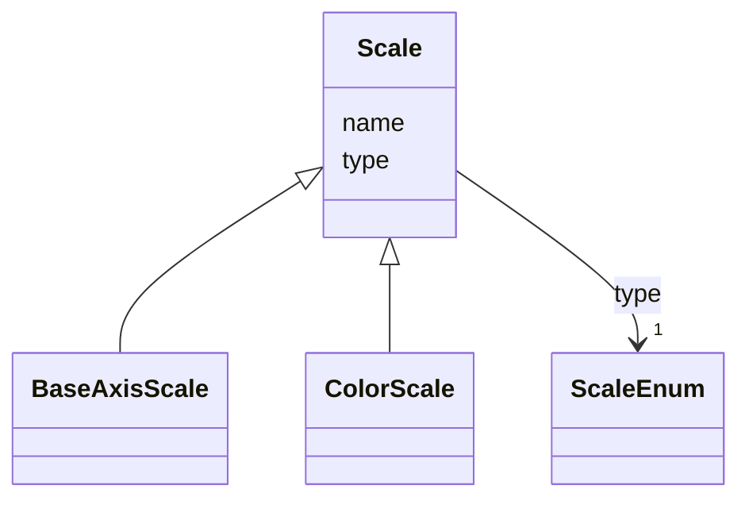

# Class: Scale 


_Base class for vega like scales which map from a data domain to a visual range, be it axis or color._


* __NOTE__: this is an abstract class and should not be instantiated directly


URI: [vega_scverse:Scale](https://w3id.org/scverse/vega-scverse/Scale)





## Inheritance
* **Scale**
    * [BaseAxisScale](BaseAxisScale.md)
    * [ColorScale](ColorScale.md)


## Slots

| Name | Cardinality and Range | Description | Inheritance |
| ---  | --- | --- | --- |
| [name](name.md) | 1 <br/> [String](String.md) | Name of the scale | direct |
| [type](type.md) | 1 <br/> [ScaleEnum](ScaleEnum.md) | The type of scale which is a description of what kind of mapping is performed... | direct |


## Usages

| used by | used in | type | used |
| ---  | --- | --- | --- |
| [GroupMark](GroupMark.md) | [scales](scales.md) | range | [Scale](Scale.md) |


## Identifier and Mapping Information


### Schema Source


* from schema: https://w3id.org/scverse/vega-scverse/specification


## Mappings

| Mapping Type | Mapped Value |
| ---  | ---  |
| self | vega_scverse:Scale |
| native | vega_scverse:Scale |


## LinkML Source

<!-- TODO: investigate https://stackoverflow.com/questions/37606292/how-to-create-tabbed-code-blocks-in-mkdocs-or-sphinx -->

### Direct

<details>
```yaml
name: Scale
description: Base class for vega like scales which map from a data domain to a visual
  range, be it axis or color.
from_schema: https://w3id.org/scverse/vega-scverse/specification
rank: 1000
abstract: true
attributes:
  name:
    name: name
    description: 'Name of the scale. Is used to refer to the scale in the rest of
      the view configuration. For scales used for

      axes typically `Y_scale` or `X_scale` optionally followed by `_n` where n stands
      for the index of the subplot.

      In case of a color mapping it is `color_` followed by a pseudo UUID.'
    from_schema: https://w3id.org/scverse/vega-scverse/scales
    identifier: true
    domain_of:
    - DataObject
    - Scale
    range: string
    required: true
  type:
    name: type
    description: "The type of scale which is a description of what kind of mapping\
      \ is performed between data domain and \nvisual range, e.g. `linear`."
    from_schema: https://w3id.org/scverse/vega-scverse/scales
    domain_of:
    - Transform
    - Format
    - Scale
    - Legend
    - Mark
    - TextMark
    - GroupMark
    range: ScaleEnum
    required: true

```
</details>

### Induced

<details>
```yaml
name: Scale
description: Base class for vega like scales which map from a data domain to a visual
  range, be it axis or color.
from_schema: https://w3id.org/scverse/vega-scverse/specification
rank: 1000
abstract: true
attributes:
  name:
    name: name
    description: 'Name of the scale. Is used to refer to the scale in the rest of
      the view configuration. For scales used for

      axes typically `Y_scale` or `X_scale` optionally followed by `_n` where n stands
      for the index of the subplot.

      In case of a color mapping it is `color_` followed by a pseudo UUID.'
    from_schema: https://w3id.org/scverse/vega-scverse/scales
    identifier: true
    alias: name
    owner: Scale
    domain_of:
    - DataObject
    - Scale
    range: string
    required: true
  type:
    name: type
    description: "The type of scale which is a description of what kind of mapping\
      \ is performed between data domain and \nvisual range, e.g. `linear`."
    from_schema: https://w3id.org/scverse/vega-scverse/scales
    alias: type
    owner: Scale
    domain_of:
    - Transform
    - Format
    - Scale
    - Legend
    - Mark
    - TextMark
    - GroupMark
    range: ScaleEnum
    required: true

```
</details>