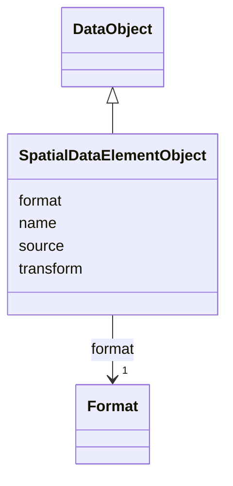

# Class: SpatialDataElementObject 


_Data object pertaining to an element within the SpatialData object._


URI: [vega_scverse:SpatialDataElementObject](https://w3id.org/scverse/vega-scverse/SpatialDataElementObject)





## Inheritance
* [DataObject](DataObject.md)
    * **SpatialDataElementObject**


## Slots

| Name | Cardinality and Range | Description | Inheritance |
| ---  | --- | --- | --- |
| [source](source.md) | 1 <br/> [String](String.md) | The source of the SpatialData element | direct |
| [transform](transform.md) | 1..* <br/> [String](String.md)&nbsp;or&nbsp;<br />[FilterTransform](FilterTransform.md)&nbsp;or&nbsp;<br />[FilterChannelTransform](FilterChannelTransform.md)&nbsp;or&nbsp;<br />[AggregateTransform](AggregateTransform.md)&nbsp;or&nbsp;<br />[SpreadTransform](SpreadTransform.md)&nbsp;or&nbsp;<br />[NormalizationFormulaTransform](NormalizationFormulaTransform.md) | An array of transforms applied to the SpatialData element | direct |
| [name](name.md) | 1 <br/> [String](String.md) | The name used throughout the view configuration to refer to the data object | [DataObject](DataObject.md) |
| [format](format.md) | 1 <br/> [Format](Format.md) | Format object containing the type of data as object and a string value repres... | [DataObject](DataObject.md) |


## Identifier and Mapping Information


### Schema Source


* from schema: https://w3id.org/scverse/vega-scverse/specification


## Mappings

| Mapping Type | Mapped Value |
| ---  | ---  |
| self | vega_scverse:SpatialDataElementObject |
| native | vega_scverse:SpatialDataElementObject |


## LinkML Source

<!-- TODO: investigate https://stackoverflow.com/questions/37606292/how-to-create-tabbed-code-blocks-in-mkdocs-or-sphinx -->

### Direct

<details>
```yaml
name: SpatialDataElementObject
description: Data object pertaining to an element within the SpatialData object.
from_schema: https://w3id.org/scverse/vega-scverse/specification
rank: 1000
is_a: DataObject
attributes:
  source:
    name: source
    description: "The source of the SpatialData element. Must be the name / identifier\
      \ of a SpatialData Object in the \nview configuration."
    from_schema: https://w3id.org/scverse/vega-scverse/data
    domain_of:
    - TableObject
    - SpatialDataElementObject
    required: true
    pattern: ^(.*_)?[0-9a-fA-F]{8}-[0-9a-fA-F]{4}-[0-9a-fA-F]{4}-[0-9a-fA-F]{4}-[0-9a-fA-F]{12}$
  transform:
    name: transform
    description: 'An array of transforms applied to the SpatialData element. The first
      transform is always `filter_element`,

      which filters the SpatialData source object based on the element name. This
      is followed by `filter_cs`, to

      specify in which coordinate system the element should be visualized. This can
      be followed by other optional

      transforms.'
    from_schema: https://w3id.org/scverse/vega-scverse/data
    domain_of:
    - TableObject
    - SpatialDataElementObject
    required: true
    multivalued: true
    any_of:
    - range: FilterTransform
    - range: FilterChannelTransform
    - range: AggregateTransform
    - range: SpreadTransform
    - range: NormalizationFormulaTransform

```
</details>

### Induced

<details>
```yaml
name: SpatialDataElementObject
description: Data object pertaining to an element within the SpatialData object.
from_schema: https://w3id.org/scverse/vega-scverse/specification
rank: 1000
is_a: DataObject
attributes:
  source:
    name: source
    description: "The source of the SpatialData element. Must be the name / identifier\
      \ of a SpatialData Object in the \nview configuration."
    from_schema: https://w3id.org/scverse/vega-scverse/data
    alias: source
    owner: SpatialDataElementObject
    domain_of:
    - TableObject
    - SpatialDataElementObject
    range: string
    required: true
    pattern: ^(.*_)?[0-9a-fA-F]{8}-[0-9a-fA-F]{4}-[0-9a-fA-F]{4}-[0-9a-fA-F]{4}-[0-9a-fA-F]{12}$
  transform:
    name: transform
    description: 'An array of transforms applied to the SpatialData element. The first
      transform is always `filter_element`,

      which filters the SpatialData source object based on the element name. This
      is followed by `filter_cs`, to

      specify in which coordinate system the element should be visualized. This can
      be followed by other optional

      transforms.'
    from_schema: https://w3id.org/scverse/vega-scverse/data
    alias: transform
    owner: SpatialDataElementObject
    domain_of:
    - TableObject
    - SpatialDataElementObject
    range: string
    required: true
    multivalued: true
    any_of:
    - range: FilterTransform
    - range: FilterChannelTransform
    - range: AggregateTransform
    - range: SpreadTransform
    - range: NormalizationFormulaTransform
  name:
    name: name
    description: "The name used throughout the view configuration to refer to the\
      \ data object. It is an arbitrary string \nfollowed by an underscore and pseudo\
      \ UUID."
    from_schema: https://w3id.org/scverse/vega-scverse/data
    rank: 1000
    alias: name
    owner: SpatialDataElementObject
    domain_of:
    - DataObject
    - Scale
    range: string
    required: true
    pattern: ^(.*_)?[0-9a-fA-F]{8}-[0-9a-fA-F]{4}-[0-9a-fA-F]{4}-[0-9a-fA-F]{4}-[0-9a-fA-F]{12}$
  format:
    name: format
    description: Format object containing the type of data as object and a string
      value representing the version.
    from_schema: https://w3id.org/scverse/vega-scverse/data
    rank: 1000
    alias: format
    owner: SpatialDataElementObject
    domain_of:
    - DataObject
    range: Format
    required: true

```
</details>