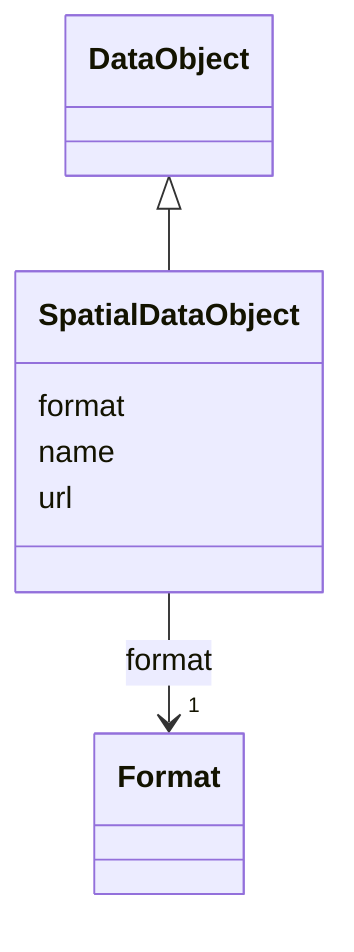

# Class: SpatialDataObject 


_SpatialData object specific to the SpatialData root_


URI: [vega_scverse:SpatialDataObject](https://w3id.org/scverse/vega-scverse/SpatialDataObject)





## Inheritance
* [DataObject](DataObject.md)
    * **SpatialDataObject**


## Slots

| Name | Cardinality and Range | Description | Inheritance |
| ---  | --- | --- | --- |
| [url](url.md) | 1 <br/> [String](String.md) | The absolute path to the SpatialData zarr | direct |
| [name](name.md) | 1 <br/> [String](String.md) | The name used throughout the view configuration to refer to the data object | [DataObject](DataObject.md) |
| [format](format.md) | 1 <br/> [Format](Format.md) | Format object containing the type of data as object and a string value repres... | [DataObject](DataObject.md) |


## Identifier and Mapping Information


### Schema Source


* from schema: https://w3id.org/scverse/vega-scverse/specification


## Mappings

| Mapping Type | Mapped Value |
| ---  | ---  |
| self | vega_scverse:SpatialDataObject |
| native | vega_scverse:SpatialDataObject |


## LinkML Source

<!-- TODO: investigate https://stackoverflow.com/questions/37606292/how-to-create-tabbed-code-blocks-in-mkdocs-or-sphinx -->

### Direct

<details>
```yaml
name: SpatialDataObject
description: SpatialData object specific to the SpatialData root
from_schema: https://w3id.org/scverse/vega-scverse/specification
rank: 1000
is_a: DataObject
attributes:
  url:
    name: url
    description: The absolute path to the SpatialData zarr.
    from_schema: https://w3id.org/scverse/vega-scverse/data
    rank: 1000
    domain_of:
    - SpatialDataObject
    range: string
    required: true

```
</details>

### Induced

<details>
```yaml
name: SpatialDataObject
description: SpatialData object specific to the SpatialData root
from_schema: https://w3id.org/scverse/vega-scverse/specification
rank: 1000
is_a: DataObject
attributes:
  url:
    name: url
    description: The absolute path to the SpatialData zarr.
    from_schema: https://w3id.org/scverse/vega-scverse/data
    rank: 1000
    alias: url
    owner: SpatialDataObject
    domain_of:
    - SpatialDataObject
    range: string
    required: true
  name:
    name: name
    description: "The name used throughout the view configuration to refer to the\
      \ data object. It is an arbitrary string \nfollowed by an underscore and pseudo\
      \ UUID."
    from_schema: https://w3id.org/scverse/vega-scverse/data
    rank: 1000
    alias: name
    owner: SpatialDataObject
    domain_of:
    - DataObject
    - Scale
    range: string
    required: true
    pattern: ^(.*_)?[0-9a-fA-F]{8}-[0-9a-fA-F]{4}-[0-9a-fA-F]{4}-[0-9a-fA-F]{4}-[0-9a-fA-F]{12}$
  format:
    name: format
    description: Format object containing the type of data as object and a string
      value representing the version.
    from_schema: https://w3id.org/scverse/vega-scverse/data
    rank: 1000
    alias: format
    owner: SpatialDataObject
    domain_of:
    - DataObject
    range: Format
    required: true

```
</details>