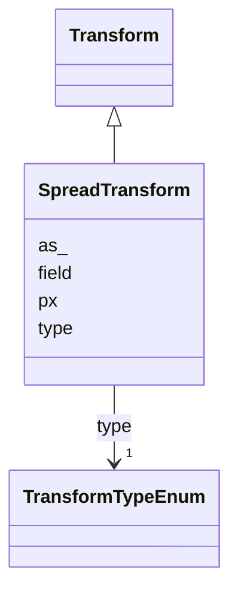

# Class: SpreadTransform 


_Datashade transform expanding each pixel in a rasterized image by a specified number of pixels to make sparse _

_data more visible. This transform MUST be preceded by an aggregate transform and is optionally preceded by _

_a normalization transform ('formula')._


URI: [vega_scverse:SpreadTransform](https://w3id.org/scverse/vega-scverse/SpreadTransform)





## Inheritance
* [Transform](Transform.md)
    * **SpreadTransform**


## Slots

| Name | Cardinality and Range | Description | Inheritance |
| ---  | --- | --- | --- |
| [field](field.md) | 1..* <br/> [String](String.md) | The data fields on which to apply the spread transform | direct |
| [px](px.md) | 1 <br/> [Integer](Integer.md) | The amount of pixels by which to expand each pixel to make data more visible | direct |
| [as_](as_.md) | 1..* <br/> [String](String.md) | The output field names to use for each field to which a spread transform is a... | direct |
| [type](type.md) | 1 <br/> [TransformTypeEnum](TransformTypeEnum.md) | The type of transform | [Transform](Transform.md) |


## Usages

| used by | used in | type | used |
| ---  | --- | --- | --- |
| [SpatialDataElementObject](SpatialDataElementObject.md) | [transform](transform.md) | any_of[range] | [SpreadTransform](SpreadTransform.md) |


## Identifier and Mapping Information


### Schema Source


* from schema: https://w3id.org/scverse/vega-scverse/specification


## Mappings

| Mapping Type | Mapped Value |
| ---  | ---  |
| self | vega_scverse:SpreadTransform |
| native | vega_scverse:SpreadTransform |


## LinkML Source

<!-- TODO: investigate https://stackoverflow.com/questions/37606292/how-to-create-tabbed-code-blocks-in-mkdocs-or-sphinx -->

### Direct

<details>
```yaml
name: SpreadTransform
description: "Datashade transform expanding each pixel in a rasterized image by a\
  \ specified number of pixels to make sparse \ndata more visible. This transform\
  \ MUST be preceded by an aggregate transform and is optionally preceded by \na normalization\
  \ transform ('formula')."
from_schema: https://w3id.org/scverse/vega-scverse/specification
rank: 1000
is_a: Transform
slot_usage:
  type:
    name: type
    ifabsent: string(spread)
    equals_string: spread
attributes:
  field:
    name: field
    description: "The data fields on which to apply the spread transform. This array\
      \ should align with the as \narrays."
    from_schema: https://w3id.org/scverse/vega-scverse/data
    domain_of:
    - AggregateTransform
    - SpreadTransform
    - ContinuousColorDomain
    - ColorItem
    - AxisItem
    - ConditionalFillUpdate
    range: string
    required: true
    multivalued: true
  px:
    name: px
    description: The amount of pixels by which to expand each pixel to make data more
      visible.
    from_schema: https://w3id.org/scverse/vega-scverse/data
    rank: 1000
    domain_of:
    - SpreadTransform
    range: integer
    required: true
  as_:
    name: as_
    description: "The output field names to use for each field to which a spread transform\
      \ is applied. In the initial \nimplementation this is the same as the values\
      \ in 'field'."
    from_schema: https://w3id.org/scverse/vega-scverse/data
    domain_of:
    - AggregateTransform
    - SpreadTransform
    - NormalizationFormulaTransform
    range: string
    required: true
    multivalued: true

```
</details>

### Induced

<details>
```yaml
name: SpreadTransform
description: "Datashade transform expanding each pixel in a rasterized image by a\
  \ specified number of pixels to make sparse \ndata more visible. This transform\
  \ MUST be preceded by an aggregate transform and is optionally preceded by \na normalization\
  \ transform ('formula')."
from_schema: https://w3id.org/scverse/vega-scverse/specification
rank: 1000
is_a: Transform
slot_usage:
  type:
    name: type
    ifabsent: string(spread)
    equals_string: spread
attributes:
  field:
    name: field
    description: "The data fields on which to apply the spread transform. This array\
      \ should align with the as \narrays."
    from_schema: https://w3id.org/scverse/vega-scverse/data
    alias: field
    owner: SpreadTransform
    domain_of:
    - AggregateTransform
    - SpreadTransform
    - ContinuousColorDomain
    - ColorItem
    - AxisItem
    - ConditionalFillUpdate
    range: string
    required: true
    multivalued: true
  px:
    name: px
    description: The amount of pixels by which to expand each pixel to make data more
      visible.
    from_schema: https://w3id.org/scverse/vega-scverse/data
    rank: 1000
    alias: px
    owner: SpreadTransform
    domain_of:
    - SpreadTransform
    range: integer
    required: true
  as_:
    name: as_
    description: "The output field names to use for each field to which a spread transform\
      \ is applied. In the initial \nimplementation this is the same as the values\
      \ in 'field'."
    from_schema: https://w3id.org/scverse/vega-scverse/data
    alias: as_
    owner: SpreadTransform
    domain_of:
    - AggregateTransform
    - SpreadTransform
    - NormalizationFormulaTransform
    range: string
    required: true
    multivalued: true
  type:
    name: type
    description: The type of transform.
    from_schema: https://w3id.org/scverse/vega-scverse/data
    rank: 1000
    ifabsent: string(spread)
    alias: type
    owner: SpreadTransform
    domain_of:
    - Transform
    - Format
    - Scale
    - Legend
    - Mark
    - TextMark
    - GroupMark
    range: TransformTypeEnum
    required: true
    equals_string: spread

```
</details>