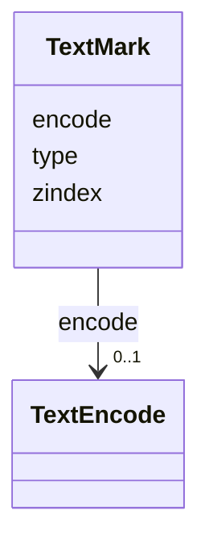

# Class: TextMark 


_Text marks can be used to annotate data and provide labels and titles for axes and legends._


URI: [vega_scverse:TextMark](https://w3id.org/scverse/vega-scverse/TextMark)





<!-- no inheritance hierarchy -->


## Slots

| Name | Cardinality and Range | Description | Inheritance |
| ---  | --- | --- | --- |
| [type](type.md) | 0..1 <br/> [String](String.md) | The type of the mark | direct |
| [encode](encode.md) | 0..1 <br/> [TextEncode](TextEncode.md) |  | direct |
| [zindex](zindex.md) | 1 <br/> [Integer](Integer.md) | An integer z-index indicating the layering order of sibling mark items | direct |


## Identifier and Mapping Information


### Schema Source


* from schema: https://w3id.org/scverse/vega-scverse/specification


## Mappings

| Mapping Type | Mapped Value |
| ---  | ---  |
| self | vega_scverse:TextMark |
| native | vega_scverse:TextMark |


## LinkML Source

<!-- TODO: investigate https://stackoverflow.com/questions/37606292/how-to-create-tabbed-code-blocks-in-mkdocs-or-sphinx -->

### Direct

<details>
```yaml
name: TextMark
description: Text marks can be used to annotate data and provide labels and titles
  for axes and legends.
from_schema: https://w3id.org/scverse/vega-scverse/specification
rank: 1000
attributes:
  type:
    name: type
    description: The type of the mark. In this case, it is always 'text'.
    from_schema: https://w3id.org/scverse/vega-scverse/marks
    ifabsent: string(text)
    domain_of:
    - Transform
    - Format
    - Scale
    - Legend
    - Mark
    - TextMark
    - GroupMark
    equals_string: text
  encode:
    name: encode
    from_schema: https://w3id.org/scverse/vega-scverse/marks
    domain_of:
    - Mark
    - TextMark
    - GroupMark
    range: TextEncode
  zindex:
    name: zindex
    description: "An integer z-index indicating the layering order of sibling mark\
      \ items. The default value is 0. Higher values \n(1) will cause marks to be\
      \ drawn on top of those with lower z-index values."
    from_schema: https://w3id.org/scverse/vega-scverse/marks
    domain_of:
    - Axis
    - Legend
    - Mark
    - TextMark
    range: integer
    required: true

```
</details>

### Induced

<details>
```yaml
name: TextMark
description: Text marks can be used to annotate data and provide labels and titles
  for axes and legends.
from_schema: https://w3id.org/scverse/vega-scverse/specification
rank: 1000
attributes:
  type:
    name: type
    description: The type of the mark. In this case, it is always 'text'.
    from_schema: https://w3id.org/scverse/vega-scverse/marks
    ifabsent: string(text)
    alias: type
    owner: TextMark
    domain_of:
    - Transform
    - Format
    - Scale
    - Legend
    - Mark
    - TextMark
    - GroupMark
    range: string
    equals_string: text
  encode:
    name: encode
    from_schema: https://w3id.org/scverse/vega-scverse/marks
    alias: encode
    owner: TextMark
    domain_of:
    - Mark
    - TextMark
    - GroupMark
    range: TextEncode
  zindex:
    name: zindex
    description: "An integer z-index indicating the layering order of sibling mark\
      \ items. The default value is 0. Higher values \n(1) will cause marks to be\
      \ drawn on top of those with lower z-index values."
    from_schema: https://w3id.org/scverse/vega-scverse/marks
    alias: zindex
    owner: TextMark
    domain_of:
    - Axis
    - Legend
    - Mark
    - TextMark
    range: integer
    required: true

```
</details>