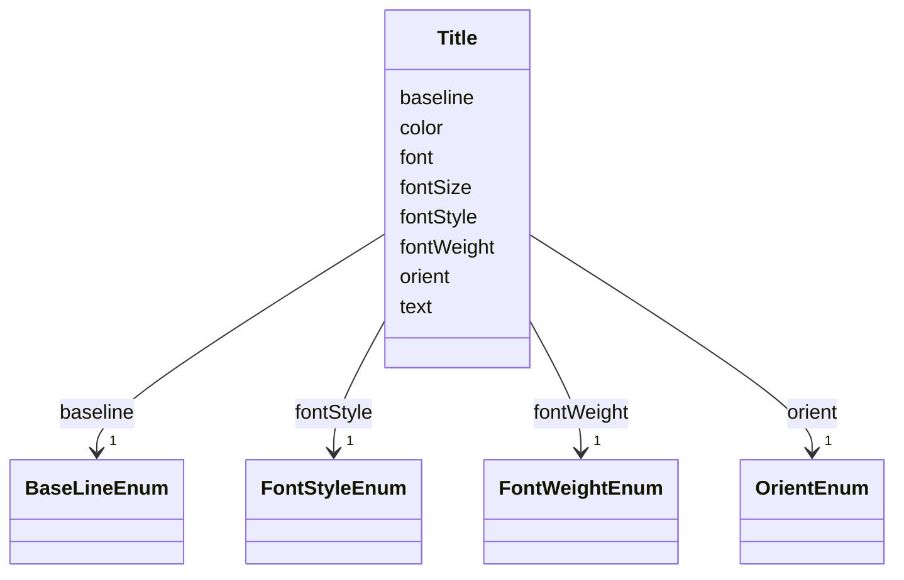

# Class: Title 


_The title directive adds a descriptive title to a chart. Similar to scales, axes, and legends, a title can be _

_defined at the top-level of a specification or as part of a group mark._


URI: [vega_scverse:Title](https://w3id.org/scverse/vega-scverse/Title)





<!-- no inheritance hierarchy -->


## Slots

| Name | Cardinality and Range | Description | Inheritance |
| ---  | --- | --- | --- |
| [text](text.md) | 1..* <br/> [String](String.md) | The title text | direct |
| [orient](orient.md) | 1 <br/> [OrientEnum](OrientEnum.md) | The orientation of the title relative to the chart | direct |
| [baseline](baseline.md) | 1 <br/> [BaseLineEnum](BaseLineEnum.md) | The baseline attribute specifies the vertical alignment (baseline) of the tex... | direct |
| [color](color.md) | 1 <br/> [String](String.md) | Text color of the title text | direct |
| [font](font.md) | 1 <br/> [String](String.md) | Font name of the title text | direct |
| [fontSize](fontSize.md) | 1 <br/> [Float](Float.md) | Font size in pixels of the title text | direct |
| [fontStyle](fontStyle.md) | 1 <br/> [FontStyleEnum](FontStyleEnum.md) | Fontstyle of the title | direct |
| [fontWeight](fontWeight.md) | 1 <br/> [FontWeightEnum](FontWeightEnum.md) | Font weight of the title | direct |


## Usages

| used by | used in | type | used |
| ---  | --- | --- | --- |
| [ViewConfiguration](ViewConfiguration.md) | [title](title.md) | range | [Title](Title.md) |


## Identifier and Mapping Information


### Schema Source


* from schema: https://w3id.org/scverse/vega-scverse/specification


## Mappings

| Mapping Type | Mapped Value |
| ---  | ---  |
| self | vega_scverse:Title |
| native | vega_scverse:Title |


## LinkML Source

<!-- TODO: investigate https://stackoverflow.com/questions/37606292/how-to-create-tabbed-code-blocks-in-mkdocs-or-sphinx -->

### Direct

<details>
```yaml
name: Title
description: "The title directive adds a descriptive title to a chart. Similar to\
  \ scales, axes, and legends, a title can be \ndefined at the top-level of a specification\
  \ or as part of a group mark."
from_schema: https://w3id.org/scverse/vega-scverse/specification
rank: 1000
attributes:
  text:
    name: text
    description: The title text. Either a string or an array of strings. The latter
      specifies multiple lines of text.
    from_schema: https://w3id.org/scverse/vega-scverse/marks
    rank: 1000
    domain_of:
    - Title
    - TextEncodeEnter
    range: string
    required: true
    multivalued: true
  orient:
    name: orient
    description: The orientation of the title relative to the chart.
    from_schema: https://w3id.org/scverse/vega-scverse/marks
    domain_of:
    - Axis
    - Legend
    - Title
    range: OrientEnum
    required: true
  baseline:
    name: baseline
    description: The baseline attribute specifies the vertical alignment (baseline)
      of the text relative to its y-coordinate.
    from_schema: https://w3id.org/scverse/vega-scverse/marks
    rank: 1000
    domain_of:
    - Title
    - TextEncodeEnter
    range: BaseLineEnum
    required: true
  color:
    name: color
    description: Text color of the title text.
    from_schema: https://w3id.org/scverse/vega-scverse/marks
    rank: 1000
    slot_uri: rgbaHexSlot
    domain_of:
    - Title
    required: true
  font:
    name: font
    description: Font name of the title text.
    from_schema: https://w3id.org/scverse/vega-scverse/marks
    rank: 1000
    domain_of:
    - Title
    - TextEncodeEnter
    range: string
    required: true
  fontSize:
    name: fontSize
    description: Font size in pixels of the title text.
    from_schema: https://w3id.org/scverse/vega-scverse/marks
    rank: 1000
    domain_of:
    - Title
    - TextEncodeEnter
    range: float
    required: true
    minimum_value: 0
  fontStyle:
    name: fontStyle
    description: Fontstyle of the title.
    from_schema: https://w3id.org/scverse/vega-scverse/marks
    rank: 1000
    domain_of:
    - Title
    - TextEncodeEnter
    range: FontStyleEnum
    required: true
  fontWeight:
    name: fontWeight
    description: Font weight of the title
    from_schema: https://w3id.org/scverse/vega-scverse/marks
    rank: 1000
    domain_of:
    - Title
    - TextEncodeEnter
    range: FontWeightEnum
    required: true

```
</details>

### Induced

<details>
```yaml
name: Title
description: "The title directive adds a descriptive title to a chart. Similar to\
  \ scales, axes, and legends, a title can be \ndefined at the top-level of a specification\
  \ or as part of a group mark."
from_schema: https://w3id.org/scverse/vega-scverse/specification
rank: 1000
attributes:
  text:
    name: text
    description: The title text. Either a string or an array of strings. The latter
      specifies multiple lines of text.
    from_schema: https://w3id.org/scverse/vega-scverse/marks
    rank: 1000
    alias: text
    owner: Title
    domain_of:
    - Title
    - TextEncodeEnter
    range: string
    required: true
    multivalued: true
  orient:
    name: orient
    description: The orientation of the title relative to the chart.
    from_schema: https://w3id.org/scverse/vega-scverse/marks
    alias: orient
    owner: Title
    domain_of:
    - Axis
    - Legend
    - Title
    range: OrientEnum
    required: true
  baseline:
    name: baseline
    description: The baseline attribute specifies the vertical alignment (baseline)
      of the text relative to its y-coordinate.
    from_schema: https://w3id.org/scverse/vega-scverse/marks
    rank: 1000
    alias: baseline
    owner: Title
    domain_of:
    - Title
    - TextEncodeEnter
    range: BaseLineEnum
    required: true
  color:
    name: color
    description: Text color of the title text.
    from_schema: https://w3id.org/scverse/vega-scverse/marks
    rank: 1000
    slot_uri: rgbaHexSlot
    alias: color
    owner: Title
    domain_of:
    - Title
    range: string
    required: true
  font:
    name: font
    description: Font name of the title text.
    from_schema: https://w3id.org/scverse/vega-scverse/marks
    rank: 1000
    alias: font
    owner: Title
    domain_of:
    - Title
    - TextEncodeEnter
    range: string
    required: true
  fontSize:
    name: fontSize
    description: Font size in pixels of the title text.
    from_schema: https://w3id.org/scverse/vega-scverse/marks
    rank: 1000
    alias: fontSize
    owner: Title
    domain_of:
    - Title
    - TextEncodeEnter
    range: float
    required: true
    minimum_value: 0
  fontStyle:
    name: fontStyle
    description: Fontstyle of the title.
    from_schema: https://w3id.org/scverse/vega-scverse/marks
    rank: 1000
    alias: fontStyle
    owner: Title
    domain_of:
    - Title
    - TextEncodeEnter
    range: FontStyleEnum
    required: true
  fontWeight:
    name: fontWeight
    description: Font weight of the title
    from_schema: https://w3id.org/scverse/vega-scverse/marks
    rank: 1000
    alias: fontWeight
    owner: Title
    domain_of:
    - Title
    - TextEncodeEnter
    range: FontWeightEnum
    required: true

```
</details>