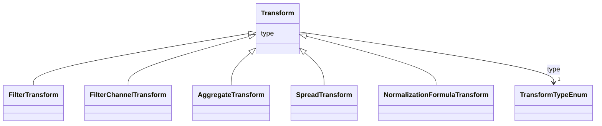

# Class: Transform 


_Transform of data applied to data input._


* __NOTE__: this is an abstract class and should not be instantiated directly


URI: [vega_scverse:Transform](https://w3id.org/scverse/vega-scverse/Transform)





## Inheritance
* **Transform**
    * [FilterTransform](FilterTransform.md)
    * [FilterChannelTransform](FilterChannelTransform.md)
    * [AggregateTransform](AggregateTransform.md)
    * [SpreadTransform](SpreadTransform.md)
    * [NormalizationFormulaTransform](NormalizationFormulaTransform.md)


## Slots

| Name | Cardinality and Range | Description | Inheritance |
| ---  | --- | --- | --- |
| [type](type.md) | 1 <br/> [TransformTypeEnum](TransformTypeEnum.md) | The type of transform | direct |


## Identifier and Mapping Information


### Schema Source


* from schema: https://w3id.org/scverse/vega-scverse/specification


## Mappings

| Mapping Type | Mapped Value |
| ---  | ---  |
| self | vega_scverse:Transform |
| native | vega_scverse:Transform |


## LinkML Source

<!-- TODO: investigate https://stackoverflow.com/questions/37606292/how-to-create-tabbed-code-blocks-in-mkdocs-or-sphinx -->

### Direct

<details>
```yaml
name: Transform
description: Transform of data applied to data input.
from_schema: https://w3id.org/scverse/vega-scverse/specification
rank: 1000
abstract: true
attributes:
  type:
    name: type
    description: The type of transform.
    from_schema: https://w3id.org/scverse/vega-scverse/data
    rank: 1000
    domain_of:
    - Transform
    - Format
    - Scale
    - Legend
    - Mark
    - TextMark
    - GroupMark
    range: TransformTypeEnum
    required: true

```
</details>

### Induced

<details>
```yaml
name: Transform
description: Transform of data applied to data input.
from_schema: https://w3id.org/scverse/vega-scverse/specification
rank: 1000
abstract: true
attributes:
  type:
    name: type
    description: The type of transform.
    from_schema: https://w3id.org/scverse/vega-scverse/data
    rank: 1000
    alias: type
    owner: Transform
    domain_of:
    - Transform
    - Format
    - Scale
    - Legend
    - Mark
    - TextMark
    - GroupMark
    range: TransformTypeEnum
    required: true

```
</details>