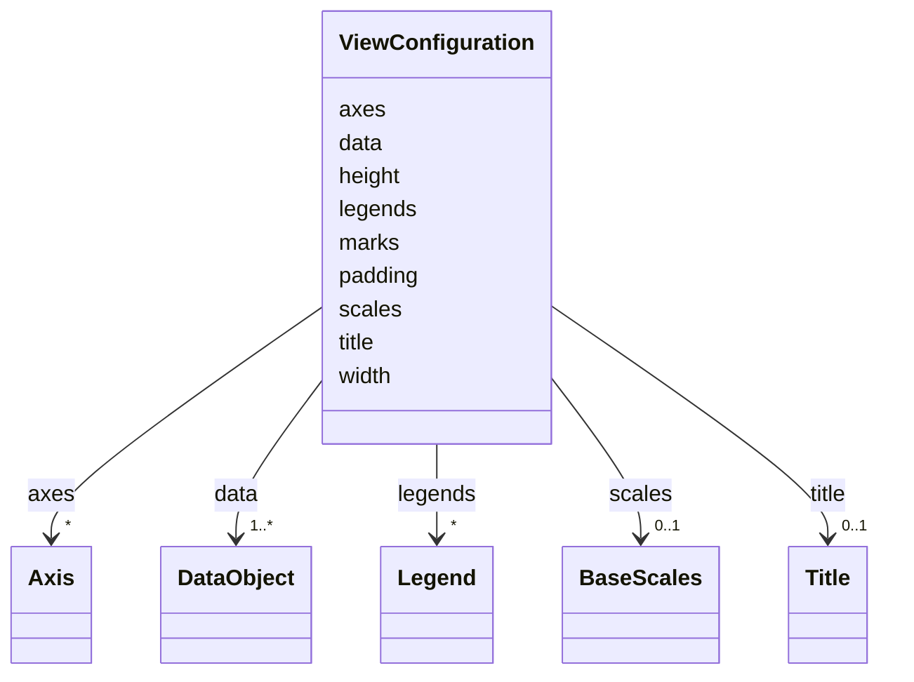

# Class: ViewConfiguration 


_Viewconfiguration based on vega for the scverse visualization ecosystem. Currently, only supports SpatialData._


URI: [vega_scverse:ViewConfiguration](https://w3id.org/scverse/vega-scverse/ViewConfiguration)





<!-- no inheritance hierarchy -->


## Slots

| Name | Cardinality and Range | Description | Inheritance |
| ---  | --- | --- | --- |
| [height](height.md) | 1 <br/> [Integer](Integer.md) | The height of the plotting area | direct |
| [width](width.md) | 1 <br/> [Integer](Integer.md) | The width of the plotting area | direct |
| [padding](padding.md) | 0..1 <br/> [String](String.md)&nbsp;or&nbsp;<br />[Float](Float.md)&nbsp;or&nbsp;<br />[Padding](Padding.md) | padding defines the amount of space (in pixels) to reserve between the edge o... | direct |
| [title](title.md) | 0..1 <br/> [Title](Title.md) | The title directive adds a descriptive title to a chart | direct |
| [data](data.md) | 1..* <br/> [DataObject](DataObject.md) | Scverse data set definitions and transforms define the data to load and how t... | direct |
| [scales](scales.md) | 0..1 <br/> [BaseScales](BaseScales.md) | Scales map data values (numbers, dates, categories, etc | direct |
| [axes](axes.md) | * <br/> [Axis](Axis.md) | Axes visualize spatial scale mappings using ticks, grid lines and labels | direct |
| [legends](legends.md) | * <br/> [Legend](Legend.md) | Legends visualize scale mappings for visual values such as color, shape and s... | direct |
| [marks](marks.md) | 1..* <br/> [String](String.md)&nbsp;or&nbsp;<br />[Mark](Mark.md)&nbsp;or&nbsp;<br />[GroupMark](GroupMark.md) | Graphical marks visually encode data using geometric primitives such as recta... | direct |


## Identifier and Mapping Information


### Schema Source


* from schema: https://w3id.org/scverse/vega-scverse/specification


## Mappings

| Mapping Type | Mapped Value |
| ---  | ---  |
| self | vega_scverse:ViewConfiguration |
| native | vega_scverse:ViewConfiguration |


## LinkML Source

<!-- TODO: investigate https://stackoverflow.com/questions/37606292/how-to-create-tabbed-code-blocks-in-mkdocs-or-sphinx -->

### Direct

<details>
```yaml
name: ViewConfiguration
description: Viewconfiguration based on vega for the scverse visualization ecosystem.
  Currently, only supports SpatialData.
from_schema: https://w3id.org/scverse/vega-scverse/specification
rank: 1000
attributes:
  height:
    name: height
    description: "The height of the plotting area. The plotting area is defined as\
      \ the rectangular region within a visualization \nwhere graphical marks (such\
      \ as points, lines, or bars) are rendered, bounded by the axes and padding,\
      \ \nexcluding titles, legends, and margins."
    from_schema: https://w3id.org/scverse/vega-scverse/specification
    rank: 1000
    domain_of:
    - ViewConfiguration
    - GroupEncodeEnter
    range: integer
    required: true
  width:
    name: width
    description: "The width of the plotting area. The plotting area is defined as\
      \ the rectangular region within a visualization \nwhere graphical marks (such\
      \ as points, lines, or bars) are rendered, bounded by the axes and padding,\
      \ \nexcluding titles, legends, and margins."
    from_schema: https://w3id.org/scverse/vega-scverse/specification
    rank: 1000
    domain_of:
    - ViewConfiguration
    - GroupEncodeEnter
    range: integer
    required: true
  padding:
    name: padding
    description: "padding defines the amount of space (in pixels) to reserve between\
      \ the edge of the chart container and the inner \nview area where data marks\
      \ are rendered. It acts as an internal margin that ensures visual elements like\
      \ axes, \ntitles, and legends don't touch or overflow the chart's outer boundaries.\n\
      When combined with \"autosize\": {\"type\": \"fit\", \"contains\": \"padding\"\
      }, this padding is included within the chart's \nspecified width and height,\
      \ and the inner view is resized accordingly to preserve layout integrity. If\
      \ padding\nis defined with this class. This class should at least have one attribute\
      \ defined."
    from_schema: https://w3id.org/scverse/vega-scverse/specification
    rank: 1000
    domain_of:
    - ViewConfiguration
    - Legend
    any_of:
    - range: float
    - range: Padding
  title:
    name: title
    description: The title directive adds a descriptive title to a chart.
    from_schema: https://w3id.org/scverse/vega-scverse/specification
    rank: 1000
    domain_of:
    - ViewConfiguration
    range: Title
    required: false
  data:
    name: data
    description: Scverse data set definitions and transforms define the data to load
      and how to process it.
    from_schema: https://w3id.org/scverse/vega-scverse/specification
    rank: 1000
    domain_of:
    - ViewConfiguration
    - ContinuousColorDomain
    - MarkDataSource
    range: DataObject
    required: true
    multivalued: true
  scales:
    name: scales
    description: "Scales map data values (numbers, dates, categories, etc.) to visual\
      \ values (pixels, colors, sizes). \nScales are a fundamental building block\
      \ of data visualization, as they determine the nature of visual \nencodings."
    from_schema: https://w3id.org/scverse/vega-scverse/specification
    rank: 1000
    domain_of:
    - ViewConfiguration
    - BaseScales
    - GroupMark
    range: BaseScales
  axes:
    name: axes
    description: Axes visualize spatial scale mappings using ticks, grid lines and
      labels.
    from_schema: https://w3id.org/scverse/vega-scverse/specification
    rank: 1000
    domain_of:
    - ViewConfiguration
    - GroupMark
    range: Axis
    multivalued: true
  legends:
    name: legends
    description: Legends visualize scale mappings for visual values such as color,
      shape and size.
    from_schema: https://w3id.org/scverse/vega-scverse/specification
    rank: 1000
    domain_of:
    - ViewConfiguration
    - GroupMark
    range: Legend
    multivalued: true
  marks:
    name: marks
    description: "Graphical marks visually encode data using geometric primitives\
      \ such as rectangles, lines, and plotting \nsymbols. Marks are the basic visual\
      \ building block of a visualization, providing basic shapes whose \nproperties\
      \ can be set according to backing data. Mark property definitions may be simple\
      \ constants or data \nfields, or scales can be used to map data values to visual\
      \ values."
    from_schema: https://w3id.org/scverse/vega-scverse/specification
    rank: 1000
    domain_of:
    - ViewConfiguration
    - GroupMark
    required: true
    multivalued: true
    any_of:
    - range: Mark
    - range: GroupMark

```
</details>

### Induced

<details>
```yaml
name: ViewConfiguration
description: Viewconfiguration based on vega for the scverse visualization ecosystem.
  Currently, only supports SpatialData.
from_schema: https://w3id.org/scverse/vega-scverse/specification
rank: 1000
attributes:
  height:
    name: height
    description: "The height of the plotting area. The plotting area is defined as\
      \ the rectangular region within a visualization \nwhere graphical marks (such\
      \ as points, lines, or bars) are rendered, bounded by the axes and padding,\
      \ \nexcluding titles, legends, and margins."
    from_schema: https://w3id.org/scverse/vega-scverse/specification
    rank: 1000
    alias: height
    owner: ViewConfiguration
    domain_of:
    - ViewConfiguration
    - GroupEncodeEnter
    range: integer
    required: true
  width:
    name: width
    description: "The width of the plotting area. The plotting area is defined as\
      \ the rectangular region within a visualization \nwhere graphical marks (such\
      \ as points, lines, or bars) are rendered, bounded by the axes and padding,\
      \ \nexcluding titles, legends, and margins."
    from_schema: https://w3id.org/scverse/vega-scverse/specification
    rank: 1000
    alias: width
    owner: ViewConfiguration
    domain_of:
    - ViewConfiguration
    - GroupEncodeEnter
    range: integer
    required: true
  padding:
    name: padding
    description: "padding defines the amount of space (in pixels) to reserve between\
      \ the edge of the chart container and the inner \nview area where data marks\
      \ are rendered. It acts as an internal margin that ensures visual elements like\
      \ axes, \ntitles, and legends don't touch or overflow the chart's outer boundaries.\n\
      When combined with \"autosize\": {\"type\": \"fit\", \"contains\": \"padding\"\
      }, this padding is included within the chart's \nspecified width and height,\
      \ and the inner view is resized accordingly to preserve layout integrity. If\
      \ padding\nis defined with this class. This class should at least have one attribute\
      \ defined."
    from_schema: https://w3id.org/scverse/vega-scverse/specification
    rank: 1000
    alias: padding
    owner: ViewConfiguration
    domain_of:
    - ViewConfiguration
    - Legend
    range: string
    any_of:
    - range: float
    - range: Padding
  title:
    name: title
    description: The title directive adds a descriptive title to a chart.
    from_schema: https://w3id.org/scverse/vega-scverse/specification
    rank: 1000
    alias: title
    owner: ViewConfiguration
    domain_of:
    - ViewConfiguration
    range: Title
    required: false
  data:
    name: data
    description: Scverse data set definitions and transforms define the data to load
      and how to process it.
    from_schema: https://w3id.org/scverse/vega-scverse/specification
    rank: 1000
    alias: data
    owner: ViewConfiguration
    domain_of:
    - ViewConfiguration
    - ContinuousColorDomain
    - MarkDataSource
    range: DataObject
    required: true
    multivalued: true
  scales:
    name: scales
    description: "Scales map data values (numbers, dates, categories, etc.) to visual\
      \ values (pixels, colors, sizes). \nScales are a fundamental building block\
      \ of data visualization, as they determine the nature of visual \nencodings."
    from_schema: https://w3id.org/scverse/vega-scverse/specification
    rank: 1000
    alias: scales
    owner: ViewConfiguration
    domain_of:
    - ViewConfiguration
    - BaseScales
    - GroupMark
    range: BaseScales
  axes:
    name: axes
    description: Axes visualize spatial scale mappings using ticks, grid lines and
      labels.
    from_schema: https://w3id.org/scverse/vega-scverse/specification
    rank: 1000
    alias: axes
    owner: ViewConfiguration
    domain_of:
    - ViewConfiguration
    - GroupMark
    range: Axis
    multivalued: true
  legends:
    name: legends
    description: Legends visualize scale mappings for visual values such as color,
      shape and size.
    from_schema: https://w3id.org/scverse/vega-scverse/specification
    rank: 1000
    alias: legends
    owner: ViewConfiguration
    domain_of:
    - ViewConfiguration
    - GroupMark
    range: Legend
    multivalued: true
  marks:
    name: marks
    description: "Graphical marks visually encode data using geometric primitives\
      \ such as rectangles, lines, and plotting \nsymbols. Marks are the basic visual\
      \ building block of a visualization, providing basic shapes whose \nproperties\
      \ can be set according to backing data. Mark property definitions may be simple\
      \ constants or data \nfields, or scales can be used to map data values to visual\
      \ values."
    from_schema: https://w3id.org/scverse/vega-scverse/specification
    rank: 1000
    alias: marks
    owner: ViewConfiguration
    domain_of:
    - ViewConfiguration
    - GroupMark
    range: string
    required: true
    multivalued: true
    any_of:
    - range: Mark
    - range: GroupMark

```
</details>